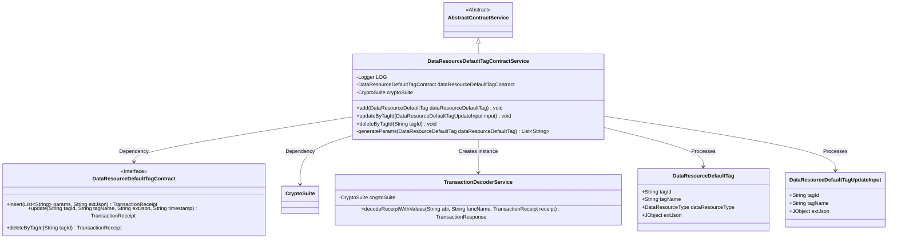
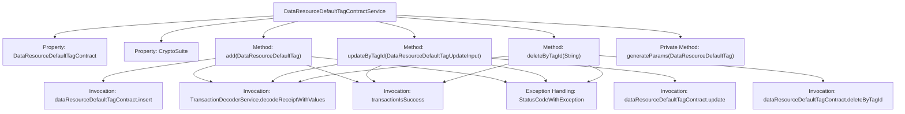

# Basic Information

|      |      |
|------|------|
| Name | DataResourceDefaultTagContractService |
| Language | .java |
| Code Path | WeFe/manager/manager-service/src/main/java/com/welab/wefe/manager/service/service/DataResourceDefaultTagContractService.java |
| Package Name | com.welab.wefe.manager.service.service |
| Dependencies | ['com.welab.wefe.common.StatusCode', 'com.welab.wefe.common.data.mongodb.entity.union.DataResourceDefaultTag', 'com.welab.wefe.common.exception.StatusCodeWithException', 'com.welab.wefe.common.util.DateUtil', 'com.welab.wefe.common.util.JObject', 'com.welab.wefe.common.util.StringUtil', 'com.welab.wefe.manager.service.contract.DataResourceDefaultTagContract', 'com.welab.wefe.manager.service.dto.tag.DataResourceDefaultTagUpdateInput', 'org.fisco.bcos.sdk.crypto.CryptoSuite', 'org.fisco.bcos.sdk.model.TransactionReceipt', 'org.fisco.bcos.sdk.transaction.codec.decode.TransactionDecoderService', 'org.fisco.bcos.sdk.transaction.model.dto.TransactionResponse', 'org.slf4j.Logger', 'org.slf4j.LoggerFactory', 'org.springframework.beans.factory.annotation.Autowired', 'org.springframework.stereotype.Service', 'java.util.ArrayList', 'java.util.Date', 'java.util.List'] |
| Brief Description | The DataResourceDefaultTagContractService provides functionalities for adding, deleting, and modifying default tags of data resources, which are implemented through smart contract transactions, including exception handling and logging. |

# Description

The DataResourceDefaultTagContractService is a service class that inherits from AbstractContractService, designed to handle the addition, deletion, and modification operations of default tags for data resources. This class interacts with the blockchain through auto-injected instances of DataResourceDefaultTagContract and CryptoSuite. Key methods include: the `add` method for adding tags by generating parameters and sending transactions; the `updateByTagId` method for updating tag information based on tag ID; and the `deleteByTagId` method for deleting tags by tag ID. All operations involve transaction sending, receipt decoding, result verification, and logging. Exception handling includes capturing and logging error messages, throwing StatusCodeWithException. The `generateParams` method is used to generate a list of transaction parameters.

# Class Summary

| Name   | Type  | Description |
|-------|------|-------------|
| DataResourceDefaultTagContractService | class | The DataResourceDefaultTagContractService provides functionalities for adding, deleting, and modifying default tags of data resources. It operates through smart contracts, processes transaction receipts, and includes exception handling and logging. |

## Class DataResourceDefaultTagContractService

|      |      |
|------|------|
| Access Modifier | @Service;public |
| Type | class |
| Name | DataResourceDefaultTagContractService |
| Description | The DataResourceDefaultTagContractService provides functionalities for adding, deleting, and modifying default tags of data resources. It operates through smart contracts, processes transaction receipts, and includes exception handling and logging. |

### UML Class Diagram

Class Diagram Description: The diagram illustrates that DataResourceDefaultTagContractService inherits from AbstractContractService and depends on the DataResourceDefaultTagContract interface and CryptoSuite class. The service class utilizes TransactionDecoderService to parse transaction receipts, primarily handling CRUD operations for DataResourceDefaultTag and DataResourceDefaultTagUpdateInput data objects, reflecting a typical layered architecture for blockchain contract invocation.

### Internal Method Call Graph

This flowchart illustrates the main structure and functionality of the DataResourceDefaultTagContractService class. The class contains two auto-injected properties (DataResourceDefaultTagContract and CryptoSuite), three public methods (add, updateByTagId, and deleteByTagId), and one private method generateParams. Each public method follows a similar workflow: invoking contract methods, decoding transaction receipts, verifying transaction results, and including exception handling logic. The private method generateParams is used to generate parameter lists for add operations. The overall design reflects encapsulation of blockchain contract operations and a unified error handling mechanism.

### Field List

| Name  | Type  | Description |
|-------|-------|------|
| cryptoSuite | CryptoSuite | Use @Autowired to automatically inject the CryptoSuite encryption tool component. |
| LOG = LoggerFactory.getLogger(DataResourceDefaultTagContractService.class) | Logger | Defined a private static immutable log object LOG for logging in the DataResourceDefaultTagContractService class. |
| dataResourceDefaultTagContract | DataResourceDefaultTagContract | Use @Autowired to automatically inject an instance of DataResourceDefaultTagContract. |

### Method List

| Name  | Type  | Description |
|-------|-------|------|
| updateByTagId | void | The method `updateByTagId` updates tag data via a blockchain contract, with the input parameter being a `DataResourceDefaultTagUpdateInput` object. It invokes the contract's `update` method, passing in the tag ID, name, extended JSON, and timestamp. The transaction receipt is decoded and verified for success; if it fails, a `StatusCodeWithException` exception is thrown. |
| add | void | This method is used to add default tags to data resources by sending a transaction and parsing the receipt to confirm the successful operation, while capturing exceptions and logging them. |
| deleteByTagId | void | This method deletes data resource tags by tagId, invokes the smart contract deletion operation, and parses the transaction receipt, throwing a system error exception upon failure. |
| generateParams | List<String> | Method for generating parameter list: Combine the tag ID, name, resource type, and current time into a list and return it. |

