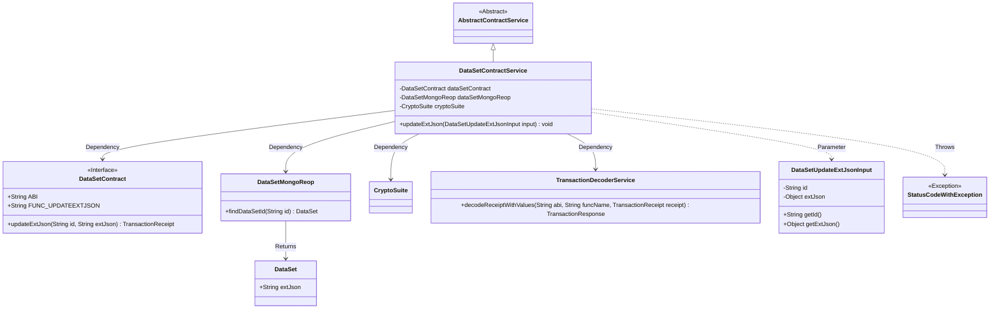
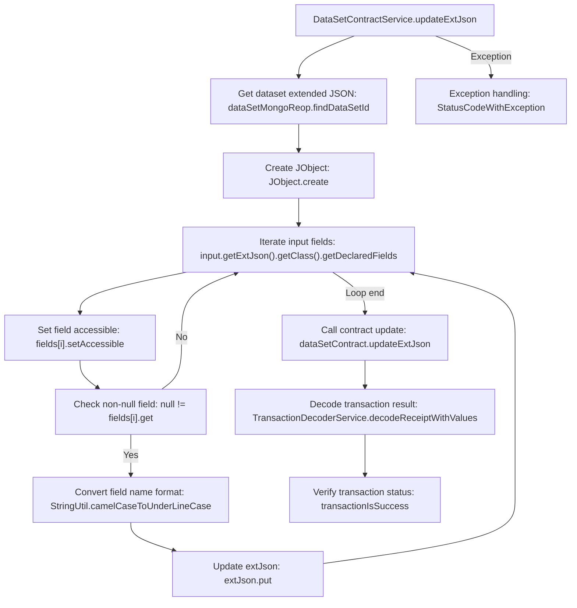

# Basic Information

|      |      |
|------|------|
| Name | DataSetContractService |
| Language | .java |
| Code Path | WeFe/manager/manager-service/src/main/java/com/welab/wefe/manager/service/service/DataSetContractService.java |
| Package Name | com.welab.wefe.manager.service.service |
| Dependencies | ['com.welab.wefe.common.StatusCode', 'com.welab.wefe.common.data.mongodb.repo.DataSetMongoReop', 'com.welab.wefe.common.exception.StatusCodeWithException', 'com.welab.wefe.common.util.JObject', 'com.welab.wefe.common.util.StringUtil', 'com.welab.wefe.manager.service.contract.DataSetContract', 'com.welab.wefe.manager.service.dto.dataset.DataSetUpdateExtJsonInput', 'org.fisco.bcos.sdk.crypto.CryptoSuite', 'org.fisco.bcos.sdk.model.TransactionReceipt', 'org.fisco.bcos.sdk.transaction.codec.decode.TransactionDecoderService', 'org.fisco.bcos.sdk.transaction.model.dto.TransactionResponse', 'org.springframework.beans.factory.annotation.Autowired', 'org.springframework.stereotype.Service', 'java.lang.reflect.Field'] |
| Brief Description | The `DataSetContractService` class is used to update the dataset extension JSON. It retrieves input fields via reflection and converts them to underscore format, updates MongoDB data, then invokes the smart contract to update on-chain data, processes transaction receipts, and checks the results. A system error is thrown in case of exceptions. |

# Description

The DataSetContractService is a service class that inherits from AbstractContractService and is used to update the extended JSON information of a dataset. It implements its functionality by injecting the DataSetContract, DataSetMongoRepo, and CryptoSuite components. The updateExtJson method takes the input parameter DataSetUpdateExtJsonInput, first retrieves the existing extended JSON from MongoDB, and then uses reflection to convert non-null fields in the input object into underscore naming format and updates them into the JSON. Subsequently, it invokes the updateExtJson method of the smart contract to submit the transaction and uses TransactionDecoderService to decode the transaction receipt for result verification. If any exceptions occur during the process, a StatusCodeWithException is thrown to indicate a system error. The entire process involves key steps such as data querying, reflection processing, blockchain transaction submission, and result verification.

# Class Summary

| Name   | Type  | Description |
|-------|------|-------------|
| DataSetContractService | class | The DataSetContractService class provides the updateExtJson method, which is used to update the dataset's extended JSON. It processes input fields through reflection, converts them to underscore format, and updates them to MongoDB. Finally, it invokes the smart contract to update on-chain data, processes transaction receipts, and checks the results. A system error is thrown in case of exceptions. |

## Class DataSetContractService

|      |      |
|------|------|
| Access Modifier | @Service;public |
| Type | class |
| Name | DataSetContractService |
| Description | The DataSetContractService class provides the updateExtJson method, which is used to update the dataset's extended JSON. It processes input fields through reflection, converts them to underscore format, and updates them to MongoDB. Finally, it invokes the smart contract to update on-chain data, processes transaction receipts, and checks the results. A system error is thrown in case of exceptions. |

### UML Class Diagram

The diagram illustrates how `DataSetContractService` inherits from `AbstractContractService` and relies on multiple components to implement data update functionality. The core method `updateExtJson` processes input object fields via reflection, invokes the contract to update data, and decodes transaction receipts to verify results. Key classes involved include data access objects, blockchain contract interfaces, cryptographic utilities, and exception handling classes, forming a complete data update workflow.

### Internal Method Call Graph

This flowchart illustrates the complete execution process of the updateExtJson method in the DataSetContractService class. The method first retrieves the dataset extended JSON from MongoDB, then iterates through all fields of the input object via reflection, converts non-null fields to underscore naming format and updates them to the extJson object. Subsequently, it calls the smart contract to update the data, and finally decodes and verifies the transaction result. The entire process includes an exception handling mechanism, where any step failure will throw StatusCodeWithException. The flowchart clearly presents four main stages: data preparation, field processing, contract invocation, and result verification, along with the logical decision relationships between each stage.

### Field List

| Name  | Type  | Description |
|-------|-------|------|
| dataSetMongoReop | DataSetMongoReop | Using @Autowired to automatically inject the DataSetMongoReop repository instance. |
| dataSetContract | DataSetContract | Automatically inject the DataSetContract instance. |
| cryptoSuite | CryptoSuite | Automatically inject encrypted tool component instances. |

### Method List

| Name  | Type  | Description |
|-------|-------|------|
| updateExtJson | void | The method `updateExtJson` is used to update the dataset extension JSON. It processes input fields via reflection, converts them to underscore format, and updates them in MongoDB. Finally, it invokes a smart contract to validate the transaction result. A system error is thrown in case of exceptions. |

