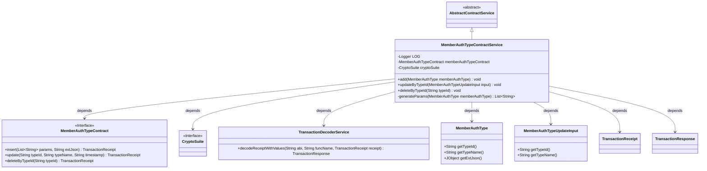
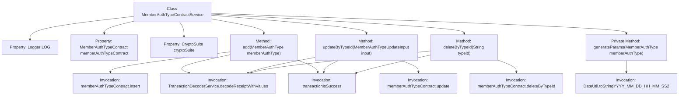

# Basic Information

|      |      |
|------|------|
| Name | MemberAuthTypeContractService |
| Language | .java |
| Code Path | WeFe/manager/manager-service/src/main/java/com/welab/wefe/manager/service/service/MemberAuthTypeContractService.java |
| Package Name | com.welab.wefe.manager.service.service |
| Dependencies | ['com.welab.wefe.common.StatusCode', 'com.welab.wefe.common.data.mongodb.entity.union.MemberAuthType', 'com.welab.wefe.common.exception.StatusCodeWithException', 'com.welab.wefe.common.util.DateUtil', 'com.welab.wefe.common.util.JObject', 'com.welab.wefe.common.util.StringUtil', 'com.welab.wefe.manager.service.contract.MemberAuthTypeContract', 'com.welab.wefe.manager.service.dto.authtype.MemberAuthTypeUpdateInput', 'org.fisco.bcos.sdk.crypto.CryptoSuite', 'org.fisco.bcos.sdk.model.TransactionReceipt', 'org.fisco.bcos.sdk.transaction.codec.decode.TransactionDecoderService', 'org.fisco.bcos.sdk.transaction.model.dto.TransactionResponse', 'org.slf4j.Logger', 'org.slf4j.LoggerFactory', 'org.springframework.beans.factory.annotation.Autowired', 'org.springframework.stereotype.Service', 'java.util.ArrayList', 'java.util.Date', 'java.util.List'] |
| Brief Description | The MemberAuthTypeContractService class provides functionalities for adding, deleting, and modifying member authentication types, implemented through blockchain transactions, including logging and exception handling. |

# Description

The MemberAuthTypeContractService is a service class that inherits from AbstractContractService, designed to manage contract operations for member authentication types. Its primary functionalities include adding, updating, and deleting member authentication types. The addition feature sends transactions via the insert method and processes the returned results; the update feature modifies type names based on type IDs through the update method; the deletion feature removes records by type ID using the deleteByTypeId method. All operations verify the transaction response status, throwing exceptions and logging errors upon failure. The internal method generateParams is used to generate transaction parameter lists.

# Class Summary

| Name   | Type  | Description |
|-------|------|-------------|
| MemberAuthTypeContractService | class | The MemberAuthTypeContractService class provides functionalities for adding, deleting, and modifying member authentication types. It operates through smart contracts, processes transaction receipts, and includes logging and exception handling. |

## Class MemberAuthTypeContractService

|      |      |
|------|------|
| Access Modifier | @Service;public |
| Type | class |
| Name | MemberAuthTypeContractService |
| Description | The MemberAuthTypeContractService class provides functionalities for adding, deleting, and modifying member authentication types. It operates through smart contracts, processes transaction receipts, and includes logging and exception handling. |

### UML Class Diagram

Class Diagram Description: MemberAuthTypeContractService inherits from AbstractContractService and is a service class responsible for handling CRUD operations of member authentication types. It depends on the MemberAuthTypeContract interface for blockchain contract operations, utilizes CryptoSuite for cryptographic operations, and parses transaction receipts via TransactionDecoderService. Key methods include adding (add), updating (updateByTypeId), and deleting (deleteByTypeId) member authentication types, with an internal generateParams method for generating contract invocation parameters.

### Internal Method Call Graph

This code illustrates a service class named MemberAuthTypeContractService, primarily designed for handling CRUD operations on member authentication types. Inheriting from AbstractContractService, the class contains three main methods: add for creating member authentication types, updateByTypeId for modifying specified authentication records, and deleteByTypeId for removing designated authentication entries. Each method invokes corresponding smart contract functionalities, parses transaction receipts via TransactionDecoderService, and verifies results using transactionIsSuccess. The private method generateParams prepares parameter lists for creation operations. The process incorporates auxiliary features including logging, exception handling, and date formatting.

### Field List

| Name  | Type  | Description |
|-------|-------|------|
| memberAuthTypeContract | MemberAuthTypeContract | Use @Autowired to automatically inject the MemberAuthTypeContract instance. |
| cryptoSuite | CryptoSuite | Use @Autowired to automatically inject the CryptoSuite encryption tool instance. |
| LOG = LoggerFactory.getLogger(MemberAuthTypeContractService.class) | Logger | The class MemberAuthTypeContractService defines a static immutable logger LOG. |

### Method List

| Name  | Type  | Description |
|-------|-------|------|
| add | void | The method sends a transaction to the blockchain to add a member authentication type, processes the transaction receipt, and checks the result. It logs success and throws an exception on failure. |
| updateByTypeId | void | The method `updateByTypeId` updates member authentication types via smart contracts, processes transaction receipts, and checks the results, throwing an exception upon failure. |
| deleteByTypeId | void | This method deletes member authorization types by typeId, invokes the smart contract function, and processes the transaction receipt, throwing an exception upon failure. |
| generateParams | List<String> | Method for generating parameter list: Retrieve type ID and name based on MemberAuthType, add current timestamp, and return the list. |

