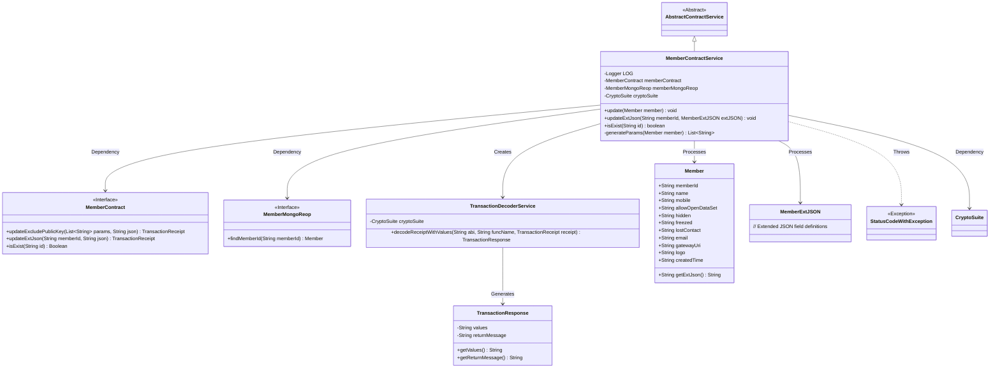
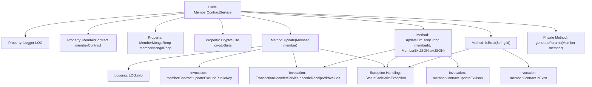

# Basic Information

|      |      |
|------|------|
| Name | MemberContractService |
| Language | .java |
| Code Path | WeFe/manager/manager-service/src/main/java/com/welab/wefe/manager/service/service/MemberContractService.java |
| Package Name | com.welab.wefe.manager.service.service |
| Dependencies | ['com.welab.wefe.common.StatusCode', 'com.welab.wefe.common.data.mongodb.entity.union.Member', 'com.welab.wefe.common.data.mongodb.entity.union.ext.MemberExtJSON', 'com.welab.wefe.common.data.mongodb.repo.MemberMongoReop', 'com.welab.wefe.common.exception.StatusCodeWithException', 'com.welab.wefe.common.util.DateUtil', 'com.welab.wefe.common.util.JObject', 'com.welab.wefe.common.util.StringUtil', 'com.welab.wefe.manager.service.contract.MemberContract', 'org.fisco.bcos.sdk.crypto.CryptoSuite', 'org.fisco.bcos.sdk.model.TransactionReceipt', 'org.fisco.bcos.sdk.transaction.codec.decode.TransactionDecoderService', 'org.fisco.bcos.sdk.transaction.model.dto.TransactionResponse', 'org.slf4j.Logger', 'org.slf4j.LoggerFactory', 'org.springframework.beans.factory.annotation.Autowired', 'org.springframework.stereotype.Service', 'java.lang.reflect.Field', 'java.util.ArrayList', 'java.util.Date', 'java.util.List'] |
| Brief Description | The MemberContractService class inherits from AbstractContractService, providing member contract updates, extended JSON updates, and member existence verification functionality, handling blockchain transactions and logging operations. |

# Description

The `MemberContractService` is a service class that inherits from `AbstractContractService`, primarily designed to handle member contract-related operations. It includes three main methods: `update` for updating member information via blockchain transactions, which also processes transaction responses; `updateExtJson` for updating a member's extended JSON information by dynamically handling fields through reflection; and `isExist` for checking whether member information exists. The class employs logging and exception handling to ensure traceability and error management. Additionally, the `generateParams` method is used to generate parameter lists for member information. The service relies on components such as `MemberContract` and `MemberMongoReop`, and integrates `CryptoSuite` for cryptographic operations.

# Class Summary

| Name   | Type  | Description |
|-------|------|-------------|
| MemberContractService | class | The MemberContractService class provides member contract operations, including updating member information, checking member existence, and handling transaction responses. It ensures data consistency through blockchain transactions and exception handling. |

## Class MemberContractService

|      |      |
|------|------|
| Access Modifier | @Service;public |
| Type | class |
| Name | MemberContractService |
| Description | The MemberContractService class provides member contract operations, including updating member information, checking member existence, and handling transaction responses. It ensures data consistency through blockchain transactions and exception handling. |

### UML Class Diagram

Class Diagram Description: This diagram illustrates that MemberContractService inherits from AbstractContractService and depends on components such as MemberContract, MemberMongoReop, and CryptoSuite. Its primary functionalities include updating member information, checking member existence, etc., with data updates implemented through blockchain transactions while handling various exception scenarios. TransactionDecoderService is used to parse transaction receipts, and Member and MemberExtJSON represent the member data models.

### Internal Method Call Graph

This flowchart illustrates the structure and key method invocation relationships of the MemberContractService class. The class contains 4 properties and 4 methods, with update() and updateExtJson() being core business methods involving blockchain transaction processing and exception handling. Methods interact through the memberContract member variable and uniformly use TransactionDecoderService for transaction receipt parsing. Exception handling permeates all public methods, demonstrating robust error handling mechanisms. The private utility method generateParams() provides parameter preprocessing for update(). The overall structure clearly presents the service layer's business logic and data flow paths.

### Field List

| Name  | Type  | Description |
|-------|-------|------|
| LOG = LoggerFactory.getLogger(MemberContractService.class) | Logger | The class MemberContractService defines a private static immutable log object LOG. |
| memberContract | MemberContract | The code automatically injects the MemberContract member variable via @Autowired. |
| memberMongoReop | MemberMongoReop | Use @Autowired to automatically inject the MemberMongoReop member variable. |
| cryptoSuite | CryptoSuite | The code automatically injects an instance of the CryptoSuite encryption utility class via @Autowired. |

### Method List

| Name  | Type  | Description |
|-------|-------|------|
| update | void | Update member information, send the transaction and process the returned result. If the transaction is abnormal or the data does not exist, an error will be thrown. When an exception is caught, log it and prompt a system error. |
| updateExtJson | void | Method for updating member extension JSON data: Retrieve field values via reflection, convert them to underscore format and store in JObject, then invoke the smart contract to update and verify the transaction result, throwing a system error on exception. |
| isExist | boolean | Check whether the member information exists, return a boolean value upon success, and throw a system error exception upon failure. |
| generateParams | List<String> | Generate a parameter list including member ID, name, mobile number, permission status, hidden freeze flag, lost contact status, email, gateway URI, LOGO, creation time, current time, and timestamp. |

