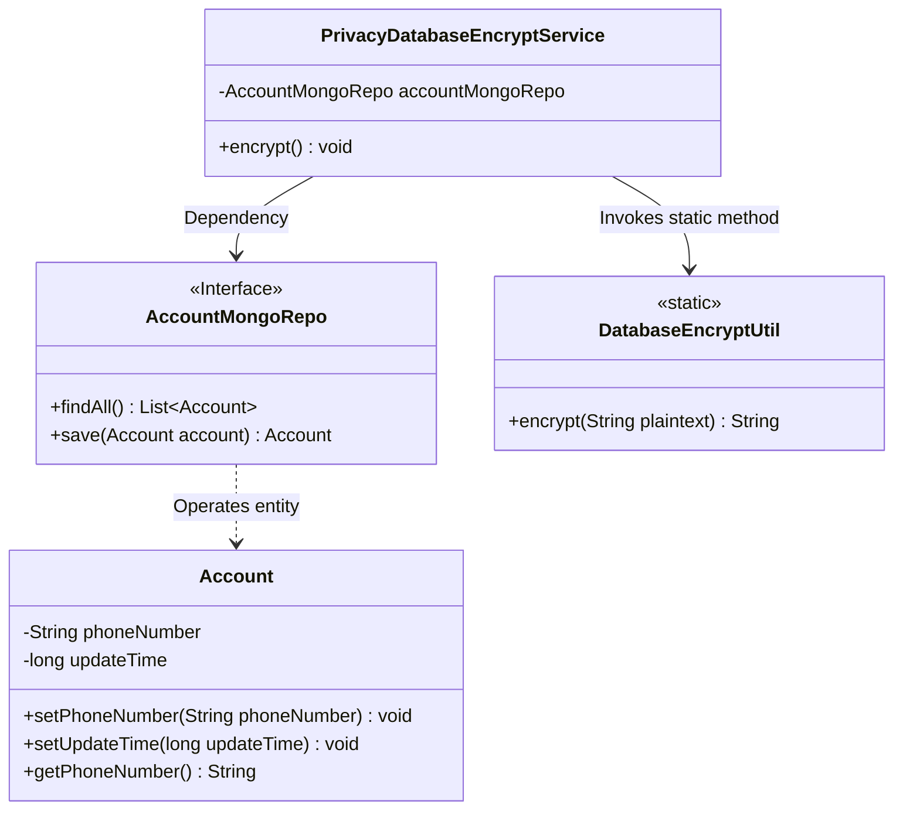
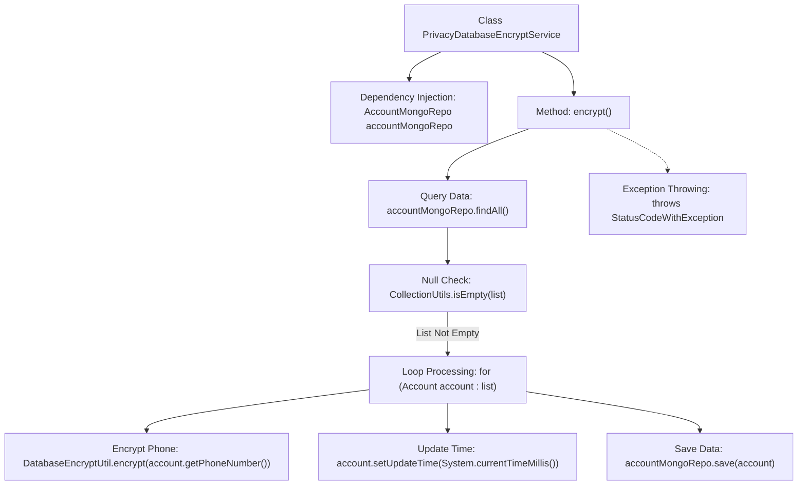

# Basic Information

|      |      |
|------|------|
| Name | PrivacyDatabaseEncryptService |
| Language | .java |
| Code Path | WeFe/manager/manager-service/src/main/java/com/welab/wefe/manager/service/service/PrivacyDatabaseEncryptService.java |
| Package Name | com.welab.wefe.manager.service.service |
| Dependencies | ['com.welab.wefe.common.data.mongodb.entity.manager.Account', 'com.welab.wefe.common.data.mongodb.repo.AccountMongoRepo', 'com.welab.wefe.common.exception.StatusCodeWithException', 'com.welab.wefe.common.web.util.DatabaseEncryptUtil', 'org.springframework.beans.factory.annotation.Autowired', 'org.springframework.stereotype.Service', 'org.springframework.util.CollectionUtils', 'java.util.List'] |
| Brief Description | Privacy database encryption service retrieves the account list via AccountMongoRepo, encrypts phone numbers using DatabaseEncryptUtil, updates the modification time, and finally saves the data to the database. |

# Description

This is a service class named PrivacyDatabaseEncryptService, designed for encrypting private data in databases. It retrieves all account data through the auto-injected AccountMongoRepo, checks if the list is empty, then iterates through each account object to encrypt the phone number field using the DatabaseEncryptUtil tool, updates the last modified timestamp, and finally saves the encrypted account data back to the database. The entire process is encapsulated in the encrypt method, which may throw a StatusCodeWithException.

# Class Summary

| Name   | Type  | Description |
|-------|------|-------------|
| PrivacyDatabaseEncryptService | class | Privacy Database Encryption Service retrieves a list of accounts via AccountMongoRepo, encrypts the phone number of each account, updates the modification time, and finally saves the data to the database. |

## Class PrivacyDatabaseEncryptService

|      |      |
|------|------|
| Access Modifier | @Service;public |
| Type | class |
| Name | PrivacyDatabaseEncryptService |
| Description | Privacy Database Encryption Service retrieves a list of accounts via AccountMongoRepo, encrypts the phone number of each account, updates the modification time, and finally saves the data to the database. |

### UML Class Diagram

This class diagram illustrates the core structure of a privacy data encryption service. The PrivacyDatabaseEncryptService retrieves account data by depending on the AccountMongoRepo interface, invokes the static encryption method of DatabaseEncryptUtil to process phone numbers during traversal, and finally persists updates through the repository. The Account entity class stores core fields, with the entire flow implementing batch encryption of sensitive database fields, including boundary handling such as empty collection checks and update time recording.

### Internal Method Call Graph

This code flowchart illustrates the core logic of the privacy data encryption service. The service first queries all account data through the MongoDB repository, performs null checks, then iteratively processes each account: encrypting the phone number field using a utility class, updating the modification timestamp, and finally saving it back to the database. The entire process is encapsulated within a method that may throw StatusCodeWithException, demonstrating the complete workflow of batch data encryption and its security protection mechanisms.

### Field List

| Name  | Type  | Description |
|-------|-------|------|
| accountMongoRepo | AccountMongoRepo | Using @Autowired to automatically inject an instance of AccountMongoRepo. |

### Method List

| Name  | Type  | Description |
|-------|-------|------|
| encrypt | void | Encrypt all account mobile numbers and update the modification time. Return directly if no accounts exist. |

