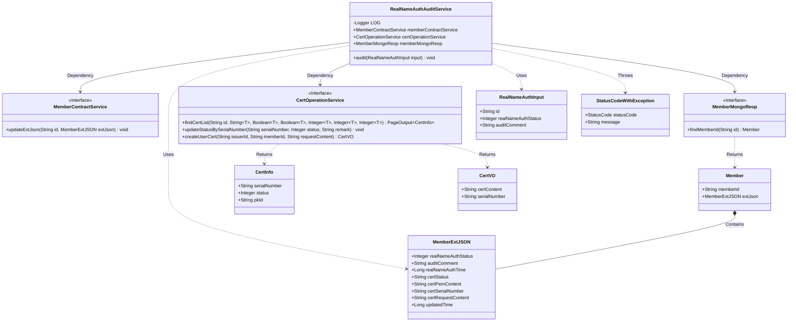
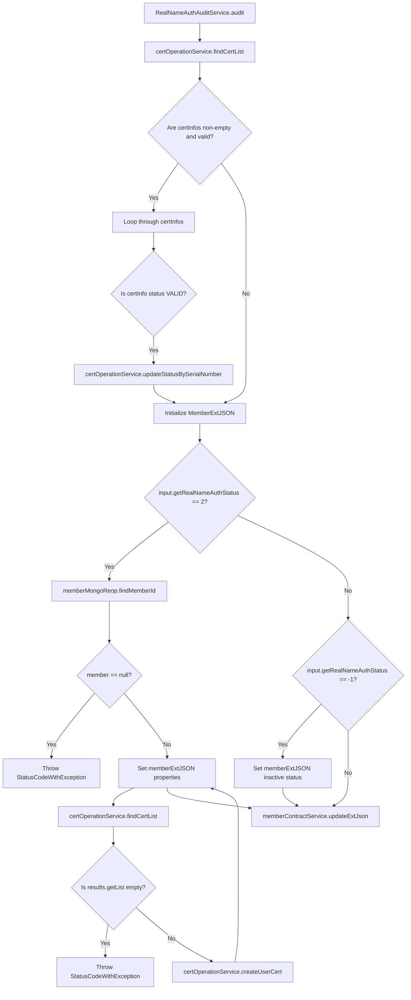

# Basic Information

|      |      |
|------|------|
| Name | RealNameAuthAuditService |
| Language | .java |
| Code Path | WeFe/manager/manager-service/src/main/java/com/welab/wefe/manager/service/service/RealNameAuthAuditService.java |
| Package Name | com.welab.wefe.manager.service.service |
| Dependencies | ['com.webank.cert.mgr.model.vo.CertVO', 'com.webank.cert.mgr.service.CertOperationService', 'com.webank.cert.toolkit.enums.CertStatusEnums', 'com.welab.wefe.common.StatusCode', 'com.welab.wefe.common.data.mongodb.dto.PageOutput', 'com.welab.wefe.common.data.mongodb.entity.manager.CertInfo', 'com.welab.wefe.common.data.mongodb.entity.union.Member', 'com.welab.wefe.common.data.mongodb.entity.union.ext.MemberExtJSON', 'com.welab.wefe.common.data.mongodb.repo.MemberMongoReop', 'com.welab.wefe.common.exception.StatusCodeWithException', 'com.welab.wefe.manager.service.dto.member.RealNameAuthInput', 'org.slf4j.Logger', 'org.slf4j.LoggerFactory', 'org.springframework.beans.factory.annotation.Autowired', 'org.springframework.stereotype.Service', 'org.springframework.util.CollectionUtils', 'javax.transaction.Transactional', 'java.util.List'] |
| Brief Description | The RealNameAuthAuditService handles real-name authentication reviews, updates certificate statuses and member information, including issuing new certificates or marking invalid statuses. |

# Description

The RealNameAuthAuditService is a service class designed to handle real-name authentication audits. It obtains MemberContractService, CertOperationService, and MemberMongoReop services through dependency injection. The audit method accepts a RealNameAuthInput parameter and processes the real-name authentication audit logic. It first checks and updates the status of existing certificates to invalid, then updates member extension information based on the audit status. If the audit is approved (status 2), a new certificate is issued and certificate information is updated; if the audit fails (status -1), the certificate is marked as invalid. Finally, the member extension information is updated via memberContractService. The entire process includes transaction management to ensure data consistency.

# Class Summary

| Name   | Type  | Description |
|-------|------|-------------|
| RealNameAuthAuditService | class | The RealNameAuthAuditService handles real-name authentication audits, updates certificate statuses, and member information. It issues new certificates upon approval and marks them as invalid if rejected. It involves the MemberContractService, CertOperationService, and MemberMongoReop services. |

## Class RealNameAuthAuditService

|      |      |
|------|------|
| Access Modifier | @Service;public |
| Type | class |
| Name | RealNameAuthAuditService |
| Description | The RealNameAuthAuditService handles real-name authentication audits, updates certificate statuses, and member information. It issues new certificates upon approval and marks them as invalid if rejected. It involves the MemberContractService, CertOperationService, and MemberMongoReop services. |

### UML Class Diagram

This class diagram illustrates the core structure of the Real-Name Authentication Audit Service (RealNameAuthAuditService) and its dependencies. The service leverages three interfaces—MemberContractService, CertOperationService, and MemberMongoReop—to perform member information updates, certificate operations, and member data queries. Key processes include verifying certificate status, updating member real-name authentication status, and issuing new certificates, involving multiple data transfer objects such as RealNameAuthInput, MemberExtJSON, and CertInfo. The system handles exceptions by throwing StatusCodeWithException, reflecting a clear division of responsibilities and modular design in the overall architecture.

### Internal Method Call Graph

Flowchart description: This flowchart illustrates the core logic flow of the real-name authentication audit service. It begins by querying the certificate list and processing valid certificates, then branches based on audit status (pass/fail): issuing new certificates and updating user extension information when passed, or marking certificates as invalid when failed. The process involves certificate status updates, member information queries, certificate issuance, and data persistence operations, with multiple exception handling branches.

### Field List

| Name  | Type  | Description |
|-------|-------|------|
| LOG = LoggerFactory.getLogger(RealNameAuthAuditService.class) | Logger | Define the static constant LOG in the RealNameAuthAuditService class for logging purposes. |
| memberContractService | MemberContractService | Automatically inject member contract service instance. |
| memberMongoReop | MemberMongoReop | The code snippet uses @Autowired to automatically inject an instance of the MemberMongoReop repository. |
| certOperationService | CertOperationService | Use @Autowired to automatically inject an instance of CertOperationService. |

### Method List

| Name  | Type  | Description |
|-------|-------|------|
| audit | void | This method handles real-name authentication review: if the status is 2 (approved), it updates the user certificate status to valid and issues a new certificate; if the status is -1 (failed), it marks the certificate as invalid. During the process, it checks the existing certificate status and updates the user's extended information. |

