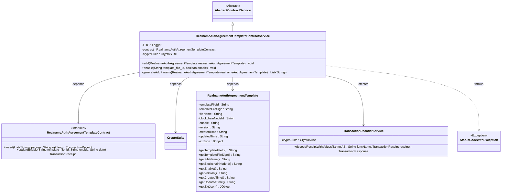

# Basic Information

|      |      |
|------|------|
| Name | RealnameAuthAgreementTemplateContractService |
| Language | .java |
| Code Path | WeFe/manager/manager-service/src/main/java/com/welab/wefe/manager/service/service/RealnameAuthAgreementTemplateContractService.java |
| Package Name | com.welab.wefe.manager.service.service |
| Dependencies | ['com.welab.wefe.common.StatusCode', 'com.welab.wefe.common.data.mongodb.entity.union.RealnameAuthAgreementTemplate', 'com.welab.wefe.common.exception.StatusCodeWithException', 'com.welab.wefe.common.util.JObject', 'com.welab.wefe.manager.service.contract.RealnameAuthAgreementTemplateContract', 'org.fisco.bcos.sdk.crypto.CryptoSuite', 'org.fisco.bcos.sdk.model.TransactionReceipt', 'org.fisco.bcos.sdk.transaction.codec.decode.TransactionDecoderService', 'org.fisco.bcos.sdk.transaction.model.dto.TransactionResponse', 'org.slf4j.Logger', 'org.slf4j.LoggerFactory', 'org.springframework.beans.factory.annotation.Autowired', 'org.springframework.stereotype.Service', 'java.util.ArrayList', 'java.util.Date', 'java.util.List', 'com.welab.wefe.common.util.DateUtil.toStringYYYY_MM_DD_HH_MM_SS2'] |
| Brief Description | The RealnameAuthAgreementTemplateContractService provides functionalities for adding and enabling real-name authentication agreement templates. It achieves data on-chain through blockchain transactions, incorporating exception handling and logging mechanisms. |

# Description

The `RealnameAuthAgreementTemplateContractService` is a service class that inherits from `AbstractContractService` and is used to handle contract operations for real-name authentication agreement templates. This class includes two main methods: the `add` method is used to add new agreement templates by executing contract insertion transactions and processing transaction receipts, while the `enable` method is used to enable or disable agreement templates based on the specified template file ID. Additionally, the `generateAddParams` method generates the parameter list required for adding agreement templates. The class injects a contract instance and an encryption suite, and logs operation processes and exception information.

# Class Summary

| Name   | Type  | Description |
|-------|------|-------------|
| RealnameAuthAgreementTemplateContractService | class | The RealnameAuthAgreementTemplateContractService provides functionalities for adding and enabling real-name authentication agreement templates, processes data through blockchain transactions, and includes exception handling and logging. |

## Class RealnameAuthAgreementTemplateContractService

|      |      |
|------|------|
| Access Modifier | @Service;public |
| Type | class |
| Name | RealnameAuthAgreementTemplateContractService |
| Description | The RealnameAuthAgreementTemplateContractService provides functionalities for adding and enabling real-name authentication agreement templates, processes data through blockchain transactions, and includes exception handling and logging. |

### UML Class Diagram

This class diagram illustrates the core structure of the Real-name Authentication Agreement Template Contract Service. RealnameAuthAgreementTemplateContractService inherits from AbstractContractService, relies on the RealnameAuthAgreementTemplateContract interface for blockchain operations, utilizes CryptoSuite for encryption/decryption, and processes RealnameAuthAgreementTemplate entity data. The service includes two main methods: adding templates and enabling/disabling templates. It parses transaction receipts via TransactionDecoderService and may throw StatusCodeWithException. The overall design reflects a typical layered architecture for blockchain contract services.

### Internal Method Call Graph

This flowchart illustrates the core structure of the real-name authentication agreement template service class, containing two main business methods: template addition (add) and enable control (enable). The sequence diagram details the complete blockchain contract invocation process, including key steps such as parameter generation, transaction submission, receipt decoding, and result validation, while covering exception handling paths. The class employs contract instances and cryptographic suites through composition, demonstrating clear responsibility division.

### Field List

| Name  | Type  | Description |
|-------|-------|------|
| LOG = LoggerFactory.getLogger(RealnameAuthAgreementTemplateContractService.class) | Logger | A static immutable logger LOG is defined in the class RealnameAuthAgreementTemplateContractService. |
| cryptoSuite | CryptoSuite | Automatically inject cipher suite instances. |
| contract | RealnameAuthAgreementTemplateContract | Use @Autowired to automatically inject the RealnameAuthAgreementTemplateContract contract instance. |

### Method List

| Name  | Type  | Description |
|-------|-------|------|
| enable | void | The method `enable` updates the template activation status via a smart contract, processes the transaction receipt, and checks the result, throwing an exception upon failure. |
| add | void | This method is used to add a real-name authentication agreement template, insert template data via contract transactions, process transaction receipts and check the results, log successes, and throw exceptions for failures. |
| generateAddParams | List<String> | Generate a list of parameters for the real-name authentication agreement template, including file ID, signature, name, blockchain node ID, activation status, version, and creation/update time. |

