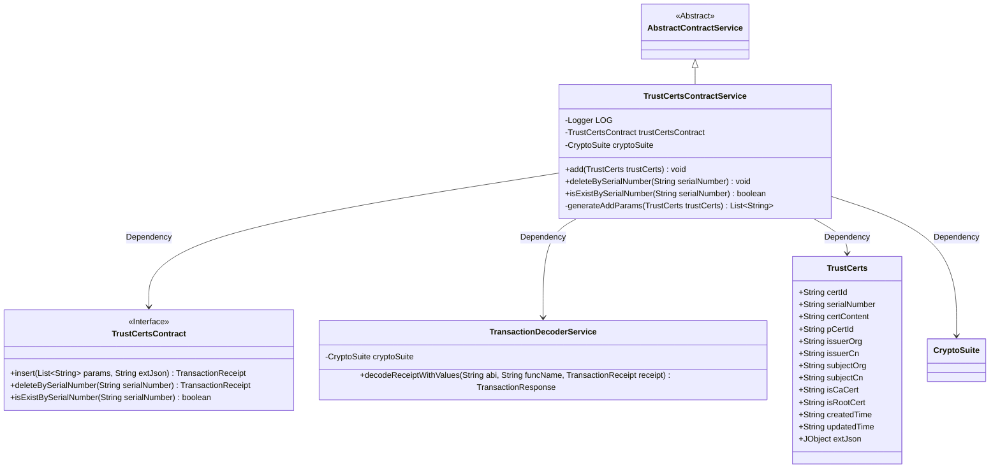
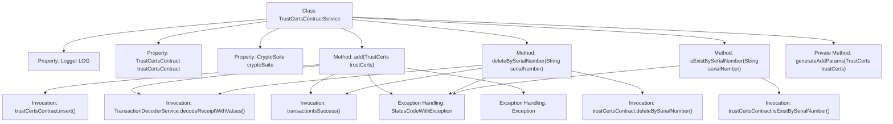

# Basic Information

|      |      |
|------|------|
| Name | TrustCertsContractService |
| Language | .java |
| Code Path | WeFe/manager/manager-service/src/main/java/com/welab/wefe/manager/service/service/TrustCertsContractService.java |
| Package Name | com.welab.wefe.manager.service.service |
| Dependencies | ['com.welab.wefe.common.StatusCode', 'com.welab.wefe.common.data.mongodb.entity.union.TrustCerts', 'com.welab.wefe.common.exception.StatusCodeWithException', 'com.welab.wefe.common.util.JObject', 'com.welab.wefe.common.util.StringUtil', 'com.welab.wefe.manager.service.contract.TrustCertsContract', 'org.fisco.bcos.sdk.crypto.CryptoSuite', 'org.fisco.bcos.sdk.model.TransactionReceipt', 'org.fisco.bcos.sdk.transaction.codec.decode.TransactionDecoderService', 'org.fisco.bcos.sdk.transaction.model.dto.TransactionResponse', 'org.slf4j.Logger', 'org.slf4j.LoggerFactory', 'org.springframework.beans.factory.annotation.Autowired', 'org.springframework.stereotype.Service', 'java.util.ArrayList', 'java.util.List'] |
| Brief Description | The TrustCertsContractService provides certificate management functionalities, including adding, deleting, and querying certificates. When adding a certificate, it generates parameters and sends transactions, while deletion and query operations are performed via serial numbers. It features robust exception handling and detailed logging. |

# Description

TrustCertsContractService is a service class that inherits from AbstractContractService, designed to manage the addition, deletion, and querying of trust certificates. By auto-injecting instances of TrustCertsContract and CryptoSuite, this class provides three main methods: the `add` method for adding certificates, processing transaction receipts, and logging; `deleteBySerialNumber` for deleting certificates by their serial numbers; and `isExistBySerialNumber` to check the existence of a certificate. The `generateAddParams` method converts certificate attributes into a parameter list. All operations include exception handling, throwing StatusCodeWithException exceptions.

# Class Summary

| Name   | Type  | Description |
|-------|------|-------------|
| TrustCertsContractService | class | The TrustCertsContractService provides functionalities for adding, deleting, and checking certificates, processes transaction receipts and logs records, and throws status code errors in case of exceptions. |

## Class TrustCertsContractService

|      |      |
|------|------|
| Access Modifier | @Service;public |
| Type | class |
| Name | TrustCertsContractService |
| Description | The TrustCertsContractService provides functionalities for adding, deleting, and checking certificates, processes transaction receipts and logs records, and throws status code errors in case of exceptions. |

### UML Class Diagram

This code demonstrates a service class named TrustCertsContractService, which inherits from AbstractContractService and is primarily used for handling contract operations related to trust certificates (TrustCerts). The class relies on the TrustCertsContract interface to perform insert, delete, and query operations, uses TransactionDecoderService to parse transaction receipts, and employs CryptoSuite for cryptographic operations. The TrustCerts class contains various attributes of certificates, such as certificate ID, serial number, issuer and subject information, etc. The overall design reflects clear separation of responsibilities and modular thinking, ensuring operational reliability through exception handling and logging.

### Internal Method Call Graph

This code illustrates a service class named TrustCertsContractService, primarily designed for managing trust certificate operations including addition, deletion, and querying. The class contains three main methods: add() for certificate addition, deleteBySerialNumber() for certificate deletion, and isExistBySerialNumber() for certificate existence verification. Each method incorporates exception handling logic, with the add() method being the most complex, involving parameter generation, transaction submission, receipt decoding, and result validation. The private method generateAddParams() prepares parameter lists for addition operations. The class obtains TrustCertsContract and CryptoSuite instances through dependency injection and utilizes a logger for outputting logs.

### Field List

| Name  | Type  | Description |
|-------|-------|------|
| cryptoSuite | CryptoSuite | The code automatically injects an instance of the CryptoSuite encryption utility class via @Autowired. |
| LOG = LoggerFactory.getLogger(TrustCertsContractService.class) | Logger | Define the static log object LOG for the TrustCertsContractService class. |
| trustCertsContract | TrustCertsContract | Automatically inject the TrustCertsContract contract instance. |

### Method List

| Name  | Type  | Description |
|-------|-------|------|
| add | void | This method is used to add trusted certificates, invoke the contract to insert data and process transaction receipts, log successes, and throw errors in case of exceptions. |
| deleteBySerialNumber | void | This method revokes trust certificates by serial number, invokes smart contracts for processing, and checks transaction results, throwing an exception upon failure. |
| isExistBySerialNumber | boolean | Check whether the certificate serial number exists, and throw a system error if abnormal. |
| generateAddParams | List<String> | Generate a list of parameters for the TrustCerts object, including certificate ID, serial number, content, parent certificate ID, issuer information, subject information, CA flag, root certificate flag, and timestamp. Convert null values to empty strings. |

