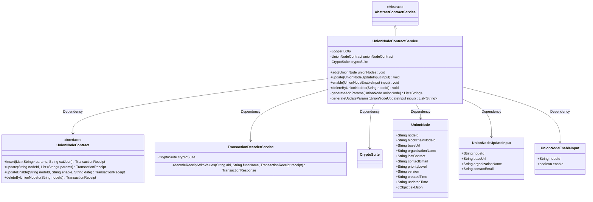
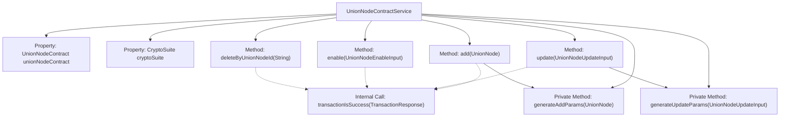
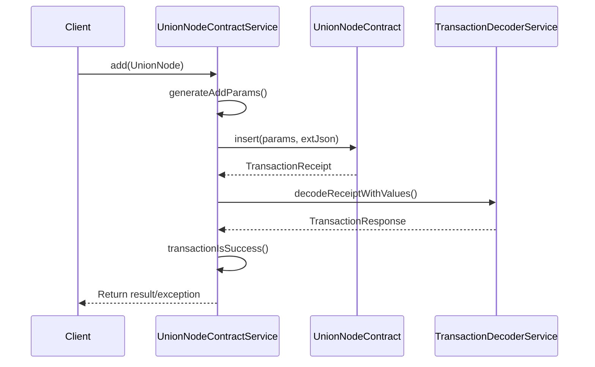

# Basic Information

|      |      |
|------|------|
| Name | UnionNodeContractService |
| Language | .java |
| Code Path | WeFe/manager/manager-service/src/main/java/com/welab/wefe/manager/service/service/UnionNodeContractService.java |
| Package Name | com.welab.wefe.manager.service.service |
| Dependencies | ['com.welab.wefe.common.StatusCode', 'com.welab.wefe.common.data.mongodb.entity.union.UnionNode', 'com.welab.wefe.common.exception.StatusCodeWithException', 'com.welab.wefe.common.util.JObject', 'com.welab.wefe.common.util.StringUtil', 'com.welab.wefe.manager.service.contract.UnionNodeContract', 'com.welab.wefe.manager.service.dto.union.UnionNodeEnableInput', 'com.welab.wefe.manager.service.dto.union.UnionNodeUpdateInput', 'org.fisco.bcos.sdk.crypto.CryptoSuite', 'org.fisco.bcos.sdk.model.TransactionReceipt', 'org.fisco.bcos.sdk.transaction.codec.decode.TransactionDecoderService', 'org.fisco.bcos.sdk.transaction.model.dto.TransactionResponse', 'org.slf4j.Logger', 'org.slf4j.LoggerFactory', 'org.springframework.beans.factory.annotation.Autowired', 'org.springframework.stereotype.Service', 'java.util.ArrayList', 'java.util.Date', 'java.util.List', 'com.welab.wefe.common.util.DateUtil.toStringYYYY_MM_DD_HH_MM_SS2'] |
| Brief Description | The UnionNodeContractService provides functionalities for adding, deleting, modifying, and querying alliance nodes, including adding, updating, enabling/disabling, and deleting nodes, as well as processing transaction receipts and logging records. |

# Description

The UnionNodeContractService is a service class that inherits from AbstractContractService, designed to manage the CRUD operations of UnionNode entities. It implements node insertion, update, enable/disable, and deletion functionalities by invoking the unionNodeContract smart contract. Key methods include add (add a node), update (update node information), enable (enable/disable a node), and deleteByUnionNodeId (delete a node). Each method sends a transaction and decodes the transaction receipt to verify its success. Exception handling involves logging errors and throwing StatusCodeWithException. Private methods generateAddParams and generateUpdateParams are used to generate transaction parameter lists. Logging is implemented using SLF4J's Logger.

# Class Summary

| Name   | Type  | Description |
|-------|------|-------------|
| UnionNodeContractService | class | The UnionNodeContractService provides functionalities for adding, deleting, modifying, and querying alliance nodes, including operations such as adding nodes, updating information, enabling/disabling, and deletion, while processing transaction receipts and verifying results. |

## Class UnionNodeContractService

|      |      |
|------|------|
| Access Modifier | @Service;public |
| Type | class |
| Name | UnionNodeContractService |
| Description | The UnionNodeContractService provides functionalities for adding, deleting, modifying, and querying alliance nodes, including operations such as adding nodes, updating information, enabling/disabling, and deletion, while processing transaction receipts and verifying results. |

### UML Class Diagram

This code demonstrates the implementation of a Union Node Contract Service (UnionNodeContractService), which inherits from the Abstract Contract Service (AbstractContractService) and primarily provides CRUD operations for union nodes. The service interacts with blockchain smart contracts through the UnionNodeContract interface, utilizes TransactionDecoderService to parse transaction receipts, and handles various input parameter types (UnionNode/UnionNodeUpdateInput/UnionNodeEnableInput). The class diagram clearly illustrates the dependency relationships between the service and its components, as well as the structure of parameter objects.

### Internal Method Call Graph

This flowchart illustrates the core structure and invocation relationships of the UnionNodeContractService class, including 4 public business methods (add/update/enable/delete) and 2 private parameter generation methods. The sequence diagram details the complete call chain of the add method: client request → parameter generation → contract invocation → transaction decoding → result validation. All methods share the transactionIsSuccess verification logic, with exception handling integrated throughout the process.

### Field List

| Name  | Type  | Description |
|-------|-------|------|
| unionNodeContract | UnionNodeContract | Automatically inject the UnionNodeContract instance. |
| cryptoSuite | CryptoSuite | Automatically inject cipher suite instances. |
| LOG = LoggerFactory.getLogger(UnionNodeContractService.class) | Logger | The UnionNodeContractService class defines a static immutable logger LOG. |

### Method List

| Name  | Type  | Description |
|-------|-------|------|
| enable | void | The method `enable` updates the node state via a smart contract, processes transaction receipts, and checks the results, throwing an exception upon failure. |
| generateAddParams | List<String> | Generate a UnionNode parameter list, including fields such as node ID, URL, organization name, etc., with null values converted to empty strings. |
| deleteByUnionNodeId | void | This method deletes the specified node ID through a smart contract, processes the transaction receipt, and checks the result, throwing an exception if it fails. |
| add | void | This method sends a transaction to the blockchain to add a UnionNode. After generating the parameters, it invokes the contract insertion method, decodes the transaction receipt, and checks the result. If successful, it logs the outcome; if failed, it throws an exception. When catching an exception, it records the error and rethrows it. |
| generateUpdateParams | List<String> | Generate a list of update parameters, including the base URL, organization name, contact email, and current time, with null values converted to empty strings. |
| update | void | Update the UnionNode node information, process the input parameters, and call the contract update method. Decode the transaction receipt to verify the result, and throw an exception if it fails. |

