# Basic Information

|      |      |
|------|------|
| Name | service |
| Language | .java |
| Code Path | WeFe/manager/manager-service/src/main/java/com/welab/wefe/manager/service/service |
| Package Name | docs.manager.manager-service.src.main.java.com.welab.wefe.manager.service.service |
| Brief Description | The DataSetContractService updates dataset extension JSON, including query, reflection processing, blockchain transactions, and validation. The RealNameAuthAuditService handles real-name authentication audits, updating certificate statuses and member information. The RealnameAuthAgreementTemplateContractService manages the addition and activation of agreement templates. The AbstractContractService provides transaction result verification methods. The AccountService handles SSO account creation and updates. The DataResourceDefaultTagContractService and DataSetDefaultTagContractService manage tag additions, deletions, and modifications. The TrustCertsContractService processes certificate operations. The MemberAuthTypeContractService manages authentication types. The PrivacyDatabaseEncryptService encrypts private data. The DataResourceContractService updates data resource statuses. The UnionNodeContractService manages node operations. The MemberContractService handles member information updates and checks. |

# Description

## Overview  
This module serves as the core service layer of the blockchain data management platform, primarily handling business operations such as member authentication, data resource tag management, and smart contract interactions. All service classes inherit from the AbstractContractService base class, providing common capabilities like transaction status checks and exception handling. Key data structures include DataSetUpdateExtJsonInput (dataset extended JSON), RealNameAuthInput (real-name authentication parameters), and others. External dependencies include MongoDB (for storing account/member data), smart contracts (e.g., MemberContract), and CryptoSuite (encryption toolkit). For example, the PrivacyDatabaseEncryptService uses DatabaseEncryptUtil to encrypt phone number fields.  

## Key Business Scenarios  
The module supports three typical scenarios: 1) Real-name authentication management (e.g., RealNameAuthAuditService audits status changes); 2) Data resource tag maintenance (e.g., DataResourceDefaultTagContractService adds or deletes tags); 3) Member information updates (e.g., MemberContractService processes extended JSON). The interaction model resembles an enhanced CRUD pattern, combining blockchain transaction submissions (e.g., add/update methods) with MongoDB state synchronization. For instance, UnionNodeContractService generates parameters via generateAddParams before sending transactions. All operations include transaction management to ensure data consistency.

### Package Internal Structure View

```mermaid
graph TD
    service --> DataSetContractService.java
    service --> RealNameAuthAuditService.java
    service --> RealnameAuthAgreementTemplateContractService.java
    service --> AbstractContractService.java
    service --> AccountService.java
    service --> DataResourceDefaultTagContractService.java
    service --> DatSetDefaultTagContractService.java
    service --> TrustCertsContractService.java
    service --> MemberAuthTypeContractService.java
    service --> PrivacyDatabaseEncryptService.java
    service --> DataResourceContractService.java
    service --> UnionNodeContractService.java
    service --> MemberContractService.java
```

This flowchart displays 13 Java service class files under the service directory of the manager-service module. All service classes are directly subordinate to the service node, presenting a flat structure. These service classes cover business functionalities such as dataset contracts, real-name authentication audits, and privacy database encryption, reflecting the core service capability distribution of this module.

# File List

| Name   | Type  | Description |
|-------|------|-------------|
| [DataSetContractService.java](DataSetContractService.md) | file | The `DataSetContractService` class is used to update the dataset extension JSON. It retrieves input fields via reflection and converts them to underscore format, updates MongoDB data, then invokes the smart contract to update on-chain data, processes transaction receipts, and checks the results. A system error is thrown in case of exceptions. |
| [RealNameAuthAuditService.java](RealNameAuthAuditService.md) | file | The RealNameAuthAuditService handles real-name authentication audits, updates certificate status and member information, including issuing new certificates or marking invalid statuses. |
| [RealnameAuthAgreementTemplateContractService.java](RealnameAuthAgreementTemplateContractService.md) | file | The RealnameAuthAgreementTemplateContractService provides functionality for adding and enabling real-name authentication agreement templates, achieving data on-chain through blockchain transactions, including exception handling and logging. |
| [AbstractContractService.java](AbstractContractService.md) | file | The `AbstractContractService` class provides multiple methods to check the status of blockchain transactions, including success, failure, and the presence or absence of data. It determines the result by parsing JSON response values and throws errors in case of exceptions. |
| [AccountService.java](AccountService.md) | file | The AccountService class provides SSO login functionality, checks and creates or updates account information, and returns output containing ID, token, phone number, and nickname. It uses MongoDB to store account data, ensuring data consistency and encryption security. |
| [DataResourceDefaultTagContractService.java](DataResourceDefaultTagContractService.md) | file | The DataResourceDefaultTagContractService provides functionalities for adding, deleting, and modifying default tags of data resources. These operations are implemented through smart contract transactions and include exception handling and logging. |
| [DatSetDefaultTagContractService.java](DatSetDefaultTagContractService.md) | file | The DatSetDefaultTagContractService provides functionalities for adding, deleting, and modifying default dataset tags through smart contract operations, including transaction processing, logging, and exception handling. |
| [TrustCertsContractService.java](TrustCertsContractService.md) | file | The TrustCertsContractService provides certificate management functionalities, including adding, deleting, and querying certificates. When adding a certificate, it generates parameters and sends a transaction, while deletion and query operations are performed via serial numbers. It features robust exception handling and detailed logging. |
| [MemberAuthTypeContractService.java](MemberAuthTypeContractService.md) | file | The MemberAuthTypeContractService class provides functionalities for adding, deleting, and modifying member authentication types, implemented through blockchain transactions, including logging and exception handling. |
| [PrivacyDatabaseEncryptService.java](PrivacyDatabaseEncryptService.md) | file | Privacy database encryption service retrieves the account list via AccountMongoRepo, encrypts phone numbers using DatabaseEncryptUtil while updating modification timestamps, and finally saves them to the database. |
| [DataResourceContractService.java](DataResourceContractService.md) | file | The `DataResourceContractService` class updates the data resource activation status via smart contracts, processes transaction receipts, and checks the results, throwing a system error in case of exceptions. |
| [UnionNodeContractService.java](UnionNodeContractService.md) | file | The UnionNodeContractService provides functionalities for adding, deleting, modifying, and querying alliance nodes, including adding, updating, enabling/disabling, and deleting nodes, as well as processing transaction receipts and logging records. |
| [MemberContractService.java](MemberContractService.md) | file | The MemberContractService class inherits from AbstractContractService, providing member contract updates, extended JSON updates, and member existence verification functionalities. It handles blockchain transactions and logs records. |

