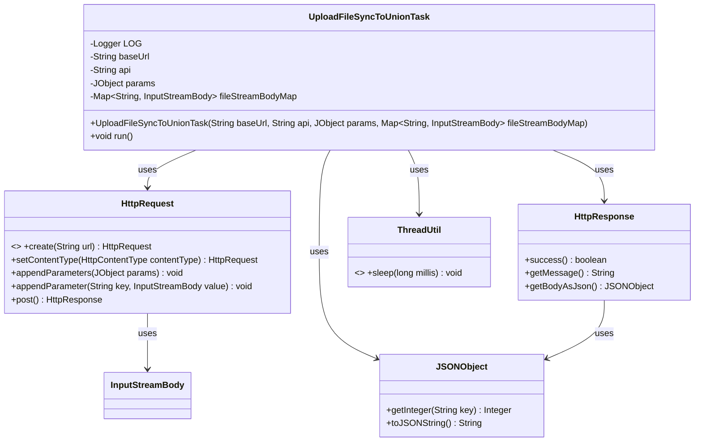
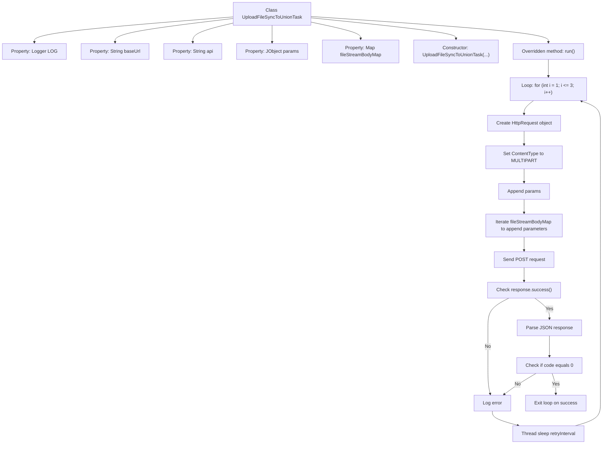

# Basic Information

|      |      |
|------|------|
| Name | UploadFileSyncToUnionTask |
| Language | .java |
| Code Path | WeFe/manager/manager-service/src/main/java/com/welab/wefe/manager/service/task/UploadFileSyncToUnionTask.java |
| Package Name | com.welab.wefe.manager.service.task |
| Dependencies | ['com.alibaba.fastjson.JSONException', 'com.alibaba.fastjson.JSONObject', 'com.welab.wefe.common.http.HttpContentType', 'com.welab.wefe.common.http.HttpRequest', 'com.welab.wefe.common.http.HttpResponse', 'com.welab.wefe.common.util.JObject', 'com.welab.wefe.common.util.StringUtil', 'com.welab.wefe.common.util.ThreadUtil', 'org.apache.http.entity.ContentType', 'org.apache.http.entity.mime.content.InputStreamBody', 'org.slf4j.Logger', 'org.slf4j.LoggerFactory', 'org.springframework.util.MultiValueMap', 'org.springframework.web.multipart.MultipartFile', 'java.io.IOException', 'java.util.Map'] |
| Brief Description | The `UploadFileSyncToUnionTask` class is designed for multi-threaded file uploads to a specified API, supporting 3 retries with incrementally increasing intervals. It handles parameters and file streams, while checking response status and return codes. |

# Description

This is a thread class named UploadFileSyncToUnionTask, designed for synchronously uploading files to a union server. The class includes attributes such as base URL, API path, parameter objects, and file stream mappings. The constructor initializes these attributes. The run method implements a three-time retry mechanism with incrementally increasing intervals. It constructs an HTTP request, sets the multipart content type, adds parameters and file streams, and sends a POST request. If the response fails, JSON parsing encounters an exception, or the return code is non-zero, it logs the error and retries. Upon success, the loop terminates. The entire process logs error messages for tracking.

# Class Summary

| Name   | Type  | Description |
|-------|------|-------------|
| UploadFileSyncToUnionTask | class | File upload synchronization task thread class, including base URL, API, parameters, and file stream, supports three retries with incrementally increasing intervals, uploads files via HTTP requests, and processes responses. |

## Class UploadFileSyncToUnionTask

|      |      |
|------|------|
| Access Modifier | public |
| Type | class |
| Name | UploadFileSyncToUnionTask |
| Description | File upload synchronization task thread class, including base URL, API, parameters, and file stream, supports three retries with incrementally increasing intervals, uploads files via HTTP requests, and processes responses. |

### UML Class Diagram

This code demonstrates a multi-threaded file upload task class `UploadFileSyncToUnionTask`, which inherits from the `Thread` class. It uploads files and parameters to a specified API interface via HTTP requests, supporting a maximum of 3 retry attempts with incrementally increasing intervals between each retry. Key functionalities include constructing multipart form requests, processing response results, and implementing error retry logic. The class diagram clearly illustrates its relationships with helper classes like HttpRequest and HttpResponse, as well as the core data flow path.

### Internal Method Call Graph

This code implements a file upload thread class with retry mechanism. The flowchart illustrates the complete process from initialization to successful upload, including a 3-attempt retry loop, HTTP request construction, parameter handling, response validation, and error handling. Key paths involve request building, response status checking, JSON parsing, and business status code verification. Failed attempts will retry after 300*i milliseconds, with a maximum of 3 attempts. Success condition requires both successful HTTP request and JSON response with code field equal to 0.

### Field List

| Name  | Type  | Description |
|-------|-------|------|
| baseUrl | String | Define a private string variable baseUrl. |
| fileStreamBodyMap | Map<String, InputStreamBody> | Private mapping with string keys and InputStreamBody values, storing file stream objects. |
| LOG = LoggerFactory.getLogger(this.getClass()) | Logger | A protected final log object LOG is defined in the class, initialized with the current class. |
| api | String | Declare a private string variable api. |
| params | JObject | Private JSON object parameter variables. |

### Method List

| Name  | Type  | Description |
|-------|-------|------|
| run | void | The method implements synchronous file upload with a maximum of 3 retries and incremental intervals between each attempt. It constructs a multipart request containing parameters and file streams. The response status and JSON return code are checked; if failed, it sleeps and retries, otherwise terminates upon success. |

