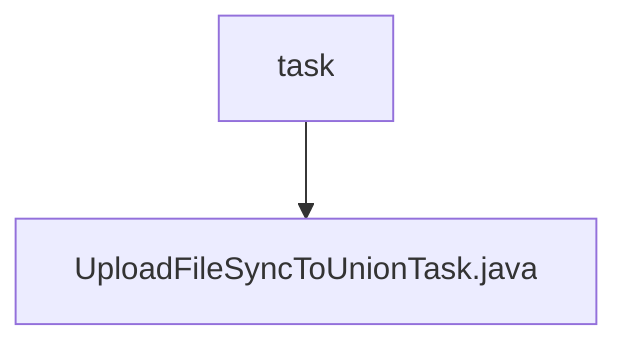

# Basic Information

|      |      |
|------|------|
| Name | task |
| Language | .java |
| Code Path | WeFe/manager/manager-service/src/main/java/com/welab/wefe/manager/service/task |
| Package Name | docs.manager.manager-service.src.main.java.com.welab.wefe.manager.service.task |
| Brief Description | The `UploadFileSyncToUnionTask` class is designed for multi-threaded file uploads to a specified API, supporting 3 retries with incrementally increasing intervals. It handles parameters and file streams, and checks response status and return codes. |

# Description

This is a thread class named UploadFileSyncToUnionTask, designed for synchronously uploading files to a union server. The class includes properties such as base URL, API path, parameter object, and file stream mapping. The constructor initializes these properties. The run method implements a three-attempt retry mechanism with incrementally increasing intervals. It constructs an HTTP request, sets the multipart content type, adds parameters and file streams, and sends a POST request. If the response fails, JSON parsing encounters an exception, or the return code is not 0, it logs the error and retries. Upon success, the loop terminates. The entire process logs error messages.

### Package Internal Structure View

This flowchart illustrates the task directory structure of the manager-service module in the WeFe project. The root node "task" represents the task directory, which contains a child node "UploadFileSyncToUnionTask.java," representing the implementation class for the file upload synchronization task to the union. The entire structure is concise and clear, reflecting the basic composition of the task module.

# File List

| Name   | Type  | Description |
|-------|------|-------------|
| [UploadFileSyncToUnionTask.java](UploadFileSyncToUnionTask.md) | file | The `UploadFileSyncToUnionTask` class is designed for multi-threaded file uploads to a specified API, supporting 3 retries with incrementally increasing intervals. It handles parameters and file streams while checking response status and return codes. |

