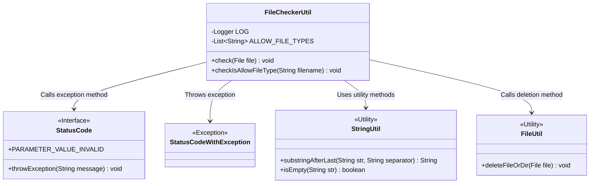
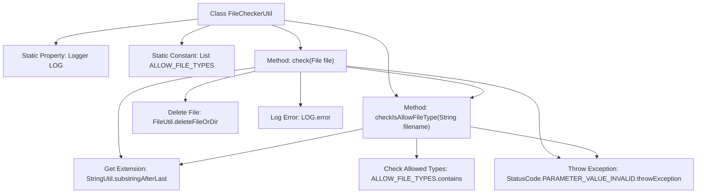

# Basic Information

|      |      |
|------|------|
| Name | FileCheckerUtil |
| Language | .java |
| Code Path | WeFe/manager/manager-service/src/main/java/com/welab/wefe/manager/service/util/FileCheckerUtil.java |
| Package Name | com.welab.wefe.manager.service.util |
| Dependencies | ['com.welab.wefe.common.StatusCode', 'com.welab.wefe.common.exception.StatusCodeWithException', 'com.welab.wefe.common.util.FileUtil', 'com.welab.wefe.common.util.StringUtil', 'org.slf4j.Logger', 'org.slf4j.LoggerFactory', 'java.io.File', 'java.util.Arrays', 'java.util.List'] |
| Brief Description | The FileCheckerUtil class is used to check file types, allowing only PDF files. In case of exceptions, it deletes the file and logs the error. |

# Description

The FileCheckerUtil class is used to verify file type security and includes static methods `check` and `checkIsAllowFileType`. Currently, only PDF file types are permitted. The `check` method validates whether the file extension is legal; if illegal, it deletes the file and throws an exception. The `checkIsAllowFileType` method checks that the filename is non-empty and the extension is valid. Exception cases are logged, and a StatusCodeWithException is thrown.

# Class Summary

| Name   | Type  | Description |
|-------|------|-------------|
| FileCheckerUtil | class | The FileCheckerUtil class is used to check file types, allowing only PDF format. It deletes the file and throws an error in case of exceptions. |

## Class FileCheckerUtil

|      |      |
|------|------|
| Access Modifier | public |
| Type | class |
| Name | FileCheckerUtil |
| Description | The FileCheckerUtil class is used to check file types, allowing only PDF format. It deletes the file and throws an error in case of exceptions. |

### UML Class Diagram

Class Diagram Description: This diagram illustrates the FileCheckerUtil utility class and its dependencies. FileCheckerUtil contains core logic for file type checking, utilizes StringUtil for string operations, relies on StatusCode and StatusCodeWithException for exception handling, and employs FileUtil for file deletion operations. The diagram clearly demonstrates the collaboration between utility classes and the exception handling mechanism.

### Internal Method Call Graph

The flowchart depicts the structure and method invocation relationships of the FileCheckerUtil class. This class provides file type validation functionality, where the check method verifies if a file extension is legal and deletes the file while logging errors for invalid cases. The checkIsAllowFileType method implements specific validation logic including null filename detection, extension existence checks, and whitelist verification. Both methods share extension extraction and exception throwing operations, forming a clear validation workflow.

### Field List

| Name  | Type  | Description |
|-------|-------|------|
| ALLOW_FILE_TYPES = Arrays.asList(            "pdf"    ) | List<String> | Only PDF format files are allowed. |
| LOG = LoggerFactory.getLogger(FileCheckerUtil.class) | Logger | Define a static log object LOG for the FileCheckerUtil class, modified with protected and final. |

### Method List

| Name  | Type  | Description |
|-------|-------|------|
| check | void | Check if the uploaded file type is allowed. Only PDF format is supported; otherwise, delete the file and throw an exception. |
| checkIsAllowFileType | void | Check if the file type is allowed: The filename cannot be empty, must have an extension, and the extension must be in the allowed list; otherwise, an exception will be thrown. |

