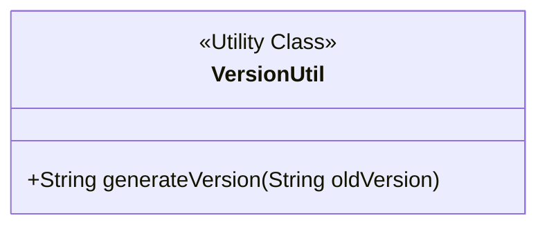
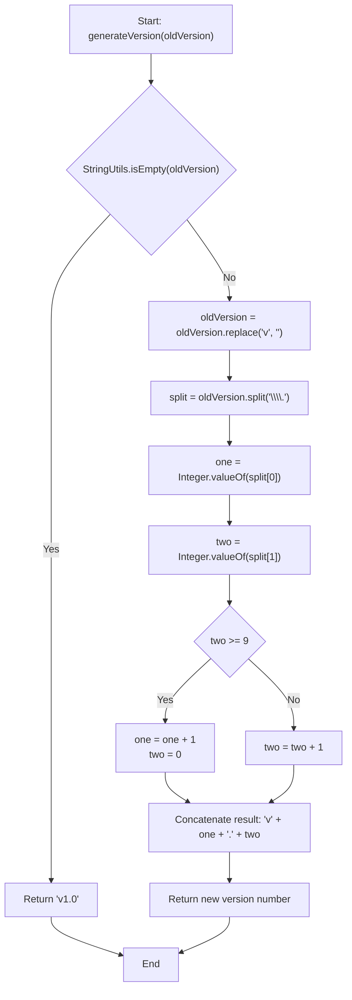
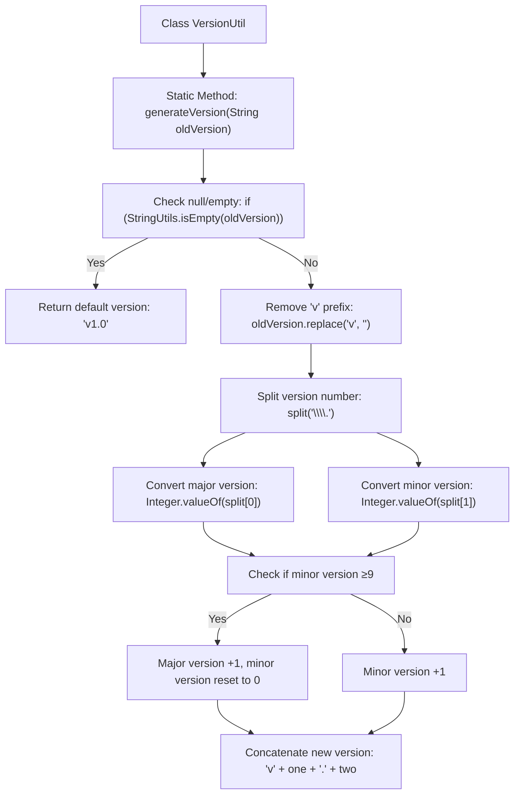

# Basic Information

|      |      |
|------|------|
| Name | VersionUtil |
| Language | .java |
| Code Path | WeFe/manager/manager-service/src/main/java/com/welab/wefe/manager/service/util/VersionUtil.java |
| Package Name | com.welab.wefe.manager.service.util |
| Dependencies | ['org.apache.commons.lang.StringUtils'] |
| Brief Description | The VersionUtil class provides the generateVersion method for version number incrementation. If the old version is empty, it returns v1.0. Otherwise, it parses the version number digits: when the minor version is greater than or equal to 9, the major version is incremented by 1 and the minor version is reset to 0; otherwise, the minor version is incremented by 1. |

# Description

The `VersionUtil` class contains a static method `generateVersion` for generating a new version number. If the input is empty, it returns `v1.0`; otherwise, it parses the old version number (formatted as `vX.Y`), removes the `v` prefix, and splits it by the dot. The major version number `X` remains unchanged, while the minor version number `Y` is incremented by 1. If `Y` ≥ 9, the major version number is incremented by 1 and the minor version number is reset to zero. The final result is returned as a new version number string in the `vX.Y` format.

# Class Summary

| Name   | Type  | Description |
|-------|------|-------------|
| VersionUtil | class | The `VersionUtil` class provides a static method `generateVersion` for incrementing version numbers. If the input is empty, it returns `v1.0`; otherwise, it increments the last digit of a version number in the format `v1.2` by 1, carrying over to the next digit if it exceeds 9. |

## Class VersionUtil

|      |      |
|------|------|
| Access Modifier | public |
| Type | class |
| Name | VersionUtil |
| Description | The `VersionUtil` class provides a static method `generateVersion` for incrementing version numbers. If the input is empty, it returns `v1.0`; otherwise, it increments the last digit of a version number in the format `v1.2` by 1, carrying over to the next digit if it exceeds 9. |

### UML Class Diagram

Class diagram description: VersionUtil is a utility class that provides a static method generateVersion for generating new version numbers. The method takes the old version number string as input, processes it, and returns the new version number string. The processing logic is: if the input is empty, return "v1.0"; otherwise, parse the major and minor version numbers. When the minor version ≥ 9, increment the major version by 1 and reset the minor version to 0; otherwise, increment the minor version by 1. The final result is returned as a string in the format "vMajorVersion.MinorVersion".

### Internal Method Call Graph

This flowchart illustrates the version number generation logic of the VersionUtil class. When the input is null/empty, it returns the default version 'v1.0'. Otherwise, it parses the input version string by removing the 'v' prefix and splitting into major/minor versions. If the minor version ≥9, it increments the major version and resets the minor version to 0; otherwise, it increments the minor version. The final output is a new version string with 'v' prefix (e.g., input "1.2.9" outputs "1.3.0"). The process fully demonstrates the version increment rules and string handling operations.

### Field List

| Name  | Type  | Description |
|-------|-------|------|

### Method List

| Name  | Type  | Description |
|-------|-------|------|
| generateVersion | String | Static methods generate new version numbers based on the old version number. Empty input returns v1.0. For non-empty input, the "v" prefix is removed, and the major and minor version numbers are split. If the minor version number is ≥9, the major version increments by 1 and the minor version resets to zero; otherwise, the minor version increments by 1. Returns the format vmajor.minor. |

