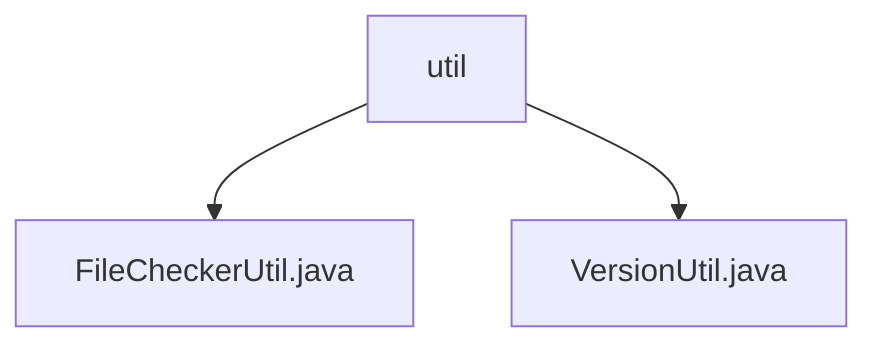

# Basic Information

|      |      |
|------|------|
| Name | util |
| Language | .java |
| Code Path | WeFe/manager/manager-service/src/main/java/com/welab/wefe/manager/service/util |
| Package Name | docs.manager.manager-service.src.main.java.com.welab.wefe.manager.service.util |
| Brief Description | The `FileCheckerUtil` class checks file types, allowing only PDFs; illegal files are deleted and an exception is thrown. The `VersionUtil` class generates version numbers, returning `v1.0` for empty input; otherwise, the major version remains unchanged while the minor version increments by 1. If the minor version ≥ 9, the major version increments by 1 and the minor version resets to zero. |

# Description

## Overview  
The core responsibility of this module is to provide file type safety checks and version number generation functionality. The interface specifications include the `check` method of the `FileCheckerUtil` class (validating file extension legality) and the `generateVersion` method of the `VersionUtil` class (incrementing version numbers). Key data structures involve version number strings (format `vX.Y`) and a file extension whitelist (currently only PDF). External dependencies include the logging system and the `StatusCodeWithException` exception class. For example, the `check` method deletes invalid files, while `generateVersion` supports carry-over logic (e.g., `v1.9` → `v2.0`).  

## Primary Business Scenarios  
Typical application scenarios include file type validation during uploads (similar to a gateway filtering pattern) and version management during system iterations. The business process first validates filenames via `checkIsAllowFileType`, then invokes `check` to perform deletion operations; version generation adopts a segmented increment strategy for major and minor version numbers. For example, uploading a non-PDF file triggers an exception, while an empty version number input initializes to `v1.0`. Integration cases cover file management modules and automated deployment workflows.

### Package Internal Structure View

This flowchart illustrates the file structure of the util package under the manager-service module in the WeFe project. The root node is the util directory, which contains two Java utility class files: FileCheckerUtil.java for file checking functionality and VersionUtil.java for handling version-related operations. This concise hierarchical structure reflects a design pattern of centralized utility class management, facilitating developers to quickly locate and use common utility methods.

# File List

| Name   | Type  | Description |
|-------|------|-------------|
| [FileCheckerUtil.java](FileCheckerUtil.md) | file | The FileCheckerUtil class is used to check file types, allowing only PDF files. In case of exceptions, it deletes the files and logs the event. |
| [VersionUtil.java](VersionUtil.md) | file | The `VersionUtil` class provides the `generateVersion` method for version number incrementation. If the old version is empty, it returns `v1.0`; otherwise, it parses the version number digits. When the minor version is greater than or equal to 9, the major version is incremented by 1 and the minor version resets to zero; otherwise, the minor version is incremented by 1. |

