# Basic Information

|      |      |
|------|------|
| Name | wefe |
| Language | .java |
| Code Path | WeFe/mpc/mpc-common/src/main/java/com/welab/wefe |
| Package Name | docs.mpc.mpc-common.src.main.java.com.welab.wefe |
| Brief Description | AbstractHttpTransferVariable is an abstract class for handling HTTP requests, supporting JSON conversion and signature verification. The secure aggregation module implements key exchange and encrypted communication. The cryptography toolkit provides algorithms such as SM2/RSA. The MPC basic toolkit supports numerical conversion and random data generation. The PSI module processes private set intersection queries. The local caching system adopts a two-level structure. The DiffieHellmanKey class manages DH protocol parameters. The PIR module implements the private information retrieval protocol. The communication configuration class defines request parameters. |

# Description

## Overview  
This module serves as the foundational framework for Secure Multi-Party Computation (MPC), with its core responsibilities encompassing cryptographic protocol encapsulation, key management, and secure communication, akin to a middleware layer in zero-trust architecture. The interface specifications comprise four categories: Secure Aggregation (QuerySAResult), Key Exchange (QueryDiffieHellmanKey), PSI Query (QueryPrivateSetIntersection), and PIR Protocol (QueryKeysRequest), all implemented using POJO+JSON serialization. Key data structures include Diffie-Hellman parameters (p/g), PSI batch control fields, PIR session identifiers (uuid), and group operation coordinates, relying on BouncyCastle/JCE cryptographic libraries and JSON utilities. For instance, SM2KeyPair manages national cryptographic keys, while LocalIntermediateCache implements thread-safe storage.  

## Core Business Scenarios  
The module supports federated learning and joint risk control scenarios, with typical workflows as follows: 1) DH key exchange → 2) secure data aggregation/PSI comparison → 3) PIR privacy retrieval. Interactions adopt a request-response chain model, correlating sessions via uuid, similar to an encrypted envelope mechanism. Functional completeness is demonstrated through support for SM2/RSA signatures, AES/SHA encryption, Naor-Pinkas protocols, and weight-adjusted aggregation. For example, SignUtil automatically selects algorithms, while CacheUtil manages temporary data. The API design follows a layered approach, with foundational layers like DiffieHellmanUtil static methods and protocol layers like QuerySAResultRequest object-oriented operations. Integration use cases include cross-institution ID secure matching and encrypted phone number generation.

### Package Internal Structure View

```mermaid
graph TD
    wefe --> mpc
    mpc --> trasfer
    mpc --> sa
    mpc --> util
    mpc --> commom
    mpc --> psi
    mpc --> cache
    mpc --> key
    mpc --> pir
    mpc --> config
    trasfer --> AbstractHttpTransferVariable.java
    sa --> request
    sa --> SecureAggregationApiName.java
    request --> QuerySAResultRequest.java
    request --> QueryDiffieHellmanKeyResponse.java
    request --> QueryDiffieHellmanKeyRequest.java
    request --> QuerySAResultResponse.java
    util --> SignUtil.java
    util --> EncryptUtil.java
    util --> SM2Util.java
    util --> DiffieHellmanUtil.java
    util --> SHAUtil.java
    util --> RSAUtil.java
    commom --> Operator.java
    commom --> Conversion.java
    commom --> Constants.java
    commom --> RandomPhoneNum.java
    commom --> AccountEncryptionType.java
    psi --> request
    request --> QueryPrivateSetIntersectionRequest.java
    request --> QueryPrivateSetIntersectionResponse.java
    cache --> intermediate
    cache --> CacheInit.java
    intermediate --> impl
    intermediate --> CacheOperation.java
    intermediate --> CacheOperationFactory.java
    intermediate --> CacheUtil.java
    impl --> LocalIntermediateCache.java
    key --> DiffieHellmanKey.java
    pir --> request
    pir --> protocol
    pir --> flow
    pir --> PrivateInformationRetrievalApiName.java
    request --> naor
    request --> QueryRandomResponse.java
    request --> QueryKeysResponse.java
    request --> QueryPIRResultsResponse.java
    request --> QueryRandomRequest.java
    request --> QueryRandomLegalResponse.java
    request --> QueryRandomLegalRequest.java
    request --> QueryKeysRequest.java
    request --> QueryPIRResultsRequest.java
    request --> BaseResponse.java
    naor --> QueryNaorPinkasRandomResponse.java
    naor --> QueryNaorPinkasRandomRequest.java
    naor --> QueryNaorPinkasResultResponse.java
    naor --> QueryNaorPinkasResultRequest.java
    protocol --> ro
    protocol --> nt
    protocol --> se
    protocol --> ot
    ro --> mac
    ro --> hf
    mac --> Sha256MAC.java
    mac --> HashBasedMessageAuthenticationCode.java
    mac --> MessageAuthenticationCode.java
    hf --> Sha256.java
    hf --> HashFunction.java
    nt --> field
    nt --> group
    field --> integers
    field --> GaloisFieldElement.java
    field --> GaloisFieldArithmetic.java
    integers --> IntegersModuloPrimeArithmetic.java
    integers --> IntegersModuloPrimeElement.java
    group --> cyclic
    group --> GroupArithmetic.java
    group --> GroupElement.java
    cyclic --> twisted
    cyclic --> CyclicGroupArithmetic.java
    cyclic --> CyclicGroupElement.java
    twisted --> TwistedEdwardsCurveArithmetic.java
    twisted --> TwistedEdwardsCurveElement.java
    se --> aes
    se --> SymmetricKey.java
    aes --> AESKey.java
    aes --> AESEncryptKey.java
    aes --> AESDecryptKey.java
    ot --> hauck
    ot --> ObliviousTransferKey.java
    ot --> ObliviousTransfer.java
    hauck --> HauckObliviousTransfer.java
    hauck --> HauckTarget.java
    flow --> BasePrivateInformationRetrieval.java
    config --> CommunicationConfig.java
```

This flowchart illustrates the complete directory structure of the mpc module in the WeFe project, starting from the root directory wefe and expanding hierarchically to various submodules and files. It highlights core functional components under the mpc-common module, including the hierarchical relationships of secure aggregation (sa), private information retrieval (pir), caching system (cache), key management (key), and other modules. The diagram details the distribution of class files within each module, particularly showcasing the complex cryptographic algorithm implementation structure in the pir protocol layer, which encompasses multiple protocol implementation details such as RO/NT/SE/OT.

# File List

| Name   | Type  | Description |
|-------|------|-------------|
| [mpc](mpc/_module.md) | package | AbstractHttpTransferVariable is an abstract class for handling HTTP requests, supporting JSON conversion and signature verification. The secure aggregation module implements key exchange and encrypted communication. The cryptography toolkit provides algorithms such as SM2/RSA. The MPC foundational toolkit supports numerical conversion and random data generation. The PSI module processes private set intersection queries. The local caching system adopts a two-tier structure. The DiffieHellmanKey class manages DH protocol parameters. The PIR module implements the private information retrieval protocol. The communication configuration class defines request parameters. |

