# Basic Information

|      |      |
|------|------|
| Name | mpc |
| Language | .java |
| Code Path | WeFe/mpc/mpc-common/src/main/java/com/welab/wefe/mpc |
| Package Name | docs.mpc.mpc-common.src.main.java.com.welab.wefe.mpc |
| Brief Description | AbstractHttpTransferVariable is an abstract class for handling HTTP requests, supporting JSON conversion and signature verification. The secure aggregation module implements key exchange and encrypted communication. The cryptography toolkit provides algorithms such as SM2/RSA. The MPC foundational toolkit supports numerical conversion and random data generation. The PSI module processes private set intersection queries. The local caching system adopts a two-tier structure. The DiffieHellmanKey class manages DH protocol parameters. The PIR module implements the private information retrieval protocol. The communication configuration class defines request parameters. |

# Description

## Overview  
This module serves as a foundational framework for Secure Multi-Party Computation (MPC), with its core responsibilities encompassing cryptographic protocol encapsulation, key management, and secure communication, akin to a middleware layer in a zero-trust architecture. The interface specifications comprise four categories: Secure Aggregation (QuerySAResult), Key Exchange (QueryDiffieHellmanKey), PSI Query (QueryPrivateSetIntersection), and PIR Protocol (QueryKeysRequest), all implemented using POJO + JSON serialization. Key data structures include Diffie-Hellman parameters (p/g), PSI batch control fields, PIR session identifiers (uuid), and group operation coordinates, relying on BouncyCastle/JCE cryptographic libraries and JSON utilities. For instance, SM2KeyPair manages national cryptographic keys, while LocalIntermediateCache implements thread-safe storage.  

## Core Business Scenarios  
The module supports federated learning and joint risk control scenarios, with a typical workflow as follows: 1) DH key exchange → 2) Secure data aggregation/PSI comparison → 3) PIR privacy retrieval. Interactions adopt a request-response chain pattern, correlating sessions via uuid, similar to an encrypted envelope mechanism. Functional completeness is reflected in: support for SM2/RSA signatures, AES/SHA encryption, Naor-Pinkas protocols, and weight-adjusted aggregation. For example, SignUtil automatically selects algorithms, while CacheUtil manages temporary data. The API design is hierarchical, with foundational layers like DiffieHellmanUtil static methods and protocol layers like QuerySAResultRequest object-oriented operations. Integration cases include cross-institution ID secure matching and encrypted phone number generation.

### Package Internal Structure View

```mermaid
graph TD
    mpc --> trasfer
    mpc --> sa
    mpc --> util
    mpc --> commom
    mpc --> psi
    mpc --> cache
    mpc --> key
    mpc --> pir
    mpc --> config
    trasfer --> AbstractHttpTransferVariable.java
    sa --> request
    sa --> SecureAggregationApiName.java
    request --> QuerySAResultRequest.java
    request --> QueryDiffieHellmanKeyResponse.java
    request --> QueryDiffieHellmanKeyRequest.java
    request --> QuerySAResultResponse.java
    util --> SignUtil.java
    util --> EncryptUtil.java
    util --> SM2Util.java
    util --> DiffieHellmanUtil.java
    util --> SHAUtil.java
    util --> RSAUtil.java
    commom --> Operator.java
    commom --> Conversion.java
    commom --> Constants.java
    commom --> RandomPhoneNum.java
    commom --> AccountEncryptionType.java
    psi --> request
    request --> QueryPrivateSetIntersectionRequest.java
    request --> QueryPrivateSetIntersectionResponse.java
    cache --> intermediate
    cache --> CacheInit.java
    intermediate --> impl
    intermediate --> CacheOperation.java
    intermediate --> CacheOperationFactory.java
    intermediate --> CacheUtil.java
    impl --> LocalIntermediateCache.java
    key --> DiffieHellmanKey.java
    pir --> request
    pir --> protocol
    pir --> flow
    pir --> PrivateInformationRetrievalApiName.java
    request --> naor
    request --> QueryRandomResponse.java
    request --> QueryKeysResponse.java
    request --> QueryPIRResultsResponse.java
    request --> QueryRandomRequest.java
    request --> QueryRandomLegalResponse.java
    request --> QueryRandomLegalRequest.java
    request --> QueryKeysRequest.java
    request --> QueryPIRResultsRequest.java
    request --> BaseResponse.java
    naor --> QueryNaorPinkasRandomResponse.java
    naor --> QueryNaorPinkasRandomRequest.java
    naor --> QueryNaorPinkasResultResponse.java
    naor --> QueryNaorPinkasResultRequest.java
    protocol --> ro
    protocol --> nt
    protocol --> se
    protocol --> ot
    ro --> mac
    ro --> hf
    mac --> Sha256MAC.java
    mac --> HashBasedMessageAuthenticationCode.java
    mac --> MessageAuthenticationCode.java
    hf --> Sha256.java
    hf --> HashFunction.java
    nt --> field
    nt --> group
    field --> integers
    field --> GaloisFieldElement.java
    field --> GaloisFieldArithmetic.java
    integers --> IntegersModuloPrimeArithmetic.java
    integers --> IntegersModuloPrimeElement.java
    group --> cyclic
    group --> GroupArithmetic.java
    group --> GroupElement.java
    cyclic --> twisted
    cyclic --> CyclicGroupArithmetic.java
    cyclic --> CyclicGroupElement.java
    twisted --> TwistedEdwardsCurveArithmetic.java
    twisted --> TwistedEdwardsCurveElement.java
    se --> aes
    se --> SymmetricKey.java
    aes --> AESKey.java
    aes --> AESEncryptKey.java
    aes --> AESDecryptKey.java
    ot --> hauck
    ot --> ObliviousTransferKey.java
    ot --> ObliviousTransfer.java
    hauck --> HauckObliviousTransfer.java
    hauck --> HauckTarget.java
    flow --> BasePrivateInformationRetrieval.java
    config --> CommunicationConfig.java
```

This flowchart presents the complete directory structure of the WeFe MPC project, starting from the root directory 'mpc' and hierarchically expanding all submodules and files. It primarily includes core modules such as 'trasfer', 'sa', 'util', and 'commom', with the 'pir' module being the most complex, containing multiple submodules like 'request', 'protocol', and 'flow'. The 'protocol' module is further subdivided into implementations of cryptographic protocols such as 'ro', 'nt', 'se', and 'ot', each with detailed implementation classes and interfaces. The overall structure clearly illustrates the functional module division and dependency relationships within the MPC framework, particularly the hierarchical organization of cryptography-related components.

# File List

| Name   | Type  | Description |
|-------|------|-------------|
| [sa](sa/_module.md) | package | This module encapsulates secure aggregation and key exchange functionalities, comprising four types of data transfer objects. It supports multi-party secure computation workflows, adopts a request-response model, and relies on a JSON processing library. |
| [trasfer](trasfer/_module.md) | package | The abstract class AbstractHttpTransferVariable provides HTTP query functionality, supports signature and error handling, and returns data in JSON format. |
| [config](config/_module.md) | package | Communication configuration class, which includes attributes such as request ID, interface name, server address, merchant ID, signature private key, key type, and signature switch, providing getter and setter methods for each field. |
| [key](key/_module.md) | package | The DiffieHellmanKey class includes attributes p and g of type BigInteger, providing corresponding getter and setter methods. |
| [pir](pir/_module.md) | package | The module implements the Naor-Pinkas protocol for private information retrieval, including interfaces for random number generation, key management, result querying, and verification. It adopts a two-phase interaction model, supports dynamic condition combination and batch processing, and is applied in federated learning. The cryptographic foundation system provides data verification, encryption, and transmission functionalities, supporting PIR and joint risk control scenarios. The abstract base class BasePrivateInformationRetrieval offers a foundational framework, defining uuid and initialization methods. The PrivateInformationRetrievalApiName class defines constants for five types of retrieval operations. |
| [cache](cache/_module.md) | package | This module implements a thread-safe local cache, utilizing a two-level structure and factory pattern for instance management. The core interface defines add, delete, and query operations, with the default implementation using string keys and a 5-minute expiration policy. It is suitable for temporary storage and fast retrieval scenarios, supporting synchronous operations and dynamic implementation replacement. |
| [psi](psi/_module.md) | package | The QueryPrivateSetIntersectionRequest class encapsulates the parameters for a private set intersection request, including fields such as clientIds along with their corresponding getter and setter methods. The QueryPrivateSetIntersectionResponse class represents the response result, containing fields such as an encrypted ID list and status code, along with their respective getter and setter methods. |
| [commom](commom/_module.md) | package | The Operator enumeration defines addition and subtraction operations along with their descriptions. The Conversion class handles numerical conversions. The Constants class stores static configurations. RandomPhoneNum generates randomly encrypted phone numbers. The AccountEncryptionType enumeration specifies password encryption methods. |
| [util](util/_module.md) | package | SignUtil provides signature functionality, supporting SM2 and RSA. EncryptUtil supports MD5/SHA256/SHA512 hashing and AES decryption. SM2Util implements the SM2 national cryptographic algorithm, including key generation, encryption/decryption, and signing. DiffieHellmanUtil offers DH key exchange functionality. SHAUtil supports SHA and MD5 encryption. RSAUtil provides RSA encryption/decryption, signature verification, and key handling. |

