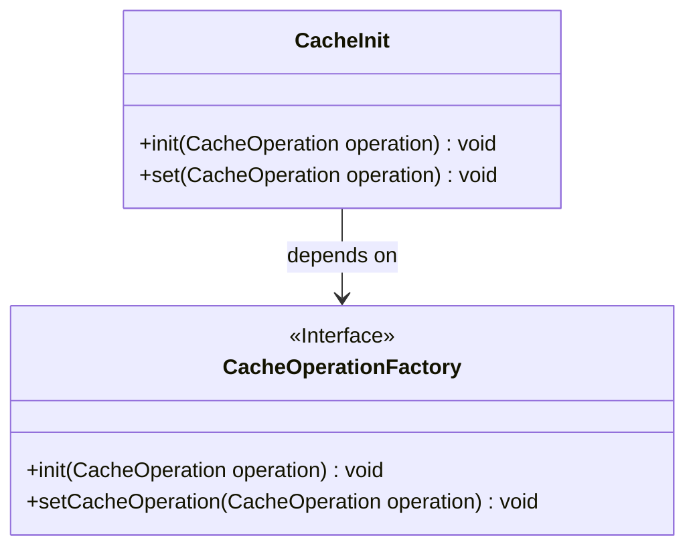
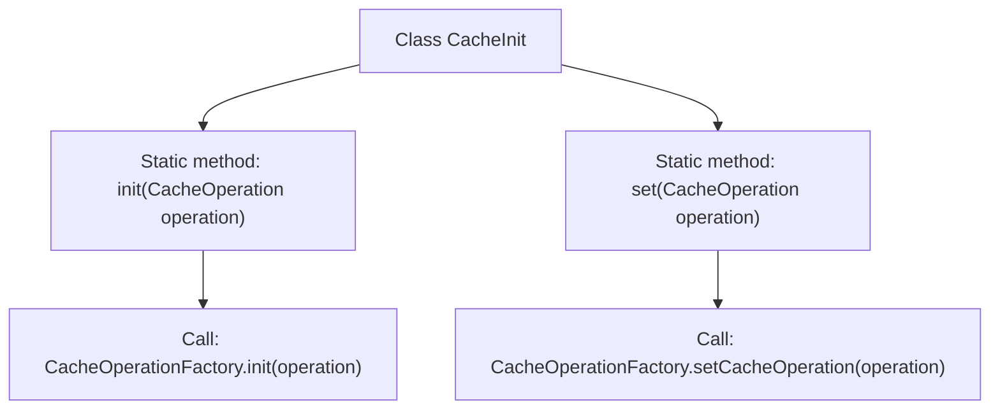

# Basic Information

|      |      |
|------|------|
| Name | CacheInit |
| Language | .java |
| Code Path | WeFe/mpc/mpc-common/src/main/java/com/welab/wefe/mpc/cache/CacheInit.java |
| Package Name | com.welab.wefe.mpc.cache |
| Dependencies | ['com.welab.wefe.mpc.cache.intermediate.CacheOperation', 'com.welab.wefe.mpc.cache.intermediate.CacheOperationFactory'] |
| Brief Description | The CacheInit class provides static methods, init and set, for initializing and configuring cache operations, both implemented via the CacheOperationFactory. |

# Description

The CacheInit class provides two static methods for cache operations. The init method initializes cache operations via CacheOperationFactory, while the set method configures cache operations through CacheOperationFactory. Both methods implement functionality for intermediate data caching of the same request, with specific operations determined by the passed CacheOperation parameter.

# Class Summary

| Name   | Type  | Description |
|-------|------|-------------|
| CacheInit | class | The CacheInit class provides static methods init and set for initializing and configuring cache operations, both implemented via CacheOperationFactory. |

## Class CacheInit

|      |      |
|------|------|
| Access Modifier | public |
| Type | class |
| Name | CacheInit |
| Description | The CacheInit class provides static methods init and set for initializing and configuring cache operations, both implemented via CacheOperationFactory. |

### UML Class Diagram

This code illustrates the relationship between a cache initialization class `CacheInit` and the cache operation factory interface `CacheOperationFactory`. `CacheInit` provides two static methods, `init` and `set`, both of which accept a `CacheOperation` parameter and invoke corresponding methods in the `CacheOperationFactory` interface to initialize and configure cache operations. `CacheOperationFactory` is marked as an interface, indicating that concrete cache operation implementations should be provided by other classes. The overall design reflects the Dependency Inversion Principle, where the high-level module `CacheInit` depends on an abstract interface rather than concrete implementations.

### Internal Method Call Graph

This flowchart illustrates the structure of the CacheInit class and its method invocation relationships. The class contains two static methods: init() and set(), which respectively execute cache operation initialization and cache operation setting through the CacheOperationFactory class. The init() method calls the factory class's init() method, while the set() method calls the factory class's setCacheOperation() method. The entire process clearly demonstrates the collaboration between classes, designed to implement the caching management functionality for intermediate request data.

### Field List

| Name  | Type  | Description |
|-------|-------|------|

### Method List

| Name  | Type  | Description |
|-------|-------|------|
| set | void | The static method `set` is used to configure cache operations, enabling inter-request data caching through the `CacheOperationFactory`. |
| init | void | The static method `init` takes a `CacheOperation` parameter and initializes cache operations via `CacheOperationFactory`, which is used for intermediate data caching within the same request. |

