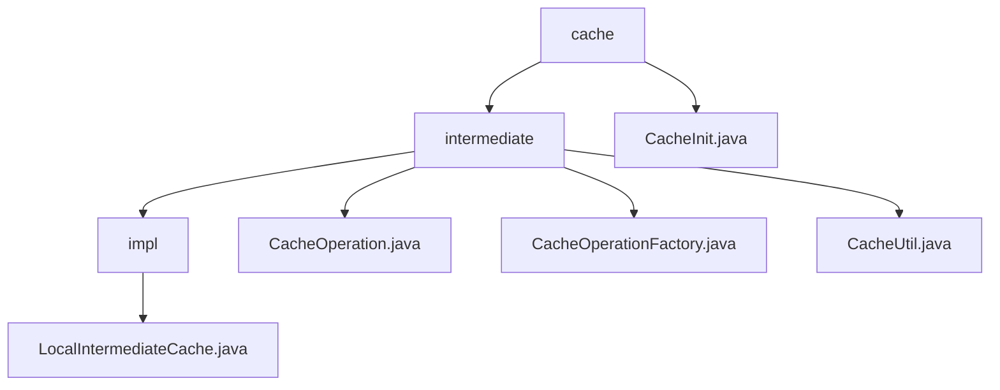

# Basic Information

|      |      |
|------|------|
| Name | cache |
| Language | .java |
| Code Path | WeFe/mpc/mpc-common/src/main/java/com/welab/wefe/mpc/cache |
| Package Name | docs.mpc.mpc-common.src.main.java.com.welab.wefe.mpc.cache |
| Brief Description | This module implements a thread-safe local cache, utilizing a two-level structure and factory pattern for instance management. The core interface defines add, delete, and query operations, with the default implementation using string keys and a 5-minute expiration policy. It is suitable for temporary storage and fast retrieval scenarios, supporting synchronous operations and dynamic implementation replacement. |

# Description

## Overview  
This module implements a thread-safe local caching system, utilizing a two-level cache structure and factory pattern for instance management. The core interface `CacheOperation` defines CRUD operations, with `LocalIntermediateCache` serving as the default implementation, employing string keys and a 5-minute expiration policy. For example, the outer cache stores inner cache instances, while the inner cache holds actual values. Dependencies require only a basic Java environment, with key data structures including generic value `T` and string key-value pairs. The factory class `CacheOperationFactory` ensures thread-safe singleton instances via synchronized methods, while `CacheInit` provides static methods to encapsulate initialization workflows.  

## Key Business Scenarios  
The module is suitable for scenarios requiring temporary storage and rapid data retrieval, akin to data relay in an event bus pattern. Typical workflows include: obtaining cache instances via `CacheOperationFactory`, saving data with `save`, and repeatedly calling `get` until successful. For instance, `CacheUtil` encapsulates blocking queries, and `CacheInit` offers static methods for initialization. The interaction mode is primarily synchronous, supporting dynamic replacement of cache implementations. Features cover cache lifecycle management, though deletion operations require further refinement. The API focuses on basic CRUD, with integration examples demonstrating combined use of factory and utility classes.

### Package Internal Structure View

This flowchart illustrates the hierarchical structure of the caching module in the MPC project. The root node is the cache directory, which contains the intermediate subdirectory and the CacheInit.java file. The intermediate directory includes the impl implementation directory and three operation class files, while the impl directory contains the LocalIntermediateCache.java implementation file. The entire structure clearly reflects the code organization of the caching module.

# File List

| Name   | Type  | Description |
|-------|------|-------------|
| [intermediate](intermediate/_module.md) | package | LocalIntermediateCache implements the CacheOperation interface, adopting a two-level cache structure with a 5-minute expiration policy, providing add, delete, and query functionalities. CacheOperation defines the basic cache operations. CacheOperationFactory manages cache instances in a singleton pattern, ensuring thread safety. CacheUtil offers a method to cyclically retrieve cache values. |
| [CacheInit.java](CacheInit.md) | file | The CacheInit class provides static methods, init and set, for initializing and configuring cache operations, both implemented via CacheOperationFactory. |

