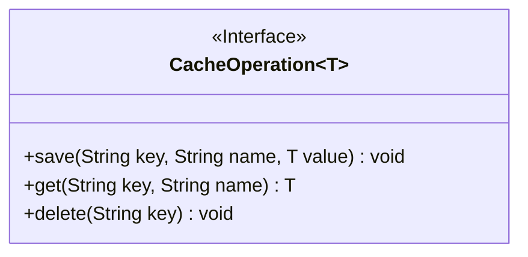
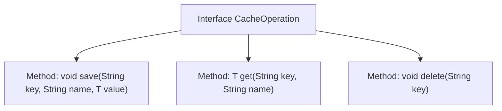

# Basic Information

|      |      |
|------|------|
| Name | CacheOperation |
| Language | .java |
| Code Path | WeFe/mpc/mpc-common/src/main/java/com/welab/wefe/mpc/cache/intermediate/CacheOperation.java |
| Package Name | com.welab.wefe.mpc.cache.intermediate |
| Dependencies | [] |
| Brief Description | The CacheOperation interface defines cache operations: save stores data requiring key, name, and value; get retrieves data via key and name; delete removes data by key. |

# Description

This interface defines the basic functionality for cache operations, comprising three core methods. The `save` method is used to store data, accepting three parameters: `key`, `name`, and `value`. The `get` method retrieves data by querying with the `key` and `name` parameters and returns the corresponding value. The `delete` method removes data, requiring only the `key` parameter to eliminate the associated cache. All methods support the generic type `T`, ensuring flexibility in data types. The interface is designed to be concise, focusing solely on the core cache operations of addition, deletion, and retrieval.

# Class Summary

| Name   | Type  | Description |
|-------|------|-------------|
| CacheOperation | interface | The CacheOperation interface defines cache operations: save stores key-value pairs, get retrieves values, and delete removes keys. The generic type T represents the value type. |

## Class CacheOperation

|      |      |
|------|------|
| Access Modifier | public |
| Type | interface |
| Name | CacheOperation |
| Description | The CacheOperation interface defines cache operations: save stores key-value pairs, get retrieves values, and delete removes keys. The generic type T represents the value type. |

### UML Class Diagram

This diagram illustrates a generic cache operation interface `CacheOperation<T>`, which defines three core methods: `save` for storing key-value pair data, `get` for retrieving data via a composite key, and `delete` for removing data associated with a specified key. The interface utilizes the generic type `T` to support storage of different data types, making it suitable for scenarios requiring abstract cache operations, such as distributed or local cache implementations. Arrow-annotated dependency relationships can be expanded upon when concrete implementation classes are added later.

### Internal Method Call Graph

This code defines a generic interface `CacheOperation<T>` with three core methods: `save` for storing key-value pair data, `get` for retrieving data based on a key name, and `delete` for removing data associated with a specified key. The flowchart clearly illustrates the hierarchical relationship between the interface and its methods, with each method explicitly annotated with parameters and return types, reflecting the fundamental functional structure of cache operations.

### Field List

| Name  | Type  | Description |
|-------|-------|------|

### Method List

| Name  | Type  | Description |
|-------|-------|------|
| get | T | Get the value of the specified key and name. |
| save | void | Store key-value pair data, where key is the key, name is the name, and value is the generic value. |
| delete | void | Delete data for the specified key. |

