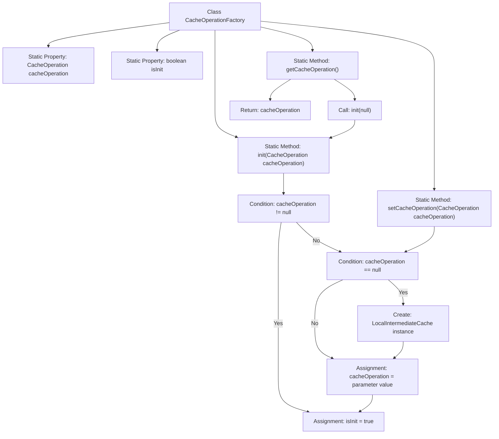

# Basic Information

|      |      |
|------|------|
| Name | CacheOperationFactory |
| Language | .java |
| Code Path | WeFe/mpc/mpc-common/src/main/java/com/welab/wefe/mpc/cache/intermediate/CacheOperationFactory.java |
| Package Name | com.welab.wefe.mpc.cache.intermediate |
| Dependencies | ['com.welab.wefe.mpc.cache.intermediate.impl.LocalIntermediateCache'] |
| Brief Description | The CacheOperationFactory class provides thread-safe singleton management for cache operations, including initialization, configuration, and retrieval methods. It defaults to using LocalIntermediateCache when uninitialized. |

# Description

CacheOperationFactory is a singleton factory class used to manage CacheOperation instances. It contains static private variables cacheOperation and an isInit flag. It provides three synchronized static methods: the init method initializes the cache operation instance, creating a LocalIntermediateCache instance if the parameter is null; the setCacheOperation method allows dynamic replacement of the cache instance; the getCacheOperation method automatically calls init when uninitialized and returns the instance. The entire class ensures thread safety through synchronization control.

# Class Summary

| Name   | Type  | Description |
|-------|------|-------------|
| CacheOperationFactory | class | The CacheOperationFactory class provides static methods to manage CacheOperation instances, supporting initialization, configuration, and retrieval operations while ensuring thread safety and defaulting to LocalIntermediateCache. |


## Class CacheOperationFactory

|      |      |
|------|------|
| Access Modifier | public |
| Type | class |
| Name | CacheOperationFactory |
| Description | The CacheOperationFactory class provides static methods to manage CacheOperation instances, supporting initialization, configuration, and retrieval operations while ensuring thread safety and defaulting to LocalIntermediateCache. |


### UML Class Diagram

```mermaid
classDiagram
    class CacheOperationFactory {
        -CacheOperation~static~ cacheOperation
        -boolean~static~ isInit
        +synchronized~static~ init(CacheOperation cacheOperation) void
        +synchronized~static~ setCacheOperation(CacheOperation cacheOperation) void
        +synchronized~static~ getCacheOperation() CacheOperation
    }

    class LocalIntermediateCache {
        <<CacheOperation>>
    }

    interface CacheOperation {
        <<Interface>>
    }

    LocalIntermediateCache ..|> CacheOperation
    CacheOperationFactory --> CacheOperation : dependency
    CacheOperationFactory --> LocalIntermediateCache : dependency
```

This code demonstrates a factory pattern implementation for a cache operation manager. The CacheOperationFactory manages the initialization and retrieval of CacheOperation instances through static methods, supporting lazy loading and thread safety. LocalIntermediateCache is the default implementation class of the CacheOperation interface, which is automatically used when the input parameter is null. The class diagram clearly illustrates the dependency relationships between the factory class and the interface/implementation classes, as well as the implementation relationship of the interface.


### Internal Method Call Graph



The flowchart describes the initialization control logic of the CacheOperationFactory class. This factory class manages the CacheOperation singleton through a double-check mechanism, incorporating initialization detection, null-value protection, and lazy loading functionality. The init() method implements first-time initialization lock protection, the set method allows dynamic implementation replacement, and the get method triggers automatic initialization and returns the instance. All operations ensure thread safety through synchronization control.

### Field List

| Name  | Type  | Description |
|-------|-------|------|
| isInit = false | boolean | The static boolean variable isInit is initially false, used to indicate whether initialization has been performed. |
| cacheOperation = null | CacheOperation | Declare a private static CacheOperation object with an initial value of null. |

### Method List

| Name  | Type  | Description |
|-------|-------|------|
| setCacheOperation | void | The static method `setCacheOperation` is used to set the cache operation instance. If the parameter is null, the default `LocalIntermediateCache` instance will be used; otherwise, the passed `cacheOperation` object will be utilized. |
| init | void | The synchronous static method `init` initializes the cache operation, returning if already initialized; otherwise, it configures the cache operation based on parameters and marks the initialization as complete. |
| getCacheOperation | CacheOperation | Synchronize the static method `getCacheOperation`, check if it is uninitialized then call `init`, and return the `cacheOperation` instance. |


