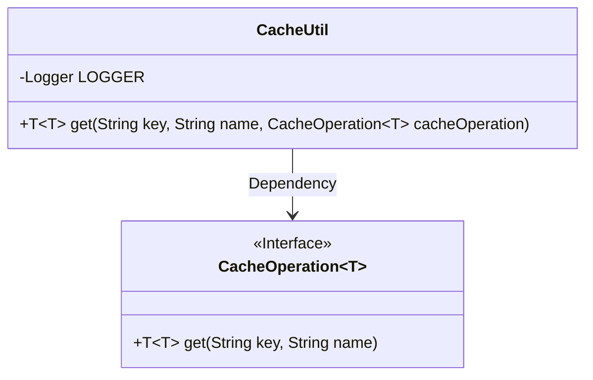
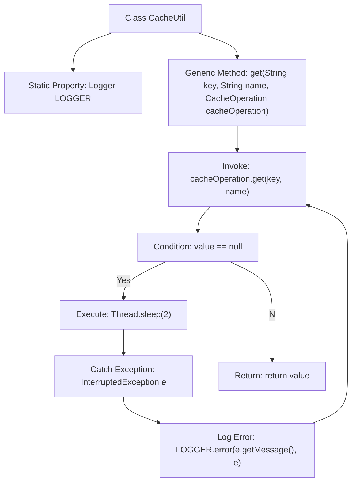

# Basic Information

|      |      |
|------|------|
| Name | CacheUtil |
| Language | .java |
| Code Path | WeFe/mpc/mpc-common/src/main/java/com/welab/wefe/mpc/cache/intermediate/CacheUtil.java |
| Package Name | com.welab.wefe.mpc.cache.intermediate |
| Dependencies | ['org.slf4j.Logger', 'org.slf4j.LoggerFactory'] |
| Brief Description | The CacheUtil class provides a static method `get`, which retrieves the value associated with a specified key and name from cache operations through a retry mechanism involving loops and sleep, until a non-null result is successfully returned. |

# Description

The `CacheUtil` class provides a static method `get` for retrieving a value from the cache based on a specified key and name. This method accepts a key, a name, and an instance of the `CacheOperation` interface as parameters. If the retrieved value is null, the method will repeatedly attempt to fetch it, waiting 2 milliseconds each time, until a non-null value is obtained. If an interruption exception occurs during the waiting process, an error log will be recorded. The method ultimately returns the non-null value retrieved.

# Class Summary

| Name   | Type  | Description |
|-------|------|-------------|
| CacheUtil | class | The CacheUtil class provides a static method `get` that ensures non-null values are retrieved from cache operations through a retry and sleep mechanism, logging error messages upon failure. |

## Class CacheUtil

|      |      |
|------|------|
| Access Modifier | public |
| Type | class |
| Name | CacheUtil |
| Description | The CacheUtil class provides a static method `get` that ensures non-null values are retrieved from cache operations through a retry and sleep mechanism, logging error messages upon failure. |

### UML Class Diagram

This code demonstrates a cache utility class `CacheUtil`, which retrieves cached values through the generic interface `CacheOperation<T>`. Its primary functionality is to loop-wait and retry fetching when the cached value is null until a non-null value is obtained. The class diagram clearly illustrates the dependency relationship between `CacheUtil` and the `CacheOperation<T>` interface, as well as the generic characteristics of the interface. This design implements a retry mechanism for cache retrieval while supporting multi-type data caching operations through generics.

### Internal Method Call Graph

This flowchart illustrates the execution logic of the core `get` method in the `CacheUtil` class. The method retrieves a cached value through the `CacheOperation` interface. When the value is null, it enters a loop to wait, retrying after a 2-millisecond sleep until a non-null value is obtained. During this process, it catches and logs thread interruption exceptions, ultimately returning the retrieved cached value. The flowchart clearly demonstrates the complete flow of method invocation, loop condition checking, and exception handling.

### Field List

| Name  | Type  | Description |
|-------|-------|------|
| LOGGER = LoggerFactory.getLogger(CacheUtil.class) | Logger | The class CacheUtil defines a static immutable logger LOGGER for logging purposes. |

### Method List

| Name  | Type  | Description |
|-------|-------|------|
| get | T | Static methods retrieve cached values by key and name. If the value is empty, they loop to wait for 2 milliseconds before retrying until successful retrieval and return. Errors are logged when exceptions occur. |

