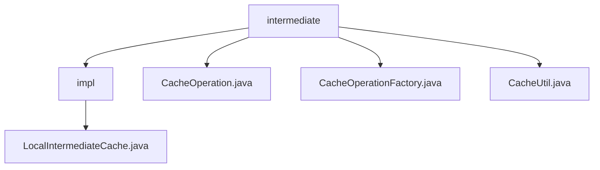

# Basic Information

|      |      |
|------|------|
| Name | intermediate |
| Language | .java |
| Code Path | WeFe/mpc/mpc-common/src/main/java/com/welab/wefe/mpc/cache/intermediate |
| Package Name | docs.mpc.mpc-common.src.main.java.com.welab.wefe.mpc.cache.intermediate |
| Brief Description | LocalIntermediateCache implements the CacheOperation interface, adopting a two-level cache structure with a 5-minute expiration policy, providing add, delete, and query functionalities. CacheOperation defines the basic cache operations. CacheOperationFactory manages cache instances in a singleton pattern, ensuring thread safety. CacheUtil offers a method to cyclically retrieve cache values. |

# Description

## Overview  
This module implements a thread-safe local caching system, utilizing a two-level cache structure and factory pattern for instance management. The core interface `CacheOperation` defines CRUD operations, with `LocalIntermediateCache` serving as the default implementation, employing string keys and a 5-minute expiration policy. For example, the outer cache stores inner cache instances, while the inner cache holds actual values. Dependencies require only a basic Java environment, with key data structures including generic type `T` and string key-value pairs. The factory class `CacheOperationFactory` ensures thread-safe singleton instances via synchronized methods.  

## Key Business Scenarios  
The module suits scenarios requiring temporary storage and fast data retrieval, akin to data relay in an event bus pattern. Typical workflows include: obtaining cache instances via the factory, saving data with `save`, and looping `get` until successful. For instance, `CacheUtil` encapsulates blocking query logic. Interaction is primarily synchronous, supporting dynamic cache implementation replacement. Integrated features cover cache lifecycle management, though deletion operations remain unimplemented. APIs focus on basic CRUD, with integration examples demonstrating usage with factories and utility classes.

### Package Internal Structure View

This flowchart illustrates the hierarchical structure of the caching middleware in the MPC common module. The root node "intermediate" contains four child nodes, where the "impl" directory includes the concrete implementation class LocalIntermediateCache.java, while the other three are utility and factory classes related to cache operations. The clear structure reflects the design principle of separating interfaces from implementations.

# File List

| Name   | Type  | Description |
|-------|------|-------------|
| [CacheOperation.java](CacheOperation.md) | file | The CacheOperation interface defines cache operations: save stores data requiring key, name, and value; get retrieves data via key and name; delete removes data by key. |
| [CacheOperationFactory.java](CacheOperationFactory.md) | file | The `CacheOperationFactory` class provides thread-safe singleton management for cache operations, including initialization, configuration, and retrieval methods. It defaults to using `LocalIntermediateCache` when uninitialized. |
| [CacheUtil.java](CacheUtil.md) | file | The CacheUtil class provides a static method `get`, which retrieves the value associated with a specified key and name from cache operations through a loop and sleep retry mechanism until a non-null result is successfully returned. |
| [impl](impl/_module.md) | package | LocalIntermediateCache implements the CacheOperation interface, utilizes a nested Cache structure for data storage, supports automatic expiration after 5 minutes of inactivity, and provides synchronous save and retrieval methods, though the deletion method remains unimplemented. |

