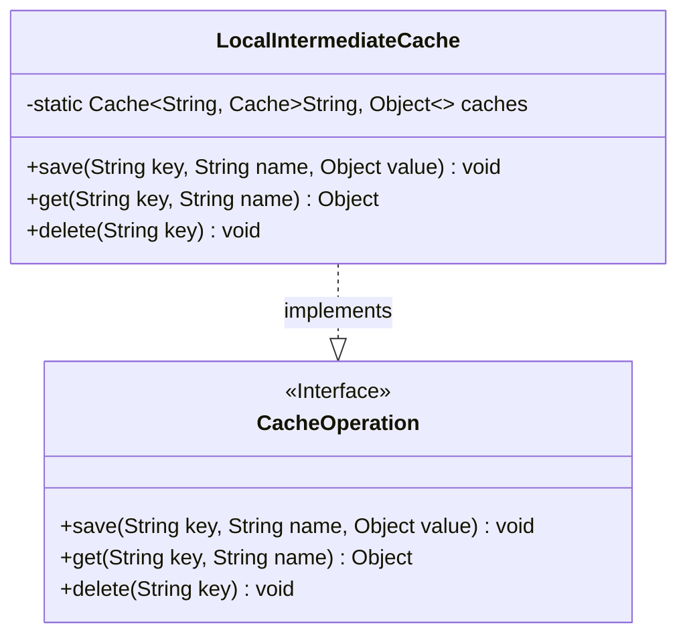
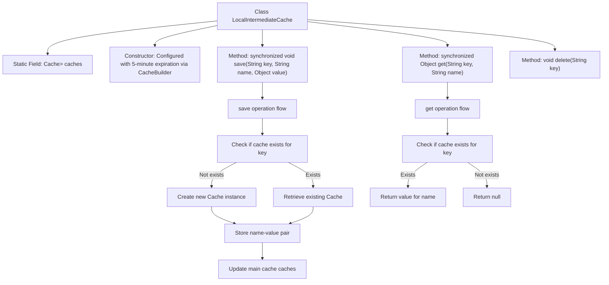

# Basic Information

|      |      |
|------|------|
| Name | LocalIntermediateCache |
| Language | .java |
| Code Path | WeFe/mpc/mpc-common/src/main/java/com/welab/wefe/mpc/cache/intermediate/impl/LocalIntermediateCache.java |
| Package Name | com.welab.wefe.mpc.cache.intermediate.impl |
| Dependencies | ['java.util.concurrent.TimeUnit', 'com.google.common.cache.Cache', 'com.google.common.cache.CacheBuilder', 'com.welab.wefe.mpc.cache.intermediate.CacheOperation'] |
| Brief Description | The LocalIntermediateCache implements the CacheOperation interface, uses a nested Cache structure to store data, supports automatic expiration after 5 minutes of no access, and provides synchronous save and retrieval methods, but the deletion method is not implemented. |

# Description

The `LocalIntermediateCache` class implements the `CacheOperation` interface and is used to manage local caching. It employs a two-level cache structure: the outer cache uses strings as keys to store inner cache objects, while the inner cache also uses strings as keys to store actual values. The outer cache is configured with a 5-minute access expiration policy. It provides a synchronous `save` method for storing key-value pairs, a `get` method for retrieving values, and an unimplemented `delete` method. When saving data, it checks and creates an instance of the inner cache if necessary.

# Class Summary

| Name   | Type  | Description |
|-------|------|-------------|
| LocalIntermediateCache | class | The `LocalIntermediateCache` class implements the `CacheOperation` interface, utilizes Guava Cache to build a secondary cache, supports synchronous data saving and retrieval, and defaults to a 5-minute expiration. |

## Class LocalIntermediateCache

|      |      |
|------|------|
| Access Modifier | public |
| Type | class |
| Name | LocalIntermediateCache |
| Description | The `LocalIntermediateCache` class implements the `CacheOperation` interface, utilizes Guava Cache to build a secondary cache, supports synchronous data saving and retrieval, and defaults to a 5-minute expiration. |

### UML Class Diagram

This code implements a local intermediate caching system using Guava Cache to construct a two-level cache structure. The LocalIntermediateCache class implements the CacheOperation interface, maintaining multiple namespace caches (where the first-level key corresponds to a second-level Cache) through a static Cache object. Key functionalities include synchronously saving key-value pairs (save), retrieving cached values (get), and deleting caches (delete), with the first-level cache configured with a 5-minute access expiration policy. The class diagram clearly illustrates the relationship between the interface and its implementation class, as well as the complex cache structure defined using generics.

### Internal Method Call Graph

This flowchart illustrates the core structure and operational logic of the LocalIntermediateCache class. The class implements a two-level cache architecture using Guava Cache, where the primary cache 'caches' stores sub-caches grouped by keys. The save method employs synchronization to ensure thread safety, enabling lazy initialization of sub-caches while maintaining dual-level cache relationships. The get method similarly accesses data synchronously, returning values only when both key levels exist. The flowchart clearly presents different processing paths for cache hits/misses and demonstrates the hierarchical calling relationships between methods.

### Field List

| Name  | Type  | Description |
|-------|-------|------|
| caches = CacheBuilder.newBuilder().expireAfterAccess(5, TimeUnit.MINUTES).build() | Cache<String, Cache<String, Object>> | Defined a static cache object, built using CacheBuilder, with String as the key and nested cache as the value, where cache entries automatically expire after 5 minutes of no access. |

### Method List

| Name  | Type  | Description |
|-------|-------|------|
| save | void | Synchronously save key-value pairs; if the cache does not exist, create and store it, then finally update the main cache. |
| get | Object | Synchronous methods retrieve cached values by key and name, returning the corresponding value if it exists, otherwise returning null. |
| delete | void | Empty method: Deletes the specified key-value pair, with no concrete logic implemented. |

