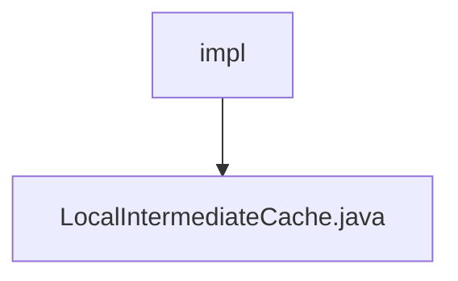

# Basic Information

|      |      |
|------|------|
| Name | impl |
| Language | .java |
| Code Path | WeFe/mpc/mpc-common/src/main/java/com/welab/wefe/mpc/cache/intermediate/impl |
| Package Name | docs.mpc.mpc-common.src.main.java.com.welab.wefe.mpc.cache.intermediate.impl |
| Brief Description | LocalIntermediateCache implements the CacheOperation interface, utilizes a nested Cache structure for data storage, supports automatic expiration after 5 minutes of inactivity, and provides synchronous save and retrieval methods, though the deletion method remains unimplemented. |

# Description

The `LocalIntermediateCache` class implements the `CacheOperation` interface and is used to manage local caching. It employs a two-level cache structure: the outer cache uses strings as keys to store inner cache objects, while the inner cache also uses strings as keys to store actual values. The outer cache is configured with a 5-minute access expiration policy. It provides a synchronous `save` method for storing key-value pairs, a `get` method for retrieving values, and an unimplemented `delete` method. When saving data, it checks and creates an instance of the inner cache if necessary.

### Package Internal Structure View

This flowchart illustrates the cache implementation structure in the mpc-common module of the WeFe project. The root node "impl" represents the intermediate cache implementation directory, which contains a concrete implementation file "LocalIntermediateCache.java". This file implements the local intermediate cache functionality. The entire structure is concise and clear, reflecting a modular design with a single implementation class.

# File List

| Name   | Type  | Description |
|-------|------|-------------|
| [LocalIntermediateCache.java](LocalIntermediateCache.md) | file | LocalIntermediateCache implements the CacheOperation interface, using a nested Cache structure to store data. It supports automatic expiration after 5 minutes of inactivity and provides synchronous save and retrieval methods, but the deletion method is not implemented. |

