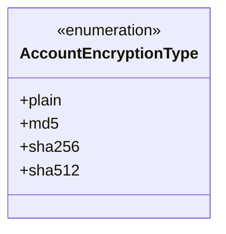
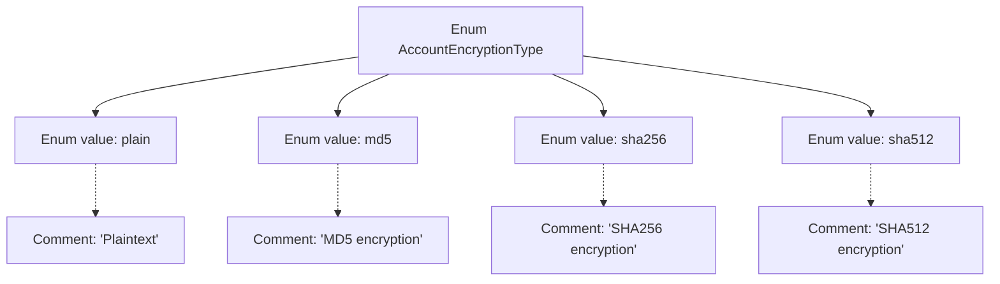

# Basic Information

|      |      |
|------|------|
| Name | AccountEncryptionType |
| Language | .java |
| Code Path | WeFe/mpc/mpc-common/src/main/java/com/welab/wefe/mpc/commom/AccountEncryptionType.java |
| Package Name | com.welab.wefe.mpc.commom |
| Dependencies | [] |
| Brief Description | Enumeration defines account encryption types: plaintext, md5, sha256, sha512. |

# Description

This enumeration defines the encryption types for account passwords, including four options: plaintext (plain), MD5 encryption (md5), SHA256 encryption (sha256), and SHA512 encryption (sha512). Each type has corresponding comments explaining its encryption method.

# Class Summary

| Name   | Type  | Description |
|-------|------|-------------|
| AccountEncryptionType | enum | The enumeration AccountEncryptionType defines four account encryption types: plaintext, md5, sha256, and sha512. |

## Class AccountEncryptionType

|      |      |
|------|------|
| Access Modifier | public |
| Type | enum |
| Name | AccountEncryptionType |
| Description | The enumeration AccountEncryptionType defines four account encryption types: plaintext, md5, sha256, and sha512. |

### UML Class Diagram

This code defines an enumeration type named AccountEncryptionType, which represents different encryption methods for account passwords. The enumeration includes four values: plain indicates plaintext storage, md5 represents encryption using the MD5 algorithm, sha256 denotes encryption with the SHA-256 algorithm, and sha512 signifies encryption with the SHA-512 algorithm. Enumeration types are typically used to define a set of fixed constants. Here, the enumeration clearly limits the available encryption options, facilitating unified management and usage of these encryption methods in code while avoiding potential errors caused by magic strings.

### Internal Method Call Graph

This flowchart illustrates the structure of the AccountEncryptionType enum, which includes four enum values (plain, md5, sha256, sha512) along with their corresponding comment descriptions. Each enum value is connected via dashed lines to its documentation comments, clearly presenting the semantic definitions of different encryption types. This design is commonly used in configuration systems to represent optional encryption algorithm types.

### Field List

| Name  | Type  | Description |
|-------|-------|------|

### Method List

| Name  | Type  | Description |
|-------|-------|------|

