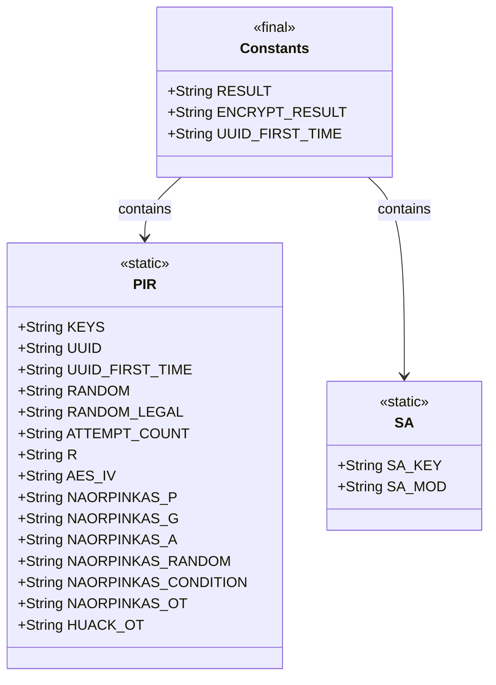

# Basic Information

|      |      |
|------|------|
| Name | Constants |
| Language | .java |
| Code Path | WeFe/mpc/mpc-common/src/main/java/com/welab/wefe/mpc/commom/Constants.java |
| Package Name | com.welab.wefe.mpc.commom |
| Dependencies | [] |
| Brief Description | Define a constant class `Constants` containing general constants such as `RESULT` and `ENCRYPT_RESULT`, along with two subclasses `PIR` and `SA` for storing configuration parameters and key names related to Private Information Retrieval and Secure Computation, respectively. |

# Description

The code defines a Java class named Constants, which contains multiple static constant strings. It is primarily divided into three parts: top-level constants including RESULT, ENCRYPT_RESULT, and UUID_FIRST_TIME; the PIR static inner class contains constants related to Private Information Retrieval, such as keys, UUID, random numbers, attempt counts, R-value, AES initialization vector, as well as parameters for the Naor-Pinkas and Huack OT protocols; the SA static inner class defines SA_KEY and SA_MOD constants related to secure computation. All constants store configuration or identifier names in string form.

# Class Summary

| Name   | Type  | Description |
|-------|------|-------------|
| Constants | class | The Java class Constants defines multiple static constant strings, including RESULT, ENCRYPT_RESULT, etc., and contains two subclasses, PIR and SA, which define related constants such as KEYS, UUID, and SA_KEY, SA_MOD, respectively. |

## Class Constants

|      |      |
|------|------|
| Access Modifier | public |
| Type | class |
| Name | Constants |
| Description | The Java class Constants defines multiple static constant strings, including RESULT, ENCRYPT_RESULT, etc., and contains two subclasses, PIR and SA, which define related constants such as KEYS, UUID, and SA_KEY, SA_MOD, respectively. |

### UML Class Diagram

This code defines a `Constants` class containing multiple static constant strings for storing configuration key names across different modules. It nests two static inner classes `PIR` and `SA`, which define constants for the Private Information Retrieval and Secure Computation modules respectively. The class diagram illustrates the containment relationship between `Constants` as a container class and its two inner classes, with all fields being public static constants adhering to the utility class design pattern. This structure facilitates centralized management of cross-module configuration keys, enhancing code maintainability.

### Internal Method Call Graph

```mermaid
graph TD
    A["Class Constants"]
    B["Constant: RESULT = 'mpc_origin_result'"]
    C["Constant: ENCRYPT_RESULT = 'mpc_encrypt_result'"]
    D["Constant: UUID_FIRST_TIME = 'mpc_first_time'"]
    E["Nested Class PIR"]
    F["Constant: KEYS = 'pir_keys'"]
    G["Constant: UUID = 'pir_uuid'"]
    H["Constant: UUID_FIRST_TIME = 'pir_time'"]
    I["Constant: RANDOM = 'pir_random'"]
    J["Constant: RANDOM_LEGAL = 'pir_random_legal'"]
    K["Constant: ATTEMPT_COUNT = 'pir_attempt_count'"]
    L["Constant: R = 'pir_r'"]
    M["Constant: AES_IV = 'pir_iv'"]
    N["Constant: NAORPINKAS_P = 'naorpinkas_p'"]
    O["Constant: NAORPINKAS_G = 'naorpinkas_g'"]
    P["Constant: NAORPINKAS_A = 'naorpinkas_a'"]
    Q["Constant: NAORPINKAS_RANDOM = 'naorpinkas_random'"]
    R["Constant: NAORPINKAS_CONDITION = 'naorpinkas_condition'"]
    S["Constant: NAORPINKAS_OT = 'naorpinkas_ot'"]
    T["Constant: HUACK_OT = 'huack_ot'"]
    U["Nested Class SA"]
    V["Constant: SA_KEY = 'sa_key'"]
    W["Constant: SA_MOD = 'sa_mod'"]

    A --> B
    A --> C
    A --> D
    A --> E
    E --> F
    E --> G
    E --> H
    E --> I
    E --> J
    E --> K
    E --> L
    E --> M
    E --> N
    E --> O
    E --> P
    E --> Q
    E --> R
    E --> S
    E --> T
    A --> U
    U --> V
    U --> W
```

This flowchart illustrates the structure of the Constants class, which includes top-level constants and two nested classes, PIR and SA. The PIR class defines constants related to Private Information Retrieval, such as keys, UUIDs, random numbers, and encryption parameters. The SA class defines constants related to Secure Computation. All constants are static final strings used for global configuration and identifier management.

### Field List

| Name  | Type  | Description |
|-------|-------|------|
| RESULT = "mpc_origin_result" | String | Define a static constant RESULT with the value "mpc_origin_result". |
| UUID_FIRST_TIME = "mpc_first_time" | String | Static constant string identifying the first-time usage state, with the key name "mpc_first_time". |
| ENCRYPT_RESULT = "mpc_encrypt_result" | String | Define the constant string ENCRYPT_RESULT with the value "mpc_encrypt_result". |

### Method List

| Name  | Type  | Description |
|-------|-------|------|

