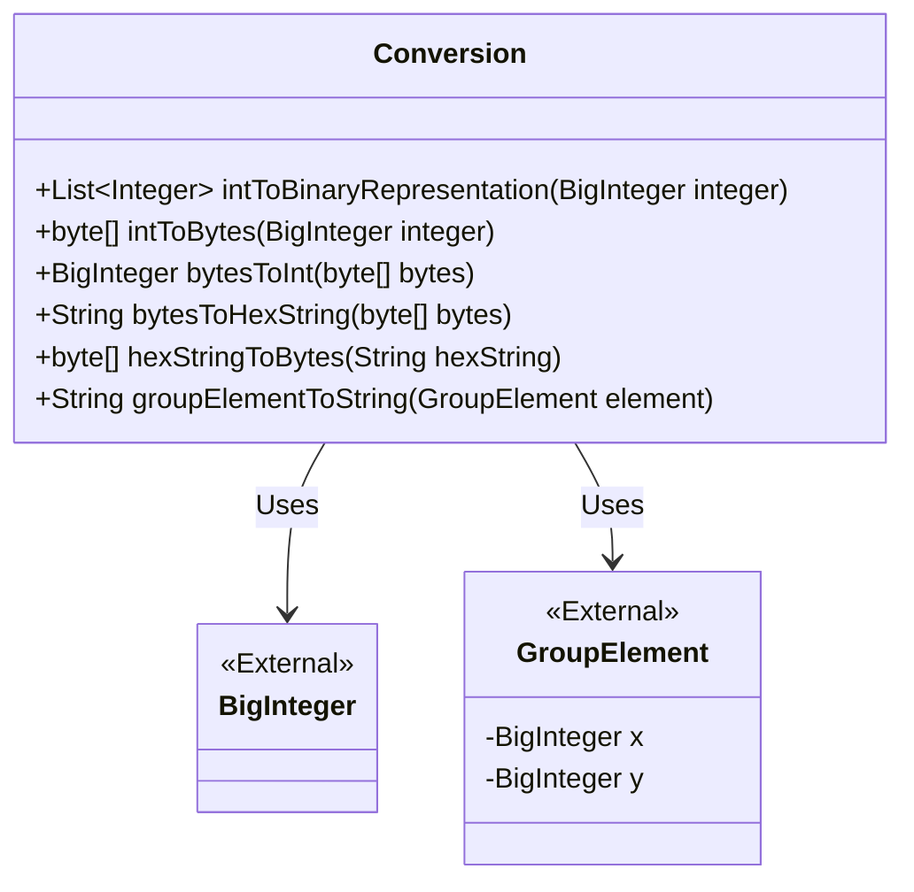
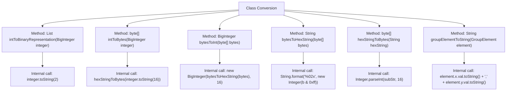

# Basic Information

|      |      |
|------|------|
| Name | Conversion |
| Language | .java |
| Code Path | WeFe/mpc/mpc-common/src/main/java/com/welab/wefe/mpc/commom/Conversion.java |
| Package Name | com.welab.wefe.mpc.commom |
| Dependencies | ['com.welab.wefe.mpc.pir.protocol.nt.group.GroupElement', 'java.math.BigInteger', 'java.util.ArrayList', 'java.util.List'] |
| Brief Description | The Conversion class provides numerical conversion functionalities: converting integers to binary exponent lists, mutual conversion between integers and byte arrays, mutual conversion between byte arrays and hexadecimal strings, and converting group elements to strings. |

# Description

The Conversion class provides various numerical conversion methods. intToBinaryRepresentation converts large integers to binary representation and returns an exponent list. intToBytes and bytesToInt facilitate mutual conversion between large integers and byte arrays. bytesToHexString and hexStringToBytes handle conversions between byte arrays and hexadecimal strings. groupElementToString transforms group elements into coordinate strings. All methods are based on BigInteger for handling large numerical values, ensuring precision and security.

# Class Summary

| Name   | Type  | Description |
|-------|------|-------------|
| Conversion | class | The `Conversion` class provides numerical conversion functionalities: converting integers to binary bit lists, mutual conversion between integers and byte arrays, mutual conversion between byte arrays and hexadecimal strings, and converting group elements to strings. |

## Class Conversion

|      |      |
|------|------|
| Access Modifier | public |
| Type | class |
| Name | Conversion |
| Description | The `Conversion` class provides numerical conversion functionalities: converting integers to binary bit lists, mutual conversion between integers and byte arrays, mutual conversion between byte arrays and hexadecimal strings, and converting group elements to strings. |

### UML Class Diagram

This code defines a utility class named `Conversion` that provides various numerical conversion methods. Key functionalities include: converting a large integer to binary representation (returning a list of exponents), bidirectional conversion between integers and byte arrays, bidirectional conversion between byte arrays and hexadecimal strings, and converting a group element object to a string. All methods are static and stateless. The class depends on external `BigInteger` and `GroupElement` classes, where `GroupElement` contains two large integer fields x and y. The conversion logic involves bit operations, radix conversion, and string processing, making it suitable for cryptography or mathematical computation scenarios.

### Internal Method Call Graph

This code demonstrates a utility class named Conversion, which provides various data format conversion functionalities. It primarily includes mutual conversions between binary/hexadecimal strings and integer/BigInteger types, as well as methods for converting between byte arrays and hexadecimal strings. The flowchart clearly illustrates the class structure and invocation relationships between methods, such as the intToBytes method calling hexStringToBytes, and the bytesToInt method relying on bytesToHexString. All methods revolve around the core functionality of data format conversion, featuring well-defined input/output types and rigorous type-handling logic.

### Field List

| Name  | Type  | Description |
|-------|-------|------|

### Method List

| Name  | Type  | Description |
|-------|-------|------|
| bytesToHexString | String | Convert a byte array to a hexadecimal string, where each byte is converted to a two-digit hexadecimal number and concatenated for return. |
| bytesToInt | BigInteger | Convert the byte array to a hexadecimal string and then to a big integer. |
| intToBytes | byte[] | Convert a large integer to a hexadecimal string, then to a byte array. |
| intToBinaryRepresentation | List<Integer> | Convert a large integer to its binary representation and return a list of exponents corresponding to all bits with a value of 1. |
| hexStringToBytes | byte[] | Convert a hexadecimal string to a byte array, return an empty array for an empty string, and parse every two characters as one byte. |
| groupElementToString | String | Convert the x and y property values of the GroupElement object into strings and concatenate them with a comma. |

