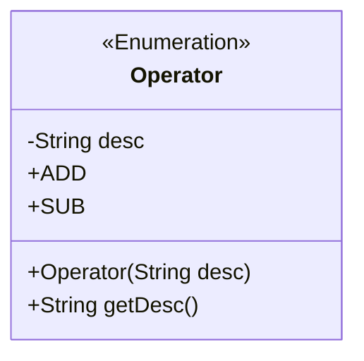
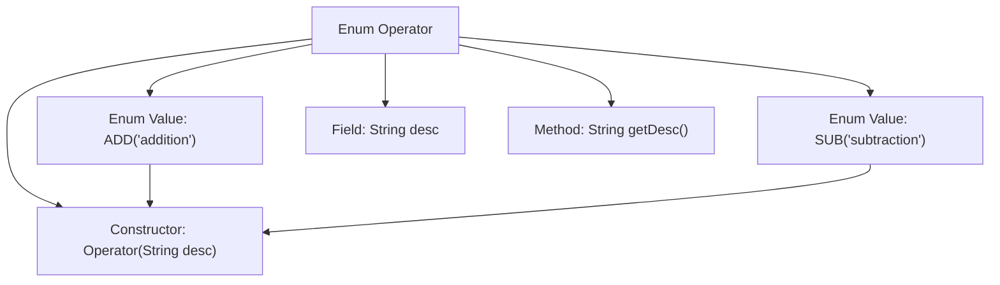

# Basic Information

|      |      |
|------|------|
| Name | Operator |
| Language | .java |
| Code Path | WeFe/mpc/mpc-common/src/main/java/com/welab/wefe/mpc/commom/Operator.java |
| Package Name | com.welab.wefe.mpc.commom |
| Dependencies | [] |
| Brief Description | Define an enum Operator, containing two values ADD and SUB, described as addition and subtraction respectively, and provide a method getDesc to retrieve the description. |

# Description

The code defines an enumeration type named `Operator`, which includes two enum values `ADD` and `SUB`, representing addition and subtraction operations respectively. Each enum value has a `desc` field initialized via a constructor. The enumeration also provides a `getDesc` method to retrieve the description. The entire structure succinctly encapsulates operators and their descriptions, making it easy to reference and extend in the code.

# Class Summary

| Name   | Type  | Description |
|-------|------|-------------|
| Operator | enum | Define an enumeration `Operator` containing two values, `ADD` and `SUB`, representing addition and subtraction respectively. Each enumeration value has a description field `desc` and can be retrieved via the `getDesc` method. |

## Class Operator

|      |      |
|------|------|
| Access Modifier | public |
| Type | enum |
| Name | Operator |
| Description | Define an enumeration `Operator` containing two values, `ADD` and `SUB`, representing addition and subtraction respectively. Each enumeration value has a description field `desc` and can be retrieved via the `getDesc` method. |

### UML Class Diagram

This class diagram illustrates a Java enumeration type `Operator`, which contains two enum values ADD and SUB, each with a description string `desc`. The enum class provides a constructor `Operator(String desc)` to initialize the description and a public method `getDesc()` to retrieve the description. The enumeration type is marked with `<<Enumeration>>` in the class diagram, clearly indicating it as a finite set of constants suitable for representing fixed operation types.

### Internal Method Call Graph

This flowchart illustrates the structure of the Operator enum, which includes two enum values ADD and SUB, a private field desc, a constructor for initializing desc, and a method getDesc to retrieve the desc. The enum values initialize their description through the constructor, clearly demonstrating the definition and usage pattern of the enum.

### Field List

| Name  | Type  | Description |
|-------|-------|------|

### Method List

| Name  | Type  | Description |
|-------|-------|------|

