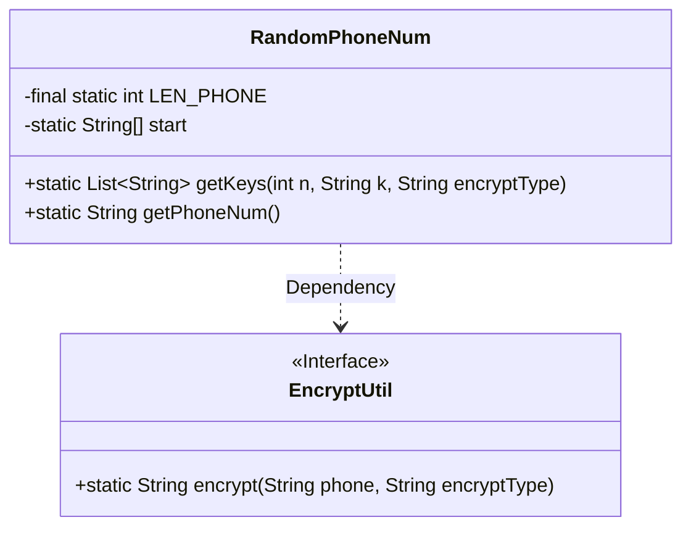
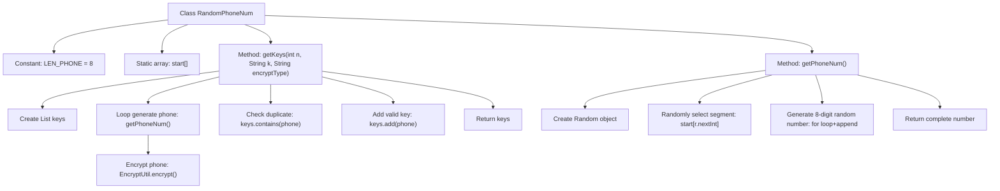

# Basic Information

|      |      |
|------|------|
| Name | RandomPhoneNum |
| Language | .java |
| Code Path | WeFe/mpc/mpc-common/src/main/java/com/welab/wefe/mpc/commom/RandomPhoneNum.java |
| Package Name | com.welab.wefe.mpc.commom |
| Dependencies | ['com.welab.wefe.mpc.util.EncryptUtil', 'java.util.ArrayList', 'java.util.List', 'java.util.Random'] |
| Brief Description | Generate a random phone number class containing common number segments, capable of producing a specified quantity of non-repeating encrypted numbers. |

# Description

The code defines a utility class named RandomPhoneNum for generating random phone numbers. The class includes an array `start` containing common Chinese mobile number segments, with a total length of 8 digits. It provides two methods: `getPhoneNum()` randomly generates a valid phone number by selecting a segment and concatenating the remaining digits, while `getKeys()` generates a list of `n` unique encrypted phone numbers, ensuring uniqueness by excluding duplicates and a specified value `k` through encryption using EncryptUtil. The entire process guarantees result uniqueness and encryption handling.

# Class Summary

| Name   | Type  | Description |
|-------|------|-------------|
| RandomPhoneNum | class | Generate a random phone number class, including a segment array and generation method, supporting encryption and deduplication. |

## Class RandomPhoneNum

|      |      |
|------|------|
| Access Modifier | public |
| Type | class |
| Name | RandomPhoneNum |
| Description | Generate a random phone number class, including a segment array and generation method, supporting encryption and deduplication. |

### UML Class Diagram

This code describes a utility class `RandomPhoneNum` for generating random phone numbers, which includes the static method `getPhoneNum()` to generate random numbers and `getKeys()` to produce a list of encrypted numbers in specified quantities. The class defines a legal prefix array `start` and a fixed number length `LEN_PHONE`. It relies on the `EncryptUtil` interface for data encryption and manages generated numbers through generic lists. The flowchart illustrates the core class structure and dependency relationships, highlighting the decoupled design between static utility class features and encryption functionality.

### Internal Method Call Graph

This flowchart illustrates the core functionality of the RandomPhoneNum class: generating phone numbers by randomly selecting segments and combining them with 8-digit random numbers (getPhoneNum method), then producing a specified quantity of unique encrypted numbers through encryption and deduplication (getKeys method). The process consists of four key stages: random segment selection, number generation, encryption verification, and result set management, demonstrating a complete pipeline from raw data generation to secure processing.

### Field List

| Name  | Type  | Description |
|-------|-------|------|
| LEN_PHONE = 8 | int | Define the constant LEN_PHONE with a value of 8, representing the length of a phone number. |
| start = {            "130", "131", "132", "133", "134", "135", "136", "137", "138", "139",            "145", "147", "149",            "150", "151", "152", "153", "155", "156", "157", "158", "159",            "166",            "170", "171", "172", "173", "175", "176", "177", "178",            "180", "181", "182", "183", "184", "185", "186", "187", "188", "189",            "198", "199"} | String[] | List of Chinese mobile phone number segments, including partial carrier number segments from 130-199. |

### Method List

| Name  | Type  | Description |
|-------|-------|------|
| getKeys | List<String> | This method generates a list of n non-repeating encrypted phone numbers that are not equal to k. It retrieves phone numbers in a loop, encrypts them, skips duplicates or values equal to k, and continues until n numbers are collected. The resulting list is then returned. |
| getPhoneNum | String | Generate a random phone number: randomly select a segment and concatenate it with 8 digits, then return the complete number. |

