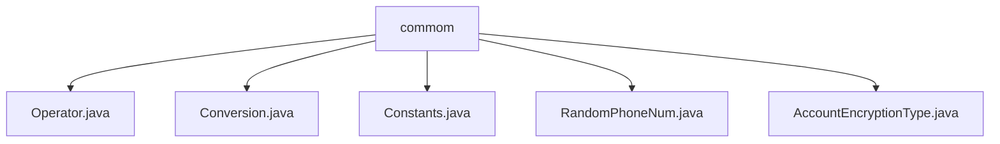

# Basic Information

|      |      |
|------|------|
| Name | commom |
| Language | .java |
| Code Path | WeFe/mpc/mpc-common/src/main/java/com/welab/wefe/mpc/commom |
| Package Name | docs.mpc.mpc-common.src.main.java.com.welab.wefe.mpc.commom |
| Brief Description | The Operator enumeration defines addition and subtraction operations along with their descriptions. The Conversion class handles numerical conversions. The Constants class stores static configurations. RandomPhoneNum generates randomly encrypted phone numbers. The AccountEncryptionType enumeration specifies password encryption methods. |

# Description

## Overview  
The core responsibility of this module is to provide a foundational toolkit for MPC (Secure Multi-Party Computation), including operator definitions, numerical conversions, constant management, and random data generation. The interface specifications cover enumerated types (such as `Operator` and `AccountEncryptionType`), utility classes (like `Conversion` and `RandomPhoneNum`), and constant containers (`Constants`). Key data structures include large integers (`BigInteger`), binary/hexadecimal data, group element coordinates, and encrypted phone numbers. External dependencies involve cryptographic tools (e.g., AES), OT protocols (Naor-Pinkas/Huack), and hash algorithms (MD5/SHA). For example, the `Operator` enumeration encapsulates arithmetic operations like addition and subtraction, while `RandomPhoneNum` generates encrypted phone numbers.  

## Key Business Scenarios  
The module supports the entire secure computation workflow, including data preprocessing (e.g., numerical conversions), protocol parameter configuration (via `Constants`), and private data handling (e.g., random phone number generation). The interaction model resembles a toolchain pattern, where components can be invoked independently. Typical applications include: numerical format conversion (e.g., `intToBytes`), protocol parameter passing (e.g., PIR constants), and test data generation (e.g., `getPhoneNum`). API types range from enumeration access and static method calls to constant references, such as selecting encryption algorithms via `AccountEncryptionType` or performing large-number operations using `Conversion`.

### Package Internal Structure View

This flowchart illustrates the directory structure of the commom folder in the mpc-common module of the WeFe project, which contains five Java class files: Operator.java, Conversion.java, Constants.java, RandomPhoneNum.java, and AccountEncryptionType.java. All files are directly located under the commom directory without any deeper subdirectory hierarchy.

# File List

| Name   | Type  | Description |
|-------|------|-------------|
| [Operator.java](Operator.md) | file | Define an enum Operator, containing two values ADD and SUB, described as addition and subtraction respectively, and provide a method getDesc to retrieve the description. |
| [Conversion.java](Conversion.md) | file | The Conversion class provides numerical conversion functionalities: converting integers to binary exponent lists, mutual conversion between integers and byte arrays, mutual conversion between byte arrays and hexadecimal strings, and converting group elements to strings. |
| [Constants.java](Constants.md) | file | Define a constant class named Constants, which includes general constants such as RESULT and ENCRYPT_RESULT, as well as two subclasses, PIR and SA, storing configuration parameters and key names related to Private Information Retrieval and Secure Computation respectively. |
| [RandomPhoneNum.java](RandomPhoneNum.md) | file | Generate a random phone number class, including common number segments, capable of producing a specified quantity of unique encrypted numbers. |
| [AccountEncryptionType.java](AccountEncryptionType.md) | file | Enumeration defines account encryption types: plaintext, md5, sha256, sha512. |

