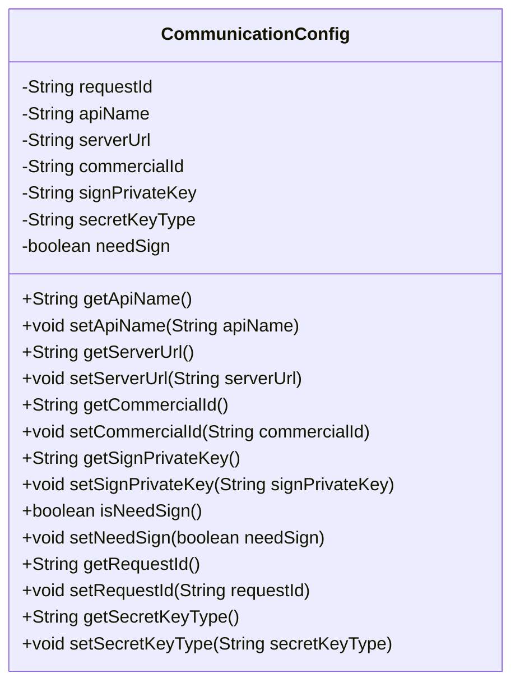

# Basic Information

|      |      |
|------|------|
| Name | CommunicationConfig |
| Language | .java |
| Code Path | WeFe/mpc/mpc-common/src/main/java/com/welab/wefe/mpc/config/CommunicationConfig.java |
| Package Name | com.welab.wefe.mpc.config |
| Dependencies | ['java.util.UUID'] |
| Brief Description | Communication configuration class, which includes attributes such as request ID, interface name, server address, merchant ID, signature private key, key type, and signature switch, providing getter and setter methods for each field. |

# Description

The `CommunicationConfig` class defines communication configuration parameters, including attributes such as request ID, interface name, server address, merchant ID, signature private key, key type, and whether a signature is required. Each attribute has corresponding getter and setter methods, with the request ID defaulting to a UUID string without hyphens.

# Class Summary

| Name   | Type  | Description |
|-------|------|-------------|
| CommunicationConfig | class | Communication configuration class, containing attributes such as request ID, interface name, server address, merchant ID, signature private key, key type, and whether signing is required, along with corresponding getter/setter methods. |

## Class CommunicationConfig

|      |      |
|------|------|
| Access Modifier | public |
| Type | class |
| Name | CommunicationConfig |
| Description | Communication configuration class, containing attributes such as request ID, interface name, server address, merchant ID, signature private key, key type, and whether signing is required, along with corresponding getter/setter methods. |

### UML Class Diagram

This code defines a configuration class named CommunicationConfig, primarily used for managing communication-related configuration information. The class contains multiple private fields such as requestId, apiName, serverUrl, etc., which store configuration parameters like request ID, API name, server address, etc. Public getter and setter methods are provided to access and modify these fields. The requestId is automatically initialized with a hyphen-stripped UUID string, and the needSign field defaults to true, indicating that signing is required by default. This class is suitable for scenarios requiring dynamic configuration of communication parameters, such as basic configuration management for API calls.

### Internal Method Call Graph

```mermaid
graph TD
    A["Class CommunicationConfig"]
    B["Property: String requestId = UUID generation"]
    C["Property: String apiName"]
    D["Property: String serverUrl"]
    E["Property: String commercialId"]
    F["Property: String signPrivateKey"]
    G["Property: String secretKeyType"]
    H["Property: boolean needSign = true"]
    I["Method: getApiName()"]
    J["Method: setApiName(String)"]
    K["Method: getServerUrl()"]
    L["Method: setServerUrl(String)"]
    M["Method: getCommercialId()"]
    N["Method: setCommercialId(String)"]
    O["Method: getSignPrivateKey()"]
    P["Method: setSignPrivateKey(String)"]
    Q["Method: isNeedSign()"]
    R["Method: setNeedSign(boolean)"]
    S["Method: getRequestId()"]
    T["Method: setRequestId(String)"]
    U["Method: getSecretKeyType()"]
    V["Method: setSecretKeyType(String)"]

    A --> B
    A --> C
    A --> D
    A --> E
    A --> F
    A --> G
    A --> H
    A --> I
    A --> J
    A --> K
    A --> L
    A --> M
    A --> N
    A --> O
    A --> P
    A --> Q
    A --> R
    A --> S
    A --> T
    A --> U
    A --> V
```

This flowchart illustrates the complete structure of the CommunicationConfig class, comprising 8 properties and 14 methods. Core properties include auto-generated requestId, interface configuration parameters (apiName/serverUrl), and signature-related fields (signPrivateKey/needSign, etc.). All properties are equipped with getter/setter methods, where requestId is generated via UUID during initialization with hyphens removed, and needSign defaults to true. The class design primarily serves to encapsulate communication configuration information, supporting dynamic modification of parameter values.

### Field List

| Name  | Type  | Description |
|-------|-------|------|
| requestId = UUID.randomUUID().toString().replaceAll("-", "") | String | Generate a unique request ID by removing hyphens from the UUID. |
| commercialId | String | Declare a private string variable commercialId. |
| signPrivateKey | String | Private string variable used to store the signing private key. |
| needSign = true | boolean | The boolean variable needSign is initialized as true, indicating that a signature is required. |
| secretKeyType | String | Private string variable storing key type information. |
| serverUrl | String | The private string variable serverUrl is used to store the server URL address. |
| apiName | String | private String variable apiName |

### Method List

| Name  | Type  | Description |
|-------|-------|------|
| setServerUrl | void | The method to set the server URL assigns the input parameter to the class's serverUrl variable. |
| setNeedSign | void | Defined a public method `setNeedSign` for setting the boolean value of the `needSign` property. |
| setCommercialId | void | The method to set the commercial ID assigns the parameter value to the class's commercialId property. |
| getApiName | String | Methods to obtain the API name, returning a string-type variable `apiName`. |
| getCommercialId | String | Method to obtain the commercial ID, returns a string-type variable `commercialId`. |
| setSignPrivateKey | void | The method to set the signature private key assigns the input parameter to the class member variable signPrivateKey. |
| setApiName | void | This is a Java method used to set the apiName property value of a class. The method takes a string parameter and assigns it to a member variable. |
| getSecretKeyType | String | Method to obtain the key type, returns a secretKeyType string. |
| setRequestId | void | Methods for setting the request ID: Assign the passed requestId to the requestId property of the current object. |
| getSignPrivateKey | String | This method returns the signature private key string. |
| getRequestId | String | The method returns the request ID string. |
| getServerUrl | String | Methods to obtain the server URL, directly returning the value of the member variable `serverUrl`. |
| isNeedSign | boolean | The method isNeedSign returns a boolean value needSign, indicating whether a signature is required. |
| setSecretKeyType | void | The method for setting the key type assigns the input parameter to the `secretKeyType` member variable of the class. |

