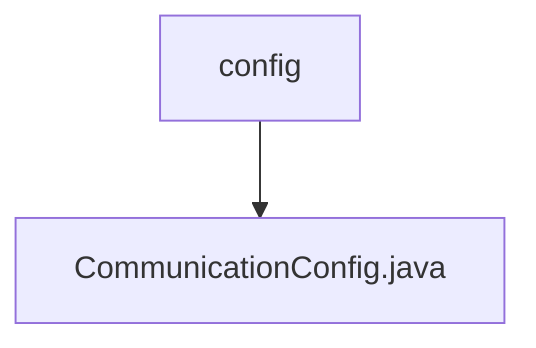

# Basic Information

|      |      |
|------|------|
| Name | config |
| Language | .java |
| Code Path | WeFe/mpc/mpc-common/src/main/java/com/welab/wefe/mpc/config |
| Package Name | docs.mpc.mpc-common.src.main.java.com.welab.wefe.mpc.config |
| Brief Description | Communication configuration class, which includes attributes such as request ID, interface name, server address, merchant ID, signature private key, key type, and signature switch, providing getter and setter methods for each field. |

# Description

The `CommunicationConfig` class defines communication configuration parameters, including attributes such as request ID, interface name, server address, merchant ID, signature private key, key type, and whether a signature is required. Each attribute has corresponding getter and setter methods, with the request ID defaulting to a UUID string without hyphens.

### Package Internal Structure View

This flowchart illustrates the configuration directory structure of the mpc-common module in the WeFe project. The root node is the config folder, which contains a Java configuration file named CommunicationConfig.java. This structure represents a typical small-scale module configuration directory layout, commonly used for storing communication configuration-related class files within the module.

# File List

| Name   | Type  | Description |
|-------|------|-------------|
| [CommunicationConfig.java](CommunicationConfig.md) | file | Communication configuration class, containing attributes such as request ID, interface name, server address, merchant ID, signature private key, key type, and signature switch, providing getter and setter methods for each field. |

