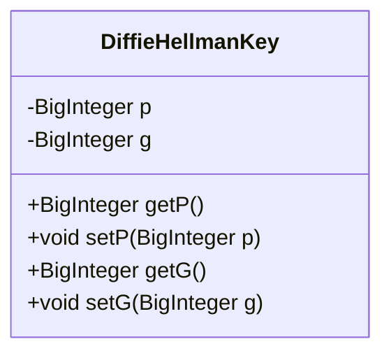
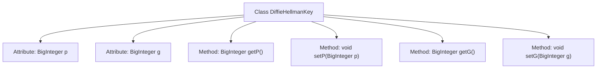

# Basic Information

|      |      |
|------|------|
| Name | DiffieHellmanKey |
| Language | .java |
| Code Path | WeFe/mpc/mpc-common/src/main/java/com/welab/wefe/mpc/key/DiffieHellmanKey.java |
| Package Name | com.welab.wefe.mpc.key |
| Dependencies | ['java.math.BigInteger'] |
| Brief Description | The DiffieHellmanKey class contains attributes p and g of type BigInteger, providing corresponding getter and setter methods. |

# Description

The code defines a Java class named DiffieHellmanKey, which implements the Diffie-Hellman key exchange protocol. The class contains two private BigInteger member variables, p and g, representing the prime modulus and the generator, respectively. It provides four public methods: getP and setP for retrieving and setting the value of p, and getG and setG for retrieving and setting the value of g. These methods allow external access and modification of these two critical parameters. The overall class structure is concise, focusing on storing and managing the two core numerical values required by the Diffie-Hellman algorithm.

# Class Summary

| Name   | Type  | Description |
|-------|------|-------------|
| DiffieHellmanKey | class | The DiffieHellmanKey class contains private variables p and g, representing a prime number and a large number base respectively, and provides corresponding getter and setter methods. |

## Class DiffieHellmanKey

|      |      |
|------|------|
| Access Modifier | public |
| Type | class |
| Name | DiffieHellmanKey |
| Description | The DiffieHellmanKey class contains private variables p and g, representing a prime number and a large number base respectively, and provides corresponding getter and setter methods. |

### UML Class Diagram

This class diagram illustrates a DiffieHellmanKey class designed to implement the Diffie-Hellman key exchange algorithm. The class contains two private attributes, p and g (a large prime number and its primitive root), along with corresponding getter and setter methods. p and g are the core parameters for key exchange, with public methods providing secure access and modification to ensure data encapsulation during the key exchange process.

### Internal Method Call Graph

This code defines a DiffieHellmanKey class for implementing the Diffie-Hellman key exchange protocol. The class contains two private attributes p and g (a large prime number and its primitive root), along with corresponding getter and setter methods. The flowchart illustrates the class structure and member relationships, where p and g serve as core parameters that can be securely accessed and modified through public methods, providing foundational data structure support for key exchange.

### Field List

| Name  | Type  | Description |
|-------|-------|------|
| g | BigInteger | The private large integer variable g. |
| p | BigInteger | Declare a private big integer variable p. |

### Method List

| Name  | Type  | Description |
|-------|-------|------|
| getG | BigInteger | Java method: Returns a variable g of type BigInteger. |
| setP | void | Java Method: Set the value of a BigInteger variable p. |
| setG | void | Java Method: Set the value of a BigInteger variable g. |
| getP | BigInteger | The method getP returns a variable p of type BigInteger. |

