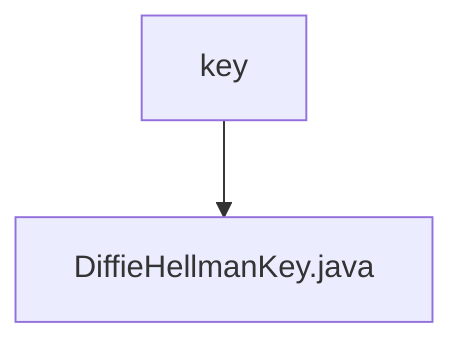

# Basic Information

|      |      |
|------|------|
| Name | key |
| Language | .java |
| Code Path | WeFe/mpc/mpc-common/src/main/java/com/welab/wefe/mpc/key |
| Package Name | docs.mpc.mpc-common.src.main.java.com.welab.wefe.mpc.key |
| Brief Description | The DiffieHellmanKey class includes attributes p and g of type BigInteger, providing corresponding getter and setter methods. |

# Description

The code defines a Java class named DiffieHellmanKey, which implements the Diffie-Hellman key exchange protocol. The class contains two private BigInteger member variables, p and g, representing the prime modulus and the generator, respectively. It provides four public methods: getP and setP for retrieving and setting the value of p, and getG and setG for retrieving and setting the value of g. These methods allow external access and modification of these two critical parameters. The overall class structure is concise, focusing on storing and managing the two core numerical values required by the Diffie-Hellman algorithm.

### Package Internal Structure View

This flowchart illustrates the file structure related to cryptographic keys in the mpc-common module of the WeFe project. The root node is the key directory, which contains a specific key implementation file DiffieHellmanKey.java. This structure reflects the single responsibility principle in modular design for key management functionality. The entire hierarchy is concise and clear, conforming to the typical directory layout of cryptographic components.

# File List

| Name   | Type  | Description |
|-------|------|-------------|
| [DiffieHellmanKey.java](DiffieHellmanKey.md) | file | The DiffieHellmanKey class contains attributes p and g of type BigInteger, providing corresponding getter and setter methods. |

