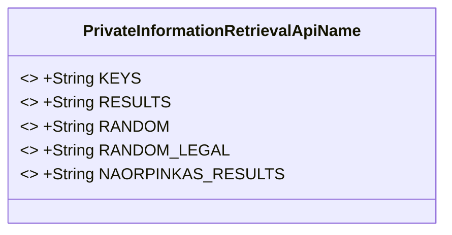
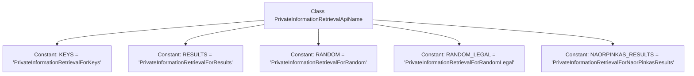

# Basic Information

|      |      |
|------|------|
| Name | PrivateInformationRetrievalApiName |
| Language | .java |
| Code Path | WeFe/mpc/mpc-common/src/main/java/com/welab/wefe/mpc/pir/PrivateInformationRetrievalApiName.java |
| Package Name | com.welab.wefe.mpc.pir |
| Dependencies | [] |
| Brief Description | The class PrivateInformationRetrievalApiName defines five constant strings, which are used for private information retrieval of keys, results, random values, valid random values, and NaorPinkas results. |

# Description

The content defines a public class named PrivateInformationRetrievalApiName, which contains five static constant string fields representing different types of private information retrieval functionalities. Specifically, KEYS is used for key retrieval, RESULTS for result retrieval, RANDOM for random retrieval, RANDOM_LEGAL for legal random retrieval, and NAORPINKAS_RESULTS for NaorPinkas algorithm result retrieval. These constants are used to identify different types of private information retrieval operations.

# Class Summary

| Name   | Type  | Description |
|-------|------|-------------|
| PrivateInformationRetrievalApiName | class | The PrivateInformationRetrievalApiName class defines five constant strings, which are used for the private information retrieval API names of key, result, random, valid random, and NaorPinkas result respectively. |

## Class PrivateInformationRetrievalApiName

|      |      |
|------|------|
| Access Modifier | public |
| Type | class |
| Name | PrivateInformationRetrievalApiName |
| Description | The PrivateInformationRetrievalApiName class defines five constant strings, which are used for the private information retrieval API names of key, result, random, valid random, and NaorPinkas result respectively. |

### UML Class Diagram

This code defines a utility class containing multiple public static constants, which represent different types of private information retrieval API names. Each constant is a final-modified string used to identify specific private information retrieval service types, including key retrieval, result retrieval, random retrieval, legal random retrieval, and Naor-Pinkas result retrieval. This design pattern is commonly employed to centrally manage API name constants, enhancing code readability and maintainability.

### Internal Method Call Graph

This code defines a class named PrivateInformationRetrievalApiName, which contains five static constant strings representing different private information retrieval API names. These constants may be used to identify or reference specific private information retrieval services or functional modules. Each constant is declared with public static final modifiers, indicating they are public, unmodifiable class-level constants.

### Field List

| Name  | Type  | Description |
|-------|-------|------|
| RANDOM = "PrivateInformationRetrievalForRandom" | String | Static constant RANDOM, with the value "PrivateInformationRetrievalForRandom", used to represent random private information retrieval. |
| NAORPINKAS_RESULTS = "PrivateInformationRetrievalForNaorPinkasResults" | String | The code defines a static constant string representing the private information retrieval result identifier for the Naor-Pinkas scheme. |
| KEYS = "PrivateInformationRetrievalForKeys" | String | The static constant KEYS is defined as "PrivateInformationRetrievalForKeys", used for private information retrieval of keys. |
| RESULTS = "PrivateInformationRetrievalForResults" | String | Define the constant RESULTS with the value "PrivateInformationRetrievalForResults". |
| RANDOM_LEGAL = "PrivateInformationRetrievalForRandomLegal" | String | The static constant RANDOM_LEGAL stores the string "PrivateInformationRetrievalForRandomLegal", which is used to represent private retrieval of random legal information. |

### Method List

| Name  | Type  | Description |
|-------|-------|------|

