# Basic Information

|      |      |
|------|------|
| Name | pir |
| Language | .java |
| Code Path | WeFe/mpc/mpc-common/src/main/java/com/welab/wefe/mpc/pir |
| Package Name | docs.mpc.mpc-common.src.main.java.com.welab.wefe.mpc.pir |
| Brief Description | The module implements the Naor-Pinkas protocol for private information retrieval, including interfaces for random number generation, key management, result querying, and verification. It adopts a two-phase interaction model, supports dynamic condition combination and batch processing, and is applied in federated learning. The cryptographic foundation system provides data verification, encryption, and transmission functionalities, supporting PIR and joint risk control scenarios. The abstract base class BasePrivateInformationRetrieval offers a foundational framework, defining uuid and initialization methods. The PrivateInformationRetrievalApiName class defines constants for five types of retrieval operations. |

# Description

## Overview  
This module establishes a secure multi-party computation (MPC) framework based on the Naor-Pinkas protocol, with core responsibilities including private information retrieval (PIR) and fundamental cryptographic operations. It enables encrypted queries and result returns through a two-phase interaction, supporting OT protocols such as Naor-Pinkas/Huack. The interface specification covers six categories of PIR operations (e.g., QueryKeysRequest/RandomLegalRequest) and basic cryptographic APIs (e.g., SymmetricKey/HauckObliviousTransfer). Key data structures include session identifiers (uuid), modular exponentiation parameters (s), curve point coordinates, and prime field elements, relying on the JCE encryption library and BigInteger. For instance, random number responses adopt a challenge-response mechanism, while Ed25519 curve operations support secure envelope generation.  

## Core Business Scenarios  
The module serves federated learning and joint risk control scenarios, providing a complete operational chain from basic hashing to advanced protocols. A typical PIR workflow involves three steps: submitting an ID set → verifying random numbers → extracting encrypted results, resembling a zero-knowledge proof mechanism. The cryptographic operation chain includes initializing keys → performing encryption/group operations → result verification, akin to a finite field arithmetic engine. The interaction mode is unified into object-oriented operations, such as Galois field element arithmetic or AES-CBC encryption/decryption. The API design adopts a layered structure, e.g., the NT protocol combines prime field operations, and the attemptCount field implements a query retry mechanism.

### Package Internal Structure View

```mermaid
graph TD
    pir --> request
    pir --> protocol
    pir --> flow
    pir --> PrivateInformationRetrievalApiName.java
    request --> naor
    request --> QueryRandomResponse.java
    request --> QueryKeysResponse.java
    request --> QueryPIRResultsResponse.java
    request --> QueryRandomRequest.java
    request --> QueryRandomLegalResponse.java
    request --> QueryRandomLegalRequest.java
    request --> QueryKeysRequest.java
    request --> QueryPIRResultsRequest.java
    request --> BaseResponse.java
    naor --> QueryNaorPinkasRandomResponse.java
    naor --> QueryNaorPinkasRandomRequest.java
    naor --> QueryNaorPinkasResultResponse.java
    naor --> QueryNaorPinkasResultRequest.java
    protocol --> ro
    protocol --> nt
    protocol --> se
    protocol --> ot
    ro --> mac
    ro --> hf
    mac --> Sha256MAC.java
    mac --> HashBasedMessageAuthenticationCode.java
    mac --> MessageAuthenticationCode.java
    hf --> Sha256.java
    hf --> HashFunction.java
    nt --> field
    nt --> group
    field --> integers
    field --> GaloisFieldElement.java
    field --> GaloisFieldArithmetic.java
    integers --> IntegersModuloPrimeArithmetic.java
    integers --> IntegersModuloPrimeElement.java
    group --> cyclic
    group --> GroupArithmetic.java
    group --> GroupElement.java
    cyclic --> twisted
    cyclic --> CyclicGroupArithmetic.java
    cyclic --> CyclicGroupElement.java
    twisted --> TwistedEdwardsCurveArithmetic.java
    twisted --> TwistedEdwardsCurveElement.java
    se --> aes
    se --> SymmetricKey.java
    aes --> AESKey.java
    aes --> AESEncryptKey.java
    aes --> AESDecryptKey.java
    ot --> hauck
    ot --> ObliviousTransferKey.java
    ot --> ObliviousTransfer.java
    hauck --> HauckObliviousTransfer.java
    hauck --> HauckTarget.java
    flow --> BasePrivateInformationRetrieval.java
```

This flowchart illustrates the directory structure of the PIR (Private Information Retrieval) functionality within the MPC module of the WeFe project. The root node is "pir", which branches into three main subdirectories (request, protocol, flow) and one standalone file. The "request" directory contains various query request/response class files and a "naor" subdirectory. The "protocol" directory has the most complex structure, comprising four sub-protocol implementations: ro (Random Oracle), nt (Number Theory), se (Symmetric Encryption), and ot (Oblivious Transfer). The "flow" directory contains the base PIR implementation class. The overall structure presents a multi-level tree hierarchy, reflecting the modular implementation of cryptographic protocols.

# File List

| Name   | Type  | Description |
|-------|------|-------------|
| [PrivateInformationRetrievalApiName.java](PrivateInformationRetrievalApiName.md) | file | The class PrivateInformationRetrievalApiName defines five constant strings, which are used for private information retrieval of keys, results, random values, valid random values, and NaorPinkas results respectively. |
| [flow](flow/_module.md) | package | The abstract class BasePrivateInformationRetrieval contains a uuid attribute and an ObliviousTransfer object, providing a method to set the uuid and an abstract initialization method initObliviousTransfer. |
| [protocol](protocol/_module.md) | package | 1. Data Security Module: Provides MAC and hash functions for data authenticity and integrity verification, relying on Java cryptographic libraries.  2. Cryptographic Operations Module: Supports prime field and elliptic curve operations for secure multi-party computation and zero-knowledge proofs.  3. AES Encryption Module: Implements key management, encryption, and decryption, supporting automatic IV generation and standard encryption processes.  4. Oblivious Transfer Protocol Module: Implements private data transmission based on elliptic curves for secure multi-party computation scenarios. |
| [request](request/_module.md) | package | This module implements private information retrieval based on the Naor-Pinkas protocol, comprising four types of operations: random number request/response and result request/response. It supports dynamic condition combination and batch result return, relying on the JCE encryption library and base response class. |

