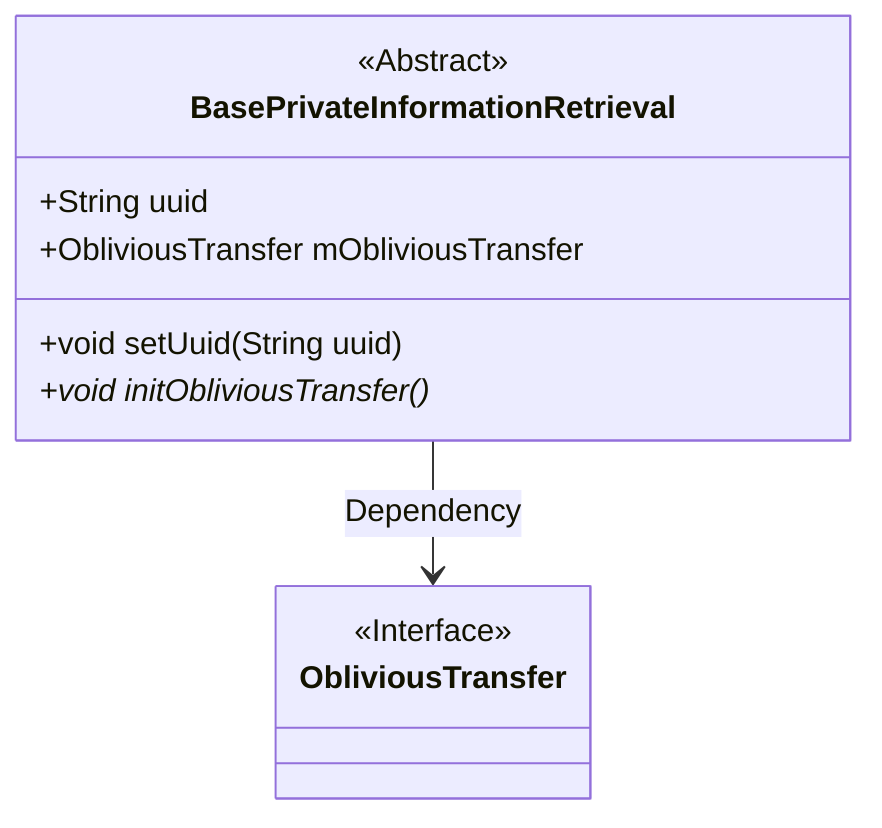
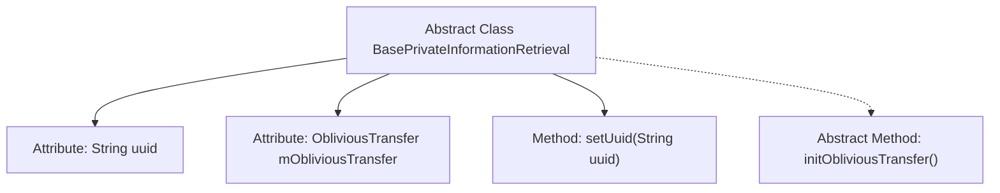

# Basic Information

|      |      |
|------|------|
| Name | BasePrivateInformationRetrieval |
| Language | .java |
| Code Path | WeFe/mpc/mpc-common/src/main/java/com/welab/wefe/mpc/pir/flow/BasePrivateInformationRetrieval.java |
| Package Name | com.welab.wefe.mpc.pir.flow |
| Dependencies | ['com.welab.wefe.mpc.pir.protocol.ot.ObliviousTransfer'] |
| Brief Description | The abstract class BasePrivateInformationRetrieval contains a uuid attribute and an ObliviousTransfer object, providing a method to set uuid and an abstract initialization method initObliviousTransfer. |

# Description

This is an abstract base class BasePrivateInformationRetrieval, designed to implement private information retrieval functionality. It contains two main components: a string-type uuid variable for unique identification, and an mObliviousTransfer object of type ObliviousTransfer. The class provides a setUuid method for assigning uuid values, and declares an abstract method initObliviousTransfer which requires subclass implementation to complete initialization operations. The entire class serves as a foundational framework for private information retrieval functionality.

# Class Summary

| Name   | Type  | Description |
|-------|------|-------------|
| BasePrivateInformationRetrieval | class | The abstract class BasePrivateInformationRetrieval contains a uuid attribute and an mObliviousTransfer object, providing methods to set the uuid and an abstract initialization method. |

## Class BasePrivateInformationRetrieval

|      |      |
|------|------|
| Access Modifier | public abstract |
| Type | class |
| Name | BasePrivateInformationRetrieval |
| Description | The abstract class BasePrivateInformationRetrieval contains a uuid attribute and an mObliviousTransfer object, providing methods to set the uuid and an abstract initialization method. |

### UML Class Diagram

This class diagram describes an abstract base class BasePrivateInformationRetrieval and its relationship with the ObliviousTransfer interface. The abstract class contains public fields uuid and mObliviousTransfer, where the latter is of an interface type. It defines a public method setUuid() for setting the uuid, as well as an abstract initialization method initObliviousTransfer() that requires implementation by subclasses. The arrow indicates that BasePrivateInformationRetrieval depends on the ObliviousTransfer interface, reflecting the design philosophy of decoupling through interfaces in this abstract class.

### Internal Method Call Graph

This flowchart illustrates the structure of the abstract class BasePrivateInformationRetrieval, which includes two attributes (uuid and mObliviousTransfer) and two methods (setUuid and the abstract method initObliviousTransfer). The dashed arrow denotes the special nature of the abstract method, indicating that it requires implementation by subclasses. The overall structure clearly reflects the class's member composition and inheritance relationships, providing an intuitive visual representation for understanding the class.

### Field List

| Name  | Type  | Description |
|-------|-------|------|
| mObliviousTransfer | ObliviousTransfer | The class member variable mObliviousTransfer, of type ObliviousTransfer. |
| uuid | String | The public string variable uuid is used to store a unique identifier. |

### Method List

| Name  | Type  | Description |
|-------|-------|------|
| setUuid | void | This is a Java method used to set the uuid property value of an object. The method accepts a string parameter uuid and assigns it to the uuid member variable of the object. |
| initObliviousTransfer | void | Abstract method, initializes an oblivious transfer protocol. |

