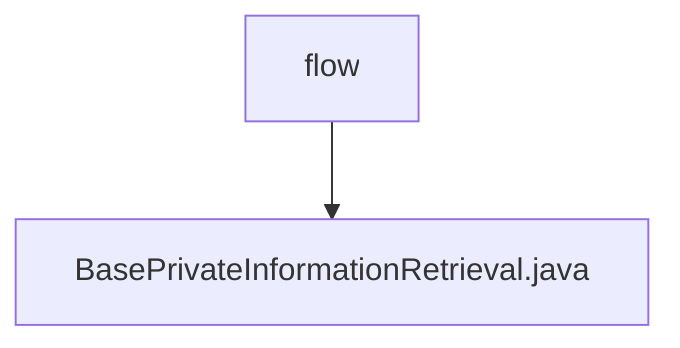

# Basic Information

|      |      |
|------|------|
| Name | flow |
| Language | .java |
| Code Path | WeFe/mpc/mpc-common/src/main/java/com/welab/wefe/mpc/pir/flow |
| Package Name | docs.mpc.mpc-common.src.main.java.com.welab.wefe.mpc.pir.flow |
| Brief Description | The abstract class BasePrivateInformationRetrieval contains a uuid attribute and an ObliviousTransfer object, providing a method to set the uuid and an abstract initialization method initObliviousTransfer. |

# Description

This is an abstract base class `BasePrivateInformationRetrieval` designed to implement private information retrieval functionality. It contains two main members: a string-type `uuid` variable for unique identification, and an `ObliviousTransfer`-type `mObliviousTransfer` object. The class provides a `setUuid` method for setting the `uuid` value and declares an abstract method `initObliviousTransfer`, which requires subclass implementation to complete the initialization operation. The entire class provides a foundational framework for private information retrieval functionality.

### Package Internal Structure View

This flowchart illustrates the PIR process structure in the mpc-common module of the WeFe project, where the flow directory contains a base private information retrieval class file. The hierarchical relationship is clear and concise, with flow as the parent node and BasePrivateInformationRetrieval as its only child node, reflecting the core implementation location of this module's functionality.

# File List

| Name   | Type  | Description |
|-------|------|-------------|
| [BasePrivateInformationRetrieval.java](BasePrivateInformationRetrieval.md) | file | The abstract class BasePrivateInformationRetrieval contains a uuid attribute and an ObliviousTransfer object, providing a method to set the uuid and an abstract initialization method initObliviousTransfer. |

