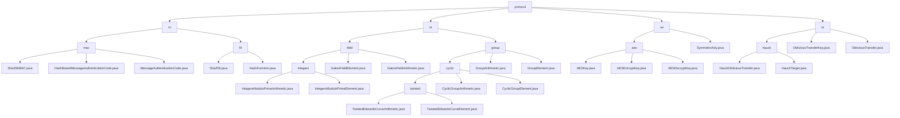

# Basic Information

|      |      |
|------|------|
| Name | protocol |
| Language | .java |
| Code Path | WeFe/mpc/mpc-common/src/main/java/com/welab/wefe/mpc/pir/protocol |
| Package Name | docs.mpc.mpc-common.src.main.java.com.welab.wefe.mpc.pir.protocol |
| Brief Description | 1. Data Security Module: Provides MAC and hash functions for data authenticity and integrity verification, relying on Java cryptographic libraries.  2. Cryptographic Operations Module: Supports prime field and elliptic curve operations for secure multi-party computation and zero-knowledge proofs.  3. AES Encryption Module: Implements key management, encryption, and decryption, supporting automatic IV generation and standard encryption processes.  4. Oblivious Transfer Protocol Module: Implements private data transmission based on elliptic curves for secure multi-party computation scenarios. |

# Description

## Overview  
This module forms the cryptographic foundation of Secure Multi-party Computation (MPC), with core responsibilities including data security verification (MAC/hashing), basic operations (prime field/elliptic curve), symmetric encryption (AES), and private transmission (oblivious transfer). It adopts a layered design pattern, such as the three-tier inheritance structure of MAC and the SymmetricKey interface specification. Key data structures encompass byte arrays for keys, curve point coordinates, prime field elements, etc., relying on Java cryptographic libraries and BigInteger. For instance, Sha256MAC implements authentication code generation, TwistedEdwardsCurveElement supports Ed25519 curve operations, and AESKey manages CBC mode encryption/decryption.  

## Key Business Scenarios  
The module serves scenarios like Private Information Retrieval (PIR) and joint risk control, providing a complete cryptographic operation chain. Typical workflows include: initializing keys/parameters → performing encryption or group operations → verifying and transmitting results. For example, the NT protocol combines prime field and curve operations, resembling a finite field arithmetic engine; oblivious transfer achieves key distribution via ObliviousTransferKey, akin to a zero-knowledge proof mechanism. Interaction modes are unified as object-oriented operations, such as Galois field element arithmetic or SymmetricKey encryption/decryption. APIs range from basic hashing to advanced protocols, e.g., HauckObliviousTransfer supports secure envelope generation, while AES encryption automatically handles IV padding.

### Package Internal Structure View

This flowchart illustrates the complete hierarchical structure of the MPC protocol module, starting from the top-level protocol directory and expanding into four submodules: ro, nt, se, and ot. Each submodule is further divided: ro contains mac and hf cryptographic components, nt includes field and group mathematical operation modules, se implements aes symmetric encryption, and ot incorporates the hauck protocol implementation. The bottom layer consists of specific Java implementation class files, totaling 23 nodes, fully presenting the technical architecture of the protocol module.

# File List

| Name   | Type  | Description |
|-------|------|-------------|
| [ro](ro/_module.md) | package | Module 1 implements hash-based message authentication code functionality, adopting a three-layer inheritance structure to support data integrity verification, and relies on the Java Cryptography Library to generate authentication codes. Module 2 provides SHA-256 hash computation services, achieving extensible digest functionality through interface segregation design, suitable for scenarios such as data verification. |
| [ot](ot/_module.md) | package | This module implements an oblivious transfer protocol based on twisted Edwards curves, with core classes providing cryptographically secure operations. It supports private information retrieval scenarios, including key management and target generation functionalities. |
| [se](se/_module.md) | package | AES symmetric encryption module, including key management, encryption and decryption functions, supports automatic IV generation and strict matching, suitable for privacy protection scenarios. Depends on Java Cryptography Extension and complies with the SymmetricKey interface specification. |
| [nt](nt/_module.md) | package | Module 1 implements prime field arithmetic operations, supporting basic arithmetic and extended operations, applied in secure multi-party computation. Module 2 provides twisted Edwards curve group operations, supporting point operations and encoding/decoding, specifically designed for privacy-preserving computation scenarios. Both rely on Galois field arithmetic. |

