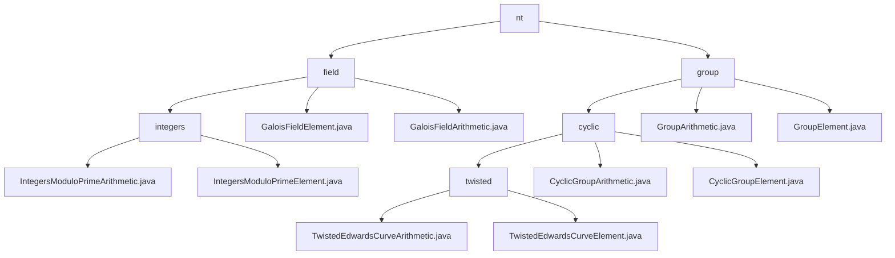

# Basic Information

|      |      |
|------|------|
| Name | nt |
| Language | .java |
| Code Path | WeFe/mpc/mpc-common/src/main/java/com/welab/wefe/mpc/pir/protocol/nt |
| Package Name | docs.mpc.mpc-common.src.main.java.com.welab.wefe.mpc.pir.protocol.nt |
| Brief Description | Module 1 implements prime field arithmetic operations, supporting basic arithmetic and extended operations, applied in secure multi-party computation. Module 2 provides twisted Edwards curve group operations, supporting point operations and encoding/decoding, specifically designed for privacy-preserving computation scenarios. Both rely on Galois field arithmetic. |

# Description

## Overview  
This module implements a foundational cryptographic computing system, comprising two core components: prime field arithmetic and elliptic curve group operations. The `GaloisFieldElement` provides prime field operations (e.g., modular inversion/fast exponentiation), while `TwistedEdwardsCurveElement` supports curve point operations (e.g., scalar multiplication/coordinate conversion). Both rely on `BigInteger` for large-number computations. Key data structures include a field element class with modulus, a curve point class with x/y coordinates, and an abstract arithmetic operator base class. For instance, the prime field employs the Tonelli-Shanks algorithm for square roots, and curve operations default to the 2²⁵⁵-19 field parameter, resembling the underlying implementations of cryptographic libraries.  

## Primary Use Cases  
The module serves secure multi-party computation scenarios, supporting protocols like Private Information Retrieval (PIR) and zero-knowledge proofs. A typical workflow involves: initializing field/group elements → performing cryptographic operations (e.g., modular exponentiation or point doubling) → serializing results for transmission. For example, the NT protocol combines prime field arithmetic and curve group operations, akin to building a finite-field arithmetic engine. The comprehensive API spans from basic arithmetic to advanced cryptographic operations, such as efficient point doubling via `CyclicGroupArithmetic`, with support for custom curve parameters or default Ed25519 parameters. All interaction modes are based on Galois field operation objects, ensuring computations adhere to algebraic constraints.

### Package Internal Structure View

This flowchart illustrates the directory structure of the MPC protocol module in the WeFe project, starting from the root directory 'nt' and branching into two main categories: 'field' and 'group'. Under 'field', it includes implementations related to integer arithmetic and Galois field operations, while 'group' encompasses group operations such as cyclic groups and twisted Edwards curves. Each subdirectory contains corresponding arithmetic operation and element class implementation files, with a clear hierarchy totaling 14 nodes.

# File List

| Name   | Type  | Description |
|-------|------|-------------|
| [group](group/_module.md) | package | This module implements twisted Edwards curve group operations, providing point addition, scalar multiplication, and encoding/decoding functionalities for privacy-preserving computations such as PIR protocols, with support for custom parameters and default operations. |
| [field](field/_module.md) | package | This module implements arithmetic operations in prime fields, supporting addition, subtraction, multiplication, division, exponentiation, and square root extraction, among others. It is designed for secure multi-party computation and cryptographic scenarios. Core classes include field elements and operators, which rely on the BigInteger class. It is suitable for private information retrieval and zero-knowledge proof protocols. |

