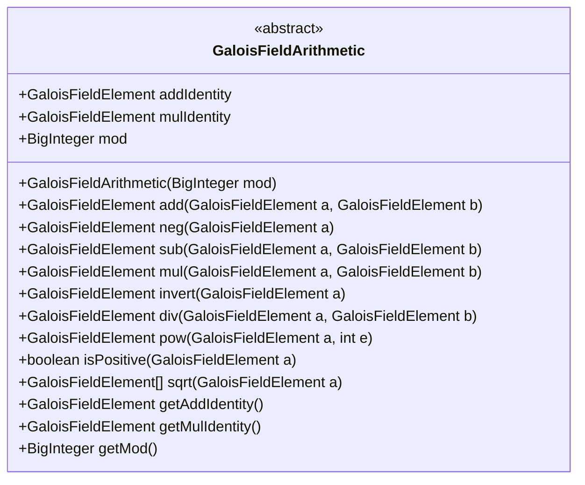

# Basic Information

|      |      |
|------|------|
| Name | GaloisFieldArithmetic |
| Language | .java |
| Code Path | WeFe/mpc/mpc-common/src/main/java/com/welab/wefe/mpc/pir/protocol/nt/field/GaloisFieldArithmetic.java |
| Package Name | com.welab.wefe.mpc.pir.protocol.nt.field |
| Dependencies | ['java.math.BigInteger'] |
| Brief Description | The abstract class `GaloisFieldArithmetic` defines arithmetic operations in Galois fields, including abstract methods for addition, subtraction, multiplication, division, exponentiation, square roots, etc., as well as properties for modulus and identity elements. |

# Description

This abstract class defines the basic structure of Galois field arithmetic operations, including the additive identity, multiplicative identity, and modulus properties. It provides abstract methods for addition, negation, subtraction, multiplication, inversion, division, exponentiation, positivity check, and square root extraction, while encapsulating concrete methods for retrieving the identity elements and modulus. All operations are performed under the specified modulus, requiring subclasses to implement the specific field arithmetic logic.

# Class Summary

| Name   | Type  | Description |
|-------|------|-------------|
| GaloisFieldArithmetic | class | The abstract class `GaloisFieldArithmetic` defines arithmetic operations in Galois fields, including abstract methods such as addition, multiplication, negation, as well as properties like modulus and identity elements. |

## Class GaloisFieldArithmetic

|      |      |
|------|------|
| Access Modifier | public abstract |
| Type | class |
| Name | GaloisFieldArithmetic |
| Description | The abstract class `GaloisFieldArithmetic` defines arithmetic operations in Galois fields, including abstract methods such as addition, multiplication, negation, as well as properties like modulus and identity elements. |

### UML Class Diagram

This abstract class defines the fundamental structure of Galois field arithmetic operations, including properties such as additive/multiplicative identities and modulus, along with abstract methods for addition, subtraction, multiplication, division, inversion, and exponentiation. The class diagram clearly illustrates its abstract nature, public attributes, and method signatures, providing an operational framework for concrete implementation classes. All methods are public abstract operations that require subclass implementations to define specific field arithmetic logic.

### Internal Method Call Graph

```mermaid
graph TD
    A["Abstract Class GaloisFieldArithmetic"]
    B["Property: GaloisFieldElement addIdentity"]
    C["Property: GaloisFieldElement mulIdentity"]
    D["Property: BigInteger mod"]
    E["Constructor: GaloisFieldArithmetic(BigInteger mod)"]
    F["Abstract Method: add(GaloisFieldElement a, GaloisFieldElement b)"]
    G["Abstract Method: neg(GaloisFieldElement a)"]
    H["Abstract Method: sub(GaloisFieldElement a, GaloisFieldElement b)"]
    I["Abstract Method: mul(GaloisFieldElement a, GaloisFieldElement b)"]
    J["Abstract Method: invert(GaloisFieldElement a)"]
    K["Abstract Method: div(GaloisFieldElement a, GaloisFieldElement b)"]
    L["Abstract Method: pow(GaloisFieldElement a, int e)"]
    M["Abstract Method: isPositive(GaloisFieldElement a)"]
    N["Abstract Method: sqrt(GaloisFieldElement a)"]
    O["Concrete Method: getAddIdentity()"]
    P["Concrete Method: getMulIdentity()"]
    Q["Concrete Method: getMod()"]

    A --> B
    A --> C
    A --> D
    A --> E
    A --> F
    A --> G
    A --> H
    A --> I
    A --> J
    A --> K
    A --> L
    A --> M
    A --> N
    A --> O
    A --> P
    A --> Q
```

This code defines an abstract class GaloisFieldArithmetic for implementing arithmetic operations in Galois fields (finite fields). The class contains 3 properties (additive identity, multiplicative identity, and modulus), 1 constructor, and 12 methods (9 abstract and 3 concrete). Abstract methods require subclass implementation and include addition, negation, subtraction, multiplication, inversion, division, exponentiation, positivity check, and square root operations. Concrete methods are used to retrieve identity elements and modulus. This design provides a unified interface specification for different types of Galois field operations.

### Field List

| Name  | Type  | Description |
|-------|-------|------|
| addIdentity | GaloisFieldElement | Additive identity element of the GaloisFieldElement type. |
| mulIdentity | GaloisFieldElement | The multiplicative identity element of a Galois field. |
| mod | BigInteger | Defined a public variable named mod of type BigInteger. |

### Method List

| Name  | Type  | Description |
|-------|-------|------|
| sub | GaloisFieldElement | Abstract method: The `sub` method of the `GaloisFieldElement` class, used to compute the subtraction of two Galois field elements. |
| getAddIdentity | GaloisFieldElement | Methods to obtain the additive identity element, returns the addIdentity field. |
| sqrt | GaloisFieldElement[] | Abstract method: Compute the square root of a Galois field element and return the result array. |
| neg | GaloisFieldElement | Abstract method: GaloisFieldElement neg(GaloisFieldElement a), used to calculate the additive inverse of a Galois field element. |
| invert | GaloisFieldElement | Abstract method: GaloisFieldElement invert(GaloisFieldElement a), used to compute the multiplicative inverse of a Galois field element. |
| mul | GaloisFieldElement | Abstract method: Galois field element multiplication, takes two elements a and b as input and returns their product. |
| add | GaloisFieldElement | Abstract method: Addition operation of GaloisFieldElement, with parameters being two Galois field elements a and b. |
| getMulIdentity | GaloisFieldElement | Methods to obtain the multiplicative identity element, returns the value of the mulIdentity field. |
| div | GaloisFieldElement | Abstract method for division operation of Galois field elements, with parameters being two elements a and b. |
| isPositive | boolean | Abstract method to determine if the Galois field element a is positive. |
| pow | GaloisFieldElement | Abstract method: Power operation of GaloisFieldElement, with parameters element a and exponent e. |
| getMod | BigInteger | Methods to obtain the mod value, returning a BigInteger type. |

