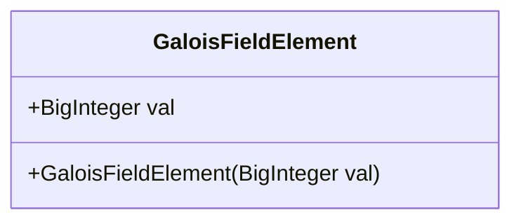
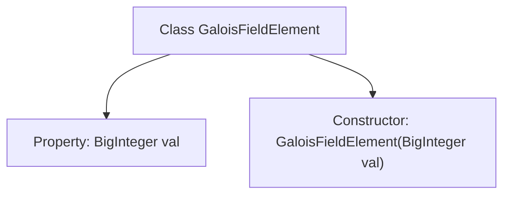

# Basic Information

|      |      |
|------|------|
| Name | GaloisFieldElement |
| Language | .java |
| Code Path | WeFe/mpc/mpc-common/src/main/java/com/welab/wefe/mpc/pir/protocol/nt/field/GaloisFieldElement.java |
| Package Name | com.welab.wefe.mpc.pir.protocol.nt.field |
| Dependencies | ['java.math.BigInteger'] |
| Brief Description | The GaloisFieldElement class stores field element values using BigInteger, and the constructor initializes this value. |

# Description

The content defines a public class named `GaloisFieldElement`, which represents an element in a Galois field. The class includes a public member variable `val` of type `BigInteger` to store the value of the field element. It provides a constructor that accepts a `BigInteger` parameter to initialize `val`. This structure concisely encapsulates the core numerical representation of a Galois field element.

# Class Summary

| Name   | Type  | Description |
|-------|------|-------------|
| GaloisFieldElement | class | The GaloisFieldElement class represents an element in a Galalois field, containing a val field of type BigInteger, which is initialized through the constructor. |

## Class GaloisFieldElement

|      |      |
|------|------|
| Access Modifier | public |
| Type | class |
| Name | GaloisFieldElement |
| Description | The GaloisFieldElement class represents an element in a Galalois field, containing a val field of type BigInteger, which is initialized through the constructor. |

### UML Class Diagram

This class diagram depicts a simple GaloisFieldElement class used to represent elements in a Galois field (finite field). The class contains a public BigInteger-type field 'val' to store the element's value, and a public constructor for initializing this value. Galois fields have significant applications in cryptography and error-correcting codes, with this class's design providing a foundational data structure for subsequent implementation of field operations (such as addition and multiplication). The diagram clearly illustrates the class's single responsibility - encapsulating the value of a field element.

### Internal Method Call Graph

This flowchart depicts the structure of the GaloisFieldElement class, which includes a BigInteger-type property "val" and a constructor. The constructor is used to initialize the "val" property, and the entire class represents an element in a Galois field (finite field). The flowchart clearly illustrates the hierarchical relationship between the class and its members, conforming to the design pattern of simple data encapsulation.

### Field List

| Name  | Type  | Description |
|-------|-------|------|
| val | BigInteger | Defined a public big integer variable val. |

### Method List

| Name  | Type  | Description |
|-------|-------|------|

