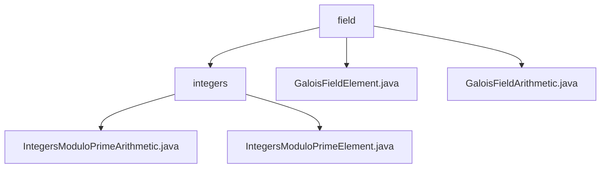

# Basic Information

|      |      |
|------|------|
| Name | field |
| Language | .java |
| Code Path | WeFe/mpc/mpc-common/src/main/java/com/welab/wefe/mpc/pir/protocol/nt/field |
| Package Name | docs.mpc.mpc-common.src.main.java.com.welab.wefe.mpc.pir.protocol.nt.field |
| Brief Description | This module implements arithmetic operations in prime fields, supporting addition, subtraction, multiplication, division, exponentiation, and square root extraction, among others. It is designed for secure multi-party computation and cryptographic scenarios. Core classes include field elements and operators, which rely on the BigInteger class. It is suitable for private information retrieval and zero-knowledge proof protocols. |

# Description

## Overview  
This module implements the arithmetic system for Galois fields (prime fields), with its core responsibility being to provide mathematical operations and element representation over prime fields. The interface specifications include element construction, basic arithmetic operations (add/subtract/multiply/divide), and extended operations (negate/invert/pow/sqrt). The operations are encapsulated through `GaloisFieldElement`, while the arithmetic logic is defined by the abstract class `GaloisFieldArithmetic`. The key data structures are the element class (storing `BigInteger` values) and the arithmetic class (maintaining the modulus property). The only external dependency is the `BigInteger` class. For example, the inversion operation resembles fraction reduction, and square roots are computed using the Tonelli-Shanks algorithm, similar to prime field implementations in cryptographic libraries.  

## Key Business Scenarios  
The module supports cryptographic protocols in secure multi-party computation, typically applied in private information retrieval and zero-knowledge proofs. The interaction model involves the arithmetic processor handling element objects, such as ensuring result validity through modulus constraints (akin to abstract algebra libraries). The complete API covers operations from basic arithmetic to advanced operations like fast modular exponentiation and element inversion. Integration examples can be found in the field computation layer of the NT protocol, forming a core component analogous to a finite field arithmetic engine, enabling privacy-preserving data operations in multi-party secure computation scenarios.

### Package Internal Structure View

This flowchart illustrates the class structure related to NT fields in the MPC protocol. The top level is the `field` directory, which contains the `integers` subdirectory and two GaloisField-related class files. The `integers` directory includes two implementation classes for integer modulo prime operations, handling arithmetic operations and element representation respectively. The entire structure clearly reflects the modular design of field operations in cryptographic protocols.

# File List

| Name   | Type  | Description |
|-------|------|-------------|
| [GaloisFieldElement.java](GaloisFieldElement.md) | file | The GaloisFieldElement class stores field element values using BigInteger, and the constructor initializes this value. |
| [GaloisFieldArithmetic.java](GaloisFieldArithmetic.md) | file | The abstract class `GaloisFieldArithmetic` defines arithmetic operations in Galois fields, including abstract methods for addition, subtraction, multiplication, division, exponentiation, square roots, etc., as well as properties like modulus and identity elements. |
| [integers](integers/_module.md) | package | The `IntegersModuloPrimeArithmetic` class implements arithmetic operations for integers modulo a prime number, including basic operations such as addition, subtraction, multiplication, and division, as well as the Tonelli-Shanks algorithm for square roots. The `IntegersModuloPrimeElement` class represents elements in the finite field of integers modulo a prime, providing constructors and value correction functionality. |

