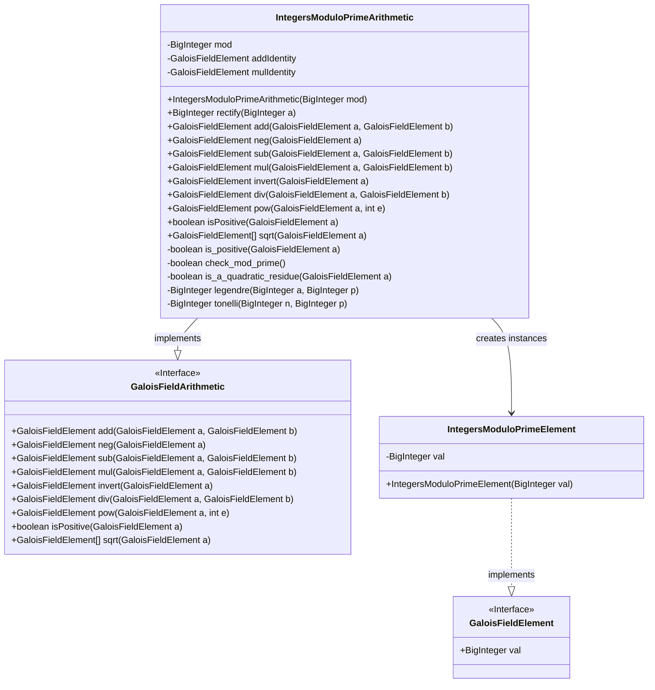
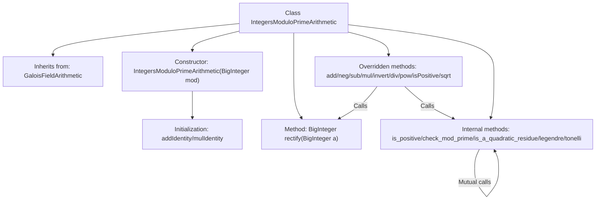
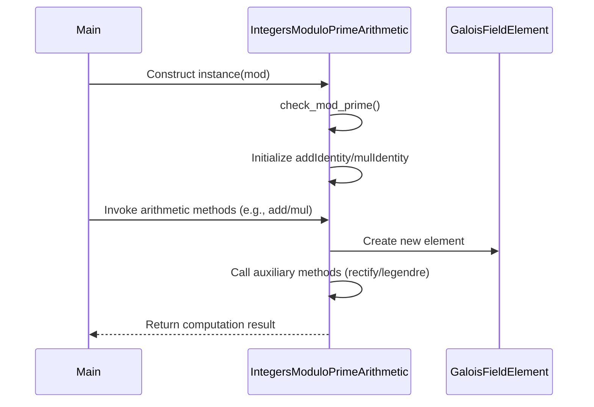

# Basic Information

|      |      |
|------|------|
| Name | IntegersModuloPrimeArithmetic |
| Language | .java |
| Code Path | WeFe/mpc/mpc-common/src/main/java/com/welab/wefe/mpc/pir/protocol/nt/field/integers/IntegersModuloPrimeArithmetic.java |
| Package Name | com.welab.wefe.mpc.pir.protocol.nt.field.integers |
| Dependencies | ['com.welab.wefe.mpc.pir.protocol.nt.field.GaloisFieldArithmetic', 'com.welab.wefe.mpc.pir.protocol.nt.field.GaloisFieldElement', 'java.math.BigInteger'] |
| Brief Description | Implemented an integer arithmetic class under prime modulus, including operations such as addition, subtraction, multiplication, division, exponentiation, and square roots, ensuring the modulus is prime and supporting quadratic residue determination. |

# Description

The `IntegersModuloPrimeArithmetic` class inherits from `GaloisFieldArithmetic` and implements integer arithmetic operations under a prime modulus. The constructor takes a `BigInteger` modulus parameter, initializes the additive identity element `0` and multiplicative identity element `1`, and verifies whether the modulus is a prime number. The class defines basic arithmetic methods such as addition, subtraction, multiplication, division, negation, inversion, and exponentiation, as well as auxiliary methods for determining element sign and computing square roots. The square root calculation is implemented using the Tonelli-Shanks algorithm, which includes Legendre symbol computation and quadratic residue determination. All operation results are ensured to be within the modulus range via the `rectify` method. This class fully implements the arithmetic system over a prime field.

# Class Summary

| Name   | Type  | Description |
|-------|------|-------------|
| IntegersModuloPrimeArithmetic | class | Integer modulo prime arithmetic class, inherits from GaloisFieldArithmetic, implements operations such as addition, subtraction, multiplication, division, exponentiation, and square roots in the modulo prime field, including the Tonelli-Shanks algorithm for square root extraction and Legendre symbol computation. |

## Class IntegersModuloPrimeArithmetic

|      |      |
|------|------|
| Access Modifier | public |
| Type | class |
| Name | IntegersModuloPrimeArithmetic |
| Description | Integer modulo prime arithmetic class, inherits from GaloisFieldArithmetic, implements operations such as addition, subtraction, multiplication, division, exponentiation, and square roots in the modulo prime field, including the Tonelli-Shanks algorithm for square root extraction and Legendre symbol computation. |

### UML Class Diagram

This code implements a finite field arithmetic class `IntegersModuloPrimeArithmetic` based on prime modulus, which inherits from the abstract class `GaloisFieldArithmetic`. The class provides basic arithmetic operations such as addition, subtraction, multiplication, division, and exponentiation, as well as advanced functionalities like square root calculation and positivity checking. It utilizes `BigInteger` for large number operations and encapsulates field elements through `IntegersModuloPrimeElement`. The class includes number-theoretic methods such as the Tonelli-Shanks algorithm for square root computation and Legendre symbol for quadratic residue determination, ensuring correct operations under prime modulus. The overall design adheres to the finite field arithmetic interface specification, providing rigorous mathematical correctness guarantees.

### Internal Method Call Graph

This flowchart illustrates the complete structure of the IntegersModuloPrimeArithmetic class, including its inheritance relationship, core arithmetic methods, and internal helper methods. The sequence diagram depicts the full interaction process from object construction to method invocation, highlighting the object collaboration and internal method call chains involved in prime field arithmetic operations. The class implements basic operations such as addition, subtraction, multiplication, and division in a prime modulus field, and supports square root calculation via the Tonelli-Shanks algorithm, with all operations strictly maintaining the properties of the prime modulus field.

### Field List

| Name  | Type  | Description |
|-------|-------|------|

### Method List

| Name  | Type  | Description |
|-------|-------|------|
| check_mod_prime | boolean | Check if the modulus is a prime number using probabilistic testing with a confidence parameter of 1. |
| invert | GaloisFieldElement | This method overrides the parent class method to calculate the multiplicative inverse of an element in the Galois field. It is implemented by calling the modInverse method of BigInteger, returning a new element based on the modulus. |
| pow | GaloisFieldElement | Method override, calculates the power of a GaloisFieldElement. If the exponent e is 0, returns the multiplicative identity element; otherwise, returns the result of a raised to the power of e modulo mod. |
| is_a_quadratic_residue | boolean | Determine whether a GaloisFieldElement is a quadratic residue by confirming that its Legendre symbol equals 1. |
| mul | GaloisFieldElement | This method implements Galois field element multiplication, returning a new element that is the product of the two element values modulo the modulus. |
| neg | GaloisFieldElement | This method overrides the parent class method, negates the element in the Galois field, and returns a new element instance after modulo operation. |
| rectify | BigInteger | The method `rectify` takes the BigInteger parameter `a` modulo `mod` and returns the result. |
| is_positive | boolean | Check if the GaloisFieldElement value is positive by comparing its value with half of the modulus. |
| isPositive | boolean | Check if a Galois field element is positive: compare the element value with half of the modulus, and it is positive if less than that. |
| sub | GaloisFieldElement | This method implements the subtraction of Galois field elements by negating the second element and then adding it to the first element. |
| add | GaloisFieldElement | This method implements the addition operation for Galois field elements, returning the result of adding two element values and then taking the modulus. |
| sqrt | GaloisFieldElement[] | This method calculates the square root of a GaloisFieldElement. If the input is a quadratic residue, it returns two ordered roots (the smaller value first); otherwise, it returns two -1s. The Tonelli algorithm is used to find the roots, which are then compared and sorted by size. |
| div | GaloisFieldElement | This method implements the division operation of Galois field elements by completing it through multiplication and inverse element operations. |
| legendre | BigInteger | A function to compute the Legendre symbol, which takes inputs a and a prime p, and returns the result of a raised to the power of (p-1)/2 modulo p. |
| tonelli | BigInteger | Implementation of Tonelli's algorithm for finding modular square roots. Decompose p-1 into q*2^s, handle the special case when s=1, otherwise find z and perform iterative computations, ultimately returning the modular square root r. |

