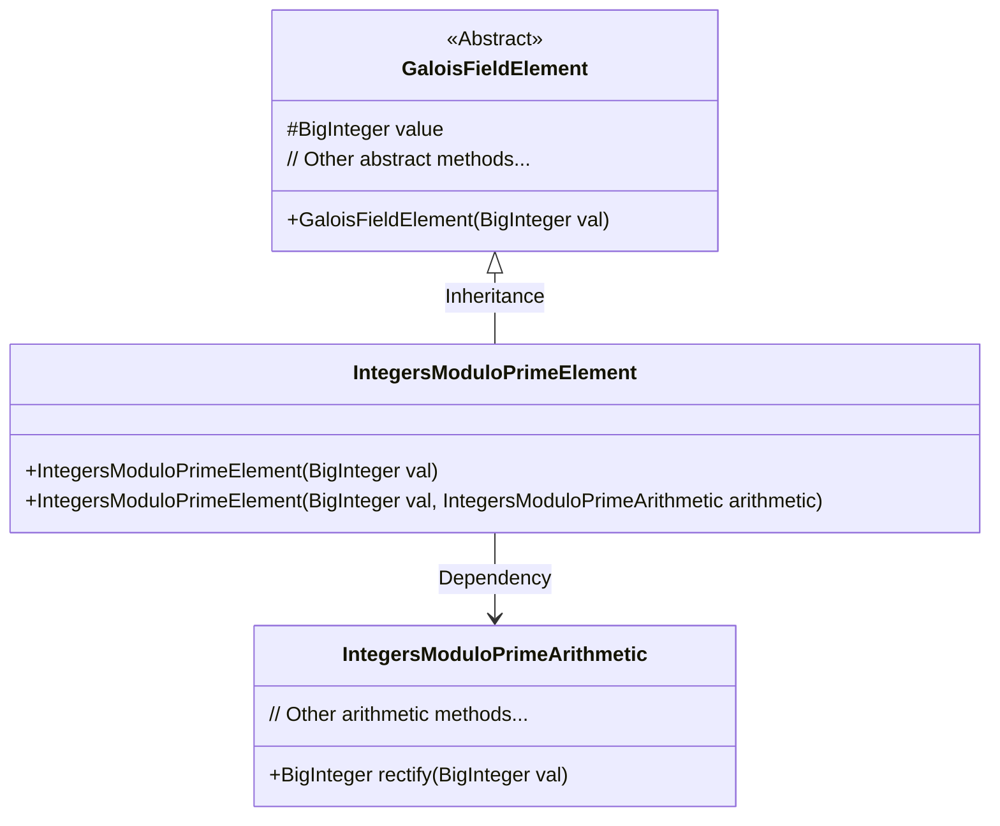
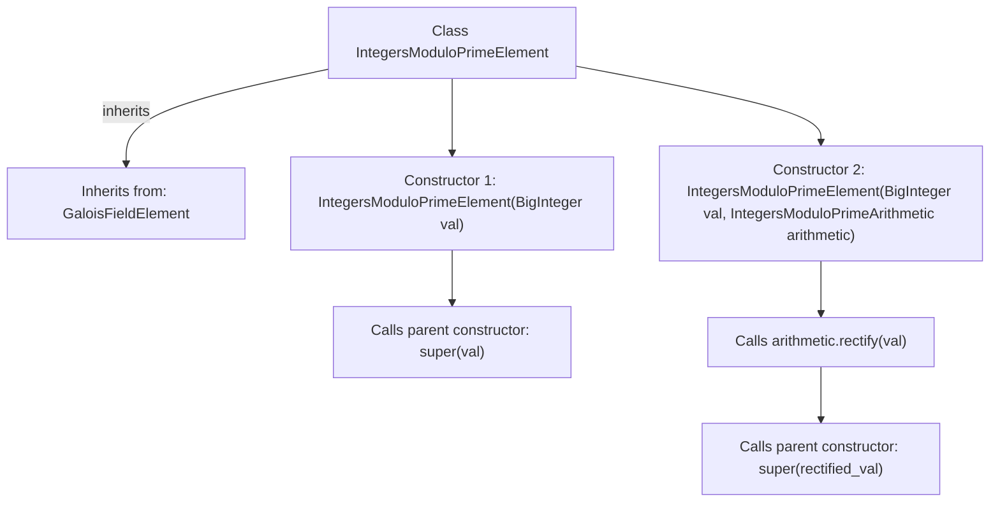

# Basic Information

|      |      |
|------|------|
| Name | IntegersModuloPrimeElement |
| Language | .java |
| Code Path | WeFe/mpc/mpc-common/src/main/java/com/welab/wefe/mpc/pir/protocol/nt/field/integers/IntegersModuloPrimeElement.java |
| Package Name | com.welab.wefe.mpc.pir.protocol.nt.field.integers |
| Dependencies | ['com.welab.wefe.mpc.pir.protocol.nt.field.GaloisFieldElement', 'java.math.BigInteger'] |
| Brief Description | Integer modulo prime element class, inherits from the Galois field element class, provides two construction methods: direct assignment or assignment after correction via arithmetic objects. |

# Description

The `IntegersModuloPrimeElement` class inherits from `GaloisFieldElement` and is used to represent elements in a prime modulus integer field. This class contains two constructors: the first constructor takes a `BigInteger` type value `val` and directly calls the parent class constructor; the second constructor additionally receives an arithmetic operation object of type `IntegersModuloPrimeArithmetic` and performs a correction process on `val` before invoking the parent class constructor.

# Class Summary

| Name   | Type  | Description |
|-------|------|-------------|
| IntegersModuloPrimeElement | class | The `IntegersModuloPrimeElement` class inherits from `GaloisFieldElement` and provides two constructor methods: one that accepts a `BigInteger` value, and another that accepts both a `BigInteger` and an arithmetic operation object. |

## Class IntegersModuloPrimeElement

|      |      |
|------|------|
| Access Modifier | public |
| Type | class |
| Name | IntegersModuloPrimeElement |
| Description | The `IntegersModuloPrimeElement` class inherits from `GaloisFieldElement` and provides two constructor methods: one that accepts a `BigInteger` value, and another that accepts both a `BigInteger` and an arithmetic operation object. |

### UML Class Diagram

This code demonstrates an inheritance structure of finite field element classes. The IntegersModuloPrimeElement inherits from the abstract base class GaloisFieldElement, representing elements in a prime modulo integer field. It is initialized via two constructors: one directly accepts a BigInteger value, while the other additionally relies on the IntegersModuloPrimeArithmetic class for value rectification (rectify). The class diagram clearly illustrates the inheritance relationship and cross-class collaboration, where arithmetic operations are delegated to the specialized IntegersModuloPrimeArithmetic class for processing.

### Internal Method Call Graph

This code demonstrates an `IntegersModuloPrimeElement` class that inherits from `GaloisFieldElement`, featuring two constructors. The first constructor directly passes a `BigInteger` value to the parent constructor, while the second constructor processes the input value through the `rectify` method of `IntegersModuloPrimeArithmetic` before passing the result to the parent constructor. The flowchart clearly illustrates the class inheritance relationship and constructor call chains, particularly highlighting the dependency handling process of the second constructor on the arithmetic object.

### Field List

| Name  | Type  | Description |
|-------|-------|------|

### Method List

| Name  | Type  | Description |
|-------|-------|------|

