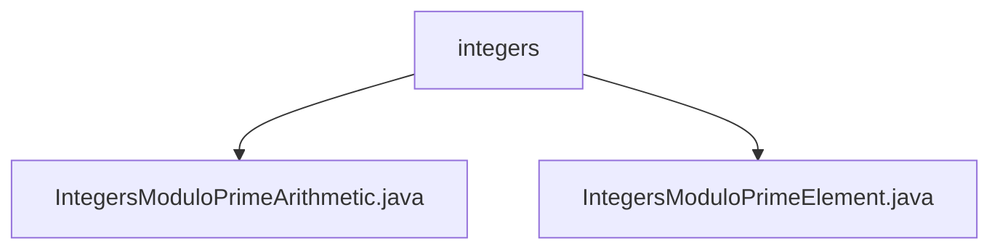

# Basic Information

|      |      |
|------|------|
| Name | integers |
| Language | .java |
| Code Path | WeFe/mpc/mpc-common/src/main/java/com/welab/wefe/mpc/pir/protocol/nt/field/integers |
| Package Name | docs.mpc.mpc-common.src.main.java.com.welab.wefe.mpc.pir.protocol.nt.field.integers |
| Brief Description | The `IntegersModuloPrimeArithmetic` class implements arithmetic operations for integers modulo a prime number, including basic operations such as addition, subtraction, multiplication, and division, as well as the Tonelli-Shanks algorithm for square roots. The `IntegersModuloPrimeElement` class represents elements in the finite field of integers modulo a prime, providing constructors and value correction functionality. |

# Description

## Overview  
This module implements an arithmetic system for integer fields modulo a prime number, with its core responsibility being to provide mathematical operations (such as addition, subtraction, multiplication, and division) and element representation over prime fields. The interface specifications include constructors, basic operations (add/subtract/multiply/divide), and auxiliary operations (negate/invert/pow/sqrt). The key data structures are `IntegersModuloPrimeElement` (field elements) and `IntegersModuloPrimeArithmetic` (arithmetic processor). The only external dependency is the `BigInteger` class. For example, the Tonelli-Shanks algorithm is used for calculating square roots, similar to prime field operations in cryptography.  

## Primary Business Scenarios  
The module is suitable for privacy information retrieval protocols in secure multi-party computation scenarios, with typical applications including cryptographic operations and zero-knowledge proofs over prime fields. The interaction pattern involves the arithmetic processor handling element objects, such as ensuring operation results fall within the modulus range via the `rectify` method. It fully supports field operation APIs, including inversion (similar to fraction reduction) and exponentiation (fast modular exponentiation). Integration examples can be found in the field computation layer of the NT protocol, serving as a foundational component akin to an abstract algebra library.

### Package Internal Structure View

This flowchart illustrates two Java files under the integers directory: IntegersModuloPrimeArithmetic.java and IntegersModuloPrimeElement.java. Both files are directly subordinate to the integers directory without deeper nesting, forming a simple parent-child hierarchy.

# File List

| Name   | Type  | Description |
|-------|------|-------------|
| [IntegersModuloPrimeArithmetic.java](IntegersModuloPrimeArithmetic.md) | file | Implemented an integer arithmetic class under prime modulus, including operations such as addition, subtraction, multiplication, division, exponentiation, and square roots, ensuring the modulus is prime and supporting quadratic residue determination. |
| [IntegersModuloPrimeElement.java](IntegersModuloPrimeElement.md) | file | Integer modulo prime element class, inherits from the Galois field element class, provides two construction methods: direct assignment or assignment after correction through arithmetic objects. |

