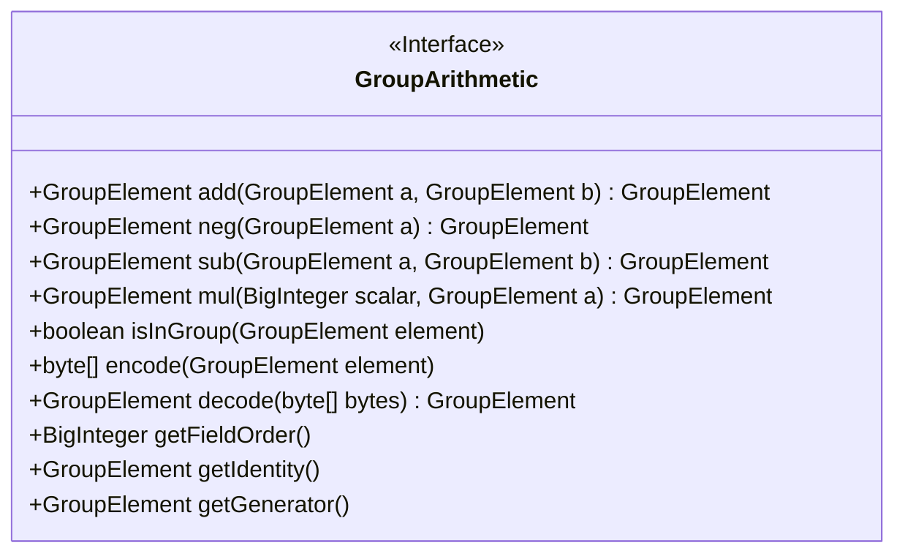

# Basic Information

|      |      |
|------|------|
| Name | GroupArithmetic |
| Language | .java |
| Code Path | WeFe/mpc/mpc-common/src/main/java/com/welab/wefe/mpc/pir/protocol/nt/group/GroupArithmetic.java |
| Package Name | com.welab.wefe.mpc.pir.protocol.nt.group |
| Dependencies | ['java.math.BigInteger'] |
| Brief Description | The GroupArithmetic interface defines group operation methods, including addition, subtraction, multiplication, negation, encoding/decoding, group element validation, and retrieval of group properties (order, identity element, generator). |

# Description

The interface defines the core methods for group operations, including addition, negation, subtraction of group elements, as well as scalar multiplication operations. It also provides encoding and decoding functionality for group elements, supporting mutual conversion between byte arrays and group elements. Additionally, the interface includes group structure query methods to obtain the group's order, identity element, and generator, and to verify whether an element belongs to the group. Together, these methods form the foundational set of group operation functionalities in abstract algebra.

# Class Summary

| Name   | Type  | Description |
|-------|------|-------------|
| GroupArithmetic | interface | Group operation interface definition, including addition, negation, subtraction, scalar multiplication, group element validation, encoding/decoding, methods for obtaining the field order, identity element, and generator. |

## Class GroupArithmetic

|      |      |
|------|------|
| Access Modifier | public |
| Type | interface |
| Name | GroupArithmetic |
| Description | Group operation interface definition, including addition, negation, subtraction, scalar multiplication, group element validation, encoding/decoding, methods for obtaining the field order, identity element, and generator. |

### UML Class Diagram

This interface defines core group operations, including algebraic computations such as addition, negation, subtraction, scalar multiplication, as well as methods for encoding/decoding, group element validation, and retrieving group properties (order, identity element, generator). All methods are abstract public methods, designed for classes implementing diverse mathematical group structures to provide a standardized group operation interface for cryptography or mathematical computations. The interface abstracts concrete group element types through the generic parameter `GroupElement`, maintaining implementation flexibility.

### Internal Method Call Graph

```mermaid
graph TD
    A["Interface GroupArithmetic"]
    B["Method: GroupElement add(GroupElement a, GroupElement b)"]
    C["Method: GroupElement neg(GroupElement a)"]
    D["Method: GroupElement sub(GroupElement a, GroupElement b)"]
    E["Method: GroupElement mul(BigInteger scalar, GroupElement a)"]
    F["Method: boolean isInGroup(GroupElement element)"]
    G["Method: byte[] encode(GroupElement element)"]
    H["Method: GroupElement decode(byte[] bytes)"]
    I["Method: BigInteger getFieldOrder()"]
    J["Method: GroupElement getIdentity()"]
    K["Method: GroupElement getGenerator()"]

    A --> B
    A --> C
    A --> D
    A --> E
    A --> F
    A --> G
    A --> H
    A --> I
    A --> J
    A --> K
```

This flowchart illustrates all method definitions of the GroupArithmetic interface, including group operations (addition, negation, subtraction, scalar multiplication), group element validation, encoding/decoding operations, and methods for obtaining group properties (order, identity element, generator). Each method is connected to the interface as an independent node, clearly presenting the core functional contract of this algebraic structure interface.

### Field List

| Name  | Type  | Description |
|-------|-------|------|

### Method List

| Name  | Type  | Description |
|-------|-------|------|
| neg | GroupElement | The function neg takes the inverse of a group element a. |
| getFieldOrder | BigInteger | Get the field order of the big integer type. |
| getGenerator | GroupElement | Generator for obtaining group elements. |
| getIdentity | GroupElement | Get the identity element of a group element. |
| isInGroup | boolean | Check if an element belongs to the specified group, returns a boolean value. |
| mul | GroupElement | Group element multiplication method, which takes a large integer and a group element as input and returns the resulting group element. |
| decode | GroupElement | Decode the byte array into a GroupElement object. |
| add | GroupElement | Group element addition operation, input two group elements a and b, and return their sum. |
| encode | byte[] | Encoding method, converting a GroupElement object into a byte array. |
| sub | GroupElement | The function `sub` is used to calculate the difference between two elements of type `GroupElement`, and the returned result remains of type `GroupElement`. |

