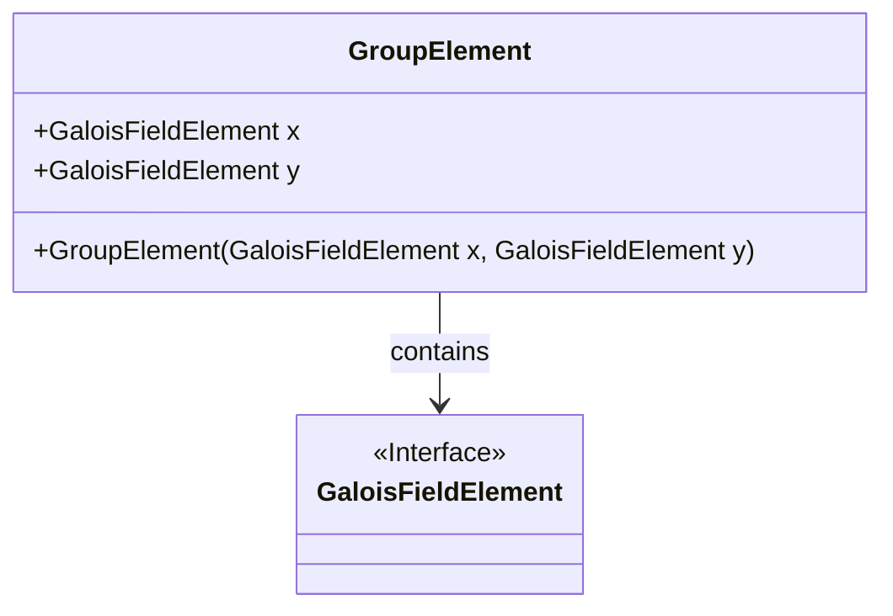
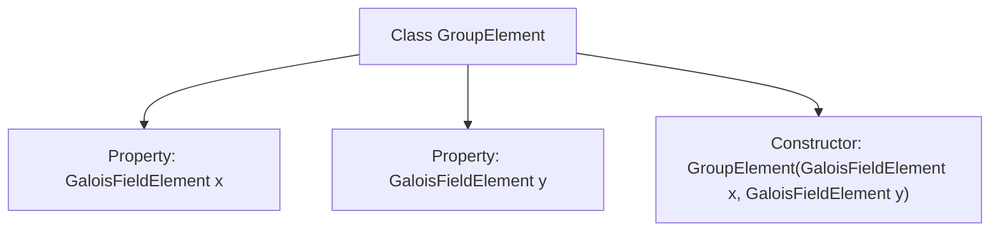

# Basic Information

|      |      |
|------|------|
| Name | GroupElement |
| Language | .java |
| Code Path | WeFe/mpc/mpc-common/src/main/java/com/welab/wefe/mpc/pir/protocol/nt/group/GroupElement.java |
| Package Name | com.welab.wefe.mpc.pir.protocol.nt.group |
| Dependencies | ['com.welab.wefe.mpc.pir.protocol.nt.field.GaloisFieldElement'] |
| Brief Description | The GroupElement class contains two member variables, x and y, of type GaloisFieldElement, which are initialized through the constructor. |

# Description

The `GroupElement` class is a public class representing a group element, containing two public properties `x` and `y` of type `GaloisFieldElement`. This class has a constructor that takes two `GaloisFieldElement` parameters, `x` and `y`, and assigns them to the corresponding class properties. This class is used to store and manipulate group elements, where each element consists of two Galois field elements.

# Class Summary

| Name   | Type  | Description |
|-------|------|-------------|
| GroupElement | class | The GroupElement class contains two properties, x and y, of type GaloisFieldElement, which are initialized through the constructor. |

## Class GroupElement

|      |      |
|------|------|
| Access Modifier | public |
| Type | class |
| Name | GroupElement |
| Description | The GroupElement class contains two properties, x and y, of type GaloisFieldElement, which are initialized through the constructor. |

### UML Class Diagram

This class diagram illustrates the relationship between the GroupElement class and the GaloisFieldElement interface. GroupElement is a class containing two public members (x and y) of type GaloisFieldElement, initialized via its constructor. GaloisFieldElement is marked as an interface, indicating it defines a set of method specifications to be implemented. GroupElement depends on GaloisFieldElement, a design commonly used for representing group elements in algebraic structures where coordinate values must adhere to specific field operation rules.

### Internal Method Call Graph

This flowchart illustrates the structure of the GroupElement class, which contains two properties of type GaloisFieldElement (x and y) and a constructor for initializing these properties. The class core functionality is to encapsulate coordinate points of group elements in elliptic curve cryptography, representing point positions through two field elements x and y. The constructor ensures these coordinate values must be provided during object creation, establishing the foundational data structure for subsequent group operations (such as point addition and point doubling).

### Field List

| Name  | Type  | Description |
|-------|-------|------|
| y | GaloisFieldElement | The public variable y of type GaloisFieldElement. |
| x | GaloisFieldElement | The public variable x of type GaloisFieldElement. |

### Method List

| Name  | Type  | Description |
|-------|-------|------|

