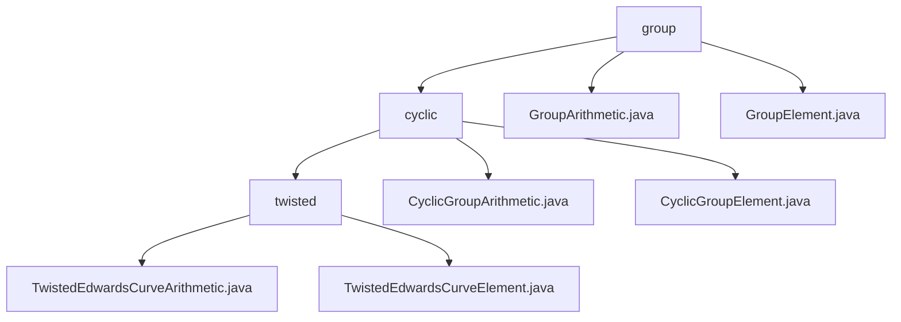

# Basic Information

|      |      |
|------|------|
| Name | group |
| Language | .java |
| Code Path | WeFe/mpc/mpc-common/src/main/java/com/welab/wefe/mpc/pir/protocol/nt/group |
| Package Name | docs.mpc.mpc-common.src.main.java.com.welab.wefe.mpc.pir.protocol.nt.group |
| Brief Description | This module implements twisted Edwards curve group operations, providing point addition, scalar multiplication, and encoding/decoding functionalities for privacy-preserving computations such as PIR protocols, with support for custom parameters and default operations. |

# Description

## Overview  
This module implements standardized group operations for twisted Edwards curves, with its core responsibility being to provide fundamental cryptographic operation interfaces and encoding/decoding functionalities. The unified interface specifications include group attribute queries, element validity verification, and point operations (addition/scalar multiplication), following a pattern similar to cryptographic primitive construction. Key data structures are TwistedEdwardsCurveElement (containing x/y coordinates) and CyclicGroupElement, relying on a Galois field arithmetic library. For instance, it employs the prime field 2²⁵⁵-19 for default operations and supports byte array serialization for data exchange.

## Primary Use Cases  
The module is specifically designed for privacy-preserving computation scenarios (e.g., PIR protocols in secure multi-party computation). A typical workflow involves: initializing group elements → performing scalar multiplication → encoding/decoding results, resembling a key derivation pattern. For example, in the NT group protocol, CyclicGroupArithmetic enables efficient point doubling operations, supporting custom a/d parameters or default values (a=2²⁵⁵-20). All operations are executed via Galois field arithmetic objects, encompassing group element addition/subtraction, negation, and order/generator queries. For instance, the GroupElement class stores curve points using x/y coordinates and facilitates bidirectional conversion with byte arrays.

### Package Internal Structure View

This flowchart illustrates the hierarchical structure of NT groups in the MPC protocol. The root node "group" contains two direct child files (GroupArithmetic/Element) and a subdirectory "cyclic". The "cyclic" directory is further divided into a "twisted" subdirectory and two cyclic group operation files. At the bottom level, the "twisted" directory contains two implementation files related to twisted Edwards curves, fully presenting the inheritance relationship from basic group operations to specific curve implementations.

# File List

| Name   | Type  | Description |
|-------|------|-------------|
| [GroupArithmetic.java](GroupArithmetic.md) | file | The GroupArithmetic interface defines group operation methods, including addition, subtraction, multiplication, negation, encoding/decoding, group element validation, and retrieval of group properties (order, identity element, generator). |
| [GroupElement.java](GroupElement.md) | file | The GroupElement class contains two member variables, x and y, of type GaloisFieldElement, which are initialized through the constructor. |
| [cyclic](cyclic/_module.md) | package | This module implements arithmetic operations for twisted Edwards curves, providing interfaces for point addition, scalar multiplication, and other functions. It supports coordinate encoding/decoding and group property queries, making it suitable for privacy-preserving computation scenarios in elliptic curve cryptography. |

